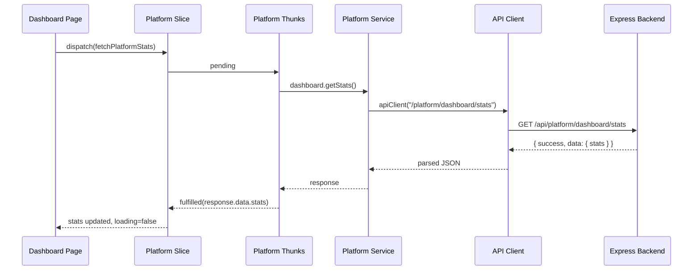

# Design Document: Fix Platform Dashboard

## Overview

This design addresses five critical bugs preventing the Platform Owner Dashboard from functioning correctly. The fixes span the frontend API layer (endpoint paths, HTTP methods, response parsing), Redux state management (loading/error handling), and route protection (auth guard). All changes are localized to existing files with no new architectural patterns introduced.

## Architecture

The platform dashboard follows this data flow:



## Components and Interfaces

### Fix 1: API Endpoint Constants (`Apps/src/lib/constants/api.ts`)

**Current (broken):**
```typescript
PLATFORM: {
  STATS: "/platform/stats",
}
```

**Fixed:**
```typescript
PLATFORM: {
  DASHBOARD: {
    STATS: "/platform/dashboard/stats",
    REVENUE: "/platform/dashboard/revenue",
    GROWTH: "/platform/dashboard/growth",
  },
}
```

The `STATS` key is replaced with a `DASHBOARD` object containing all three dashboard endpoints, matching the backend route structure.

### Fix 2: Platform Service Dashboard Methods (`Apps/src/lib/api/services/platform.service.ts`)

**Current (broken):**
```typescript
dashboard: {
  getStats() {
    return apiClient<ApiResponse<DashboardStats>>(
      `${API_ENDPOINTS.PLATFORM.STATS}`,
    );
  },
  getRevenue(params?) {
    return apiClient<ApiResponse<RevenueData[]>>(
      `${API_ENDPOINTS.PLATFORM.STATS}/revenue${query}`,
    );
  },
  getGrowth(params?) {
    return apiClient<ApiResponse<GrowthData[]>>(
      `${API_ENDPOINTS.PLATFORM.STATS}/growth${query}`,
    );
  },
}
```

**Fixed:**
```typescript
dashboard: {
  getStats() {
    return apiClient<ApiResponse<{ stats: DashboardStats }>>(
      API_ENDPOINTS.PLATFORM.DASHBOARD.STATS,
    );
  },
  getRevenue(params?) {
    const query = params
      ? `?${new URLSearchParams(params as Record<string, string>).toString()}`
      : "";
    return apiClient<ApiResponse<{ revenue: RevenueData[] }>>(
      `${API_ENDPOINTS.PLATFORM.DASHBOARD.REVENUE}${query}`,
    );
  },
  getGrowth(params?) {
    const query = params
      ? `?${new URLSearchParams(params as Record<string, string>).toString()}`
      : "";
    return apiClient<ApiResponse<{ growth: GrowthData[] }>>(
      `${API_ENDPOINTS.PLATFORM.DASHBOARD.GROWTH}${query}`,
    );
  },
}
```

Key changes:
- Use new `DASHBOARD.STATS`, `DASHBOARD.REVENUE`, `DASHBOARD.GROWTH` constants
- Type the response generics to match the actual backend response shape (`{ stats: ... }`, `{ revenue: ... }`, `{ growth: ... }`)

### Fix 3: Stats Thunk Response Extraction (`Apps/src/lib/store/slices/platform.thunks.ts`)

**Current (broken):**
```typescript
export const fetchPlatformStats = createAsyncThunk(
  "platform/fetchStats",
  async (_, { rejectWithValue }) => {
    try {
      const response = await platformService.dashboard.getStats();
      return response.data; // Returns { stats: {...} } not DashboardStats
    } catch (error: unknown) { ... }
  },
);
```

**Fixed:**
```typescript
export const fetchPlatformStats = createAsyncThunk(
  "platform/fetchStats",
  async (_, { rejectWithValue }) => {
    try {
      const response = await platformService.dashboard.getStats();
      return response.data.stats; // Extract the nested stats object
    } catch (error: unknown) { ... }
  },
);
```

The `apiClient` returns the full JSON body (since it does `return result` after `response.json()`). So `response` = `{ success: true, data: { stats: {...} } }`. We need `response.data.stats` to get the `DashboardStats` object.

### Fix 4: Platform Slice Loading/Error State (`Apps/src/lib/store/slices/platform.slice.ts`)

**Current (broken):**
```typescript
// Only handles fulfilled
.addCase(fetchPlatformStats.fulfilled, (state, action) => {
  state.stats = action.payload;
});
```

**Fixed — new state shape:**
```typescript
interface PlatformState {
  // ... existing fields ...
  stats: DashboardStats | null;
  statsLoading: boolean;
  statsError: string | null;
}
```

**Fixed — extra reducers:**
```typescript
.addCase(fetchPlatformStats.pending, (state) => {
  state.statsLoading = true;
  state.statsError = null;
})
.addCase(fetchPlatformStats.fulfilled, (state, action) => {
  state.statsLoading = false;
  state.stats = action.payload;
})
.addCase(fetchPlatformStats.rejected, (state, action) => {
  state.statsLoading = false;
  state.statsError = action.payload as string;
})
```

### Fix 5: Dashboard Page Loading/Error UI (`Apps/src/app/(platform)/platform/dashboard/page.tsx`)

**Current (broken):**
```typescript
const stats = useAppSelector((state) => state.platform.stats);
const loading = !stats; // Never becomes false if API fails
```

**Fixed:**
```typescript
const stats = useAppSelector((state) => state.platform.stats);
const loading = useAppSelector((state) => state.platform.statsLoading);
const error = useAppSelector((state) => state.platform.statsError);
```

Add error UI:
```tsx
{error && (
  <div className="rounded-lg border border-destructive/50 bg-destructive/10 p-4 flex items-center justify-between">
    <p className="text-sm text-destructive">{error}</p>
    <Button variant="outline" size="sm" onClick={() => dispatch(fetchPlatformStats())}>
      {t("retry")}
    </Button>
  </div>
)}
```

### Fix 6: Platform Layout Auth Guard (`Apps/src/app/(platform)/layout.tsx`)

**Design Decision:** Add an auth check at the top of the layout component that:
1. Reads `user` and auth loading state from Redux
2. If not authenticated (no user and not loading), redirects to `/login`
3. If authenticated but wrong role, redirects to home `/`
4. While checking, shows a full-page loading spinner

```typescript
import { useRouter } from "next/navigation";

// Inside PlatformLayout component, before the return:
const router = useRouter();
const authLoading = useAppSelector((state) => state.auth.loading);

useEffect(() => {
  if (authLoading) return; // Still loading auth state
  
  if (!user) {
    router.replace("/login");
    return;
  }
  
  const allowedRoles: SystemRole[] = ["PLATFORM_ADMIN", "PLATFORM_OWNER"];
  if (!allowedRoles.includes(user.system_role)) {
    router.replace("/");
    return;
  }
}, [user, authLoading, router]);

// Show loading while auth is being determined
if (authLoading || !user) {
  return <FullPageLoader />;
}
```

### Fix 7: HTTP Method Alignment (`Apps/src/lib/api/services/platform.service.ts`)

**Current (broken):**
```typescript
// users.update
method: "PUT"
// plans.update
method: "PUT"
// subscriptions.update
method: "PUT"
```

**Fixed:**
```typescript
// users.update
method: "PATCH"
// plans.update
method: "PATCH"
// subscriptions.update
method: "PATCH"
```

All three update methods must use `PATCH` to match the backend route definitions.

## Data Models

No data model changes required. The existing `DashboardStats` interface correctly matches the backend response shape:

```typescript
export interface DashboardStats {
  total_users: number;
  total_stores: number;
  total_orders: number;
  total_revenue: string;
  active_subscriptions: number;
}
```

The Redux state gains two new fields:
```typescript
statsLoading: boolean;  // default: false
statsError: string | null;  // default: null
```

## Error Handling

- **API 404 (Bug 1 fix):** Resolved by correcting endpoint paths. The backend already returns proper error responses for unknown routes.
- **Response parsing (Bug 2 fix):** The thunk now correctly navigates the nested response structure.
- **Redux error state (Bug 3 fix):** The `rejected` case captures error messages and exposes them to the UI. The dashboard page renders an error banner with retry functionality.
- **Auth failures (Bug 4 fix):** Unauthenticated users are redirected to login. Users with insufficient roles are redirected to home.
- **HTTP 404 on updates (Bug 5 fix):** Correcting PUT to PATCH ensures the Express router matches the request.

## Testing Strategy

Since these are configuration/wiring fixes (endpoint paths, HTTP methods, response parsing) and UI state management, property-based testing is not appropriate. The fixes are deterministic and don't involve algorithmic logic with varying inputs.

**Recommended testing approach:**

- **Unit tests:** Verify the platform service constructs correct URLs and uses correct HTTP methods
- **Integration tests:** Verify the Redux slice transitions through pending → fulfilled/rejected states correctly
- **Manual verification:** Confirm the dashboard loads stats, shows errors on failure, and the auth guard redirects unauthorized users
