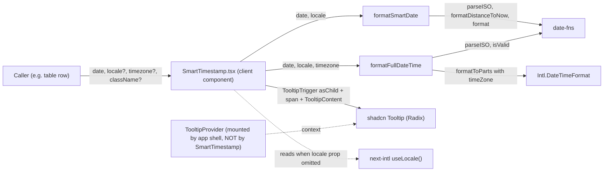
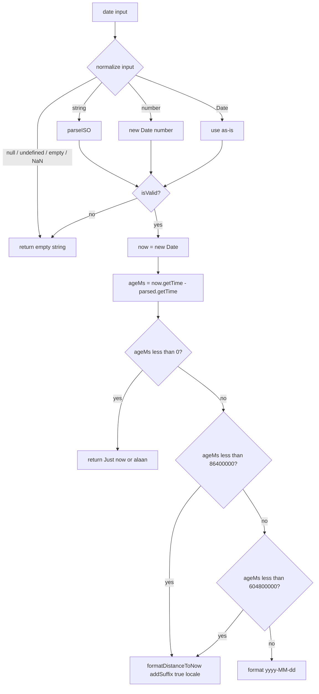
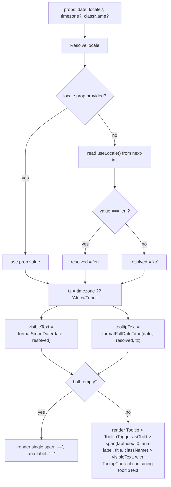

# Design Document

## Overview

`SmartTimestamp` is a presentation-only React component that renders a single timestamp in a "smart" form: relative wording for ages under 7 days and an absolute `YYYY-MM-DD` date beyond that, with a hover/focus tooltip showing the full date and time in a chosen IANA timezone (default `Africa/Tripoli`). The feature ships in two layers:

- **Layer 1 — Pure helpers** added to the existing module `Apps/src/lib/utils/formatDate.ts`:
  - `formatSmartDate(date, locale)` returns the visible relative or absolute text.
  - `formatFullDateTime(date, locale, timezone)` returns the full tooltip text in the requested timezone.
- **Layer 2 — Presentational component** at `Apps/src/components/shared/SmartTimestamp.tsx` that composes the helpers with the existing shadcn `Tooltip` primitives and a `<span>` trigger.

The design is constrained by three non-functional goals:

1. **Static**: no timers, no `setInterval`/`setTimeout`, no auto-refresh. Outputs are computed once per render from the props and the call-time `Date.now()`.
2. **Pure presentation**: no Redux dependency, no per-instance React context the component owns, no effects that schedule re-renders. Safe to render hundreds of times in a table.
3. **Bilingual**: Arabic primary (`"ar"`) and English (`"en"`), with timezone-correct rendering driven by `Intl.DateTimeFormat` so that `Africa/Tripoli` wall-clock fields are produced regardless of the host's local timezone.

The two helpers are pure functions; the component is a pure render function plus the locale fallback hook. Date math lives entirely in the helpers, which keeps the component body trivial and the hot path cheap.

## Architecture

The feature is two layers with a one-way dependency: the component imports the helpers, the helpers import nothing from the component layer.



Notes:

- `TooltipProvider` is a precondition. The component itself never mounts a provider, so each row of a long table does not pay for a provider per row. This matches the existing shadcn `tooltip.tsx` export surface.
- The `useLocale` hook from `next-intl` is read only when the `locale` prop is omitted. When the prop is provided, the hook is not invoked (no behavioral coupling to context for callers that already know their locale).
- Per the steering guide, this feature lives only inside `Apps/`. Existing exports `formatDate`, `formatRelativeDate`, and `formatDateTime` in `formatDate.ts` are not modified; the helpers are added as new named exports.

## Components and Interfaces

### Layer 1: Pure helpers in `Apps/src/lib/utils/formatDate.ts`

#### `formatSmartDate`

Returns the visible text for the trigger.

```ts
export type SmartDateLocale = "ar" | "en";

export function formatSmartDate(
  date: string | Date | number | null | undefined,
  locale: SmartDateLocale,
): string;
```

Decision tree:



Concrete steps:

1. Normalize input.
   - If `date` is `null`, `undefined`, or the empty string, return `""`.
   - If `typeof date === "string"`, parse with `parseISO`.
   - If `typeof date === "number"` and the number is finite, build `new Date(date)`.
   - If `date instanceof Date`, use it directly.
   - Anything else: return `""`.
2. Validate with `isValid(parsed)`. If invalid, return `""`.
3. Capture `nowReference = new Date()` exactly once.
4. Compute `ageMs = nowReference.getTime() - parsed.getTime()`.
5. Branch:
   - `ageMs < 0` (FutureWindow): return `locale === "ar" ? "الآن" : "Just now"`.
   - `0 <= ageMs < 86_400_000` (HoursWindow): return `formatDistanceToNow(parsed, { addSuffix: true, locale: locale === "ar" ? ar : undefined })`.
   - `86_400_000 <= ageMs < 604_800_000` (DaysWindow): same as HoursWindow.
   - `ageMs >= 604_800_000` (AbsoluteWindow): return `format(parsed, "yyyy-MM-dd")`.
6. The whole body is wrapped in `try/catch`; any thrown error is converted into `""` so the helper is total.

The `ar` locale is imported from `date-fns/locale`; the existing module already imports it for `formatRelativeDate`.

#### `formatFullDateTime`

Returns the full tooltip text in the requested timezone.

```ts
export function formatFullDateTime(
  date: string | Date | number | null | undefined,
  locale: SmartDateLocale,
  timezone: string,
): string;
```

Approach: `date-fns`'s `format` does not natively convert to an arbitrary IANA timezone, and the project does not use `date-fns-tz`. Pulling in a new dependency for one feature is excess scope. Instead, the helper uses `Intl.DateTimeFormat` with the `timeZone` option to extract the calendar fields (year, month, day, weekday) and clock fields (hour, minute, dayPeriod) for the requested zone, then assembles them into the final template per locale. Two `Intl.DateTimeFormat` instances are built per call: one for the date parts (long weekday, long month, numeric day, numeric year) and one for the time parts (`2-digit` hour and minute with `hour12: true`). Output of `formatToParts` is then walked once to pull the typed fields.

Pseudocode:

```ts
function formatFullDateTime(date, locale, timezone) {
  // 1. Normalize and validate (same rules as formatSmartDate).
  const parsed = normalize(date);
  if (parsed === null || !isValid(parsed)) return "";

  // 2. Resolve timezone with try/catch; fall back to "Africa/Tripoli".
  const tz = isValidTimeZone(timezone) ? timezone : "Africa/Tripoli";

  // 3. Build two Intl formatters scoped to tz.
  const intlLocale = locale === "ar" ? "ar-LY" : "en-US";
  const dateFmt = new Intl.DateTimeFormat(intlLocale, {
    timeZone: tz,
    weekday: "long",
    day: "numeric",
    month: "long",
    year: "numeric",
  });
  const timeFmt = new Intl.DateTimeFormat(intlLocale, {
    timeZone: tz,
    hour: "2-digit",
    minute: "2-digit",
    hour12: true,
  });

  // 4. Extract typed parts.
  const dateParts = partsByType(dateFmt.formatToParts(parsed));
  const timeParts = partsByType(timeFmt.formatToParts(parsed));

  // 5. Assemble the template per locale.
  if (locale === "ar") {
    // "<weekday> <day> <month> <year> | <hh>:<mm> <ص|م>"
    return `${dateParts.weekday} ${dateParts.day} ${dateParts.month} ${dateParts.year} | ${timeParts.hour}:${timeParts.minute} ${timeParts.dayPeriod}`;
  } else {
    // "<Weekday>, <Month> <day>, <year> | <hh>:<mm> <AM|PM>"
    return `${dateParts.weekday}, ${dateParts.month} ${dateParts.day}, ${dateParts.year} | ${timeParts.hour}:${timeParts.minute} ${timeParts.dayPeriod}`;
  }
}
```

Where:

- `normalize(date)` mirrors `formatSmartDate`'s input rules (null/undefined/empty → `null`; string → `parseISO`; number → `new Date(n)`; Date → as-is).
- `isValidTimeZone(tz)` calls `new Intl.DateTimeFormat(undefined, { timeZone: tz })` inside a `try/catch` and returns `false` on any thrown error. This is the standard JavaScript pattern for validating IANA zone identifiers without an extra dependency.
- `partsByType(parts)` reduces the array to `{ weekday, day, month, year, hour, minute, dayPeriod }`. Any missing field is treated as the empty string defensively.
- For Arabic, the locale `"ar-LY"` is passed to `Intl.DateTimeFormat`. The Libyan Arabic locale produces `"ص"` / `"م"` for the day-period part natively, which matches the requirement and avoids manual `AM`/`PM` substitution. If the runtime ICU does not carry `ar-LY`, it falls back through the locale negotiation to `ar`, which also emits `ص`/`م`. The Arabic numerals (Eastern Arabic vs. Western Arabic) follow the runtime's `ar-LY` defaults; the requirement does not pin a digit system, so we accept the platform default.
- For English, the locale `"en-US"` produces `"AM"` / `"PM"` and English month/weekday names.
- The whole body is wrapped in `try/catch`; any thrown error becomes `""`. This keeps the helper total even on exotic platforms where ICU data is incomplete.

The helper does not call `formatInTimeZone` or `date-fns-tz`. The decision is intentional: one well-supported browser/Node API does the timezone conversion, and the assembly logic is just string interpolation, which is cheaper to reason about than introducing a new dependency.

#### Both helpers: shared rules

- Pure: no module-level mutable state, no I/O, no timers.
- Total: every code path either returns a `string` or returns `""`; the `try/catch` wrapper guarantees no thrown exception escapes.
- `nowReference` is captured exactly once per call to `formatSmartDate`. `formatFullDateTime` does not need a now-reference because its output is absolute.

### Layer 2: `SmartTimestamp` component

File: `Apps/src/components/shared/SmartTimestamp.tsx`. First line: `"use client"` (the component reads a hook and uses Radix primitives).

Props:

```ts
import type { ReactElement } from "react";

export interface SmartTimestampProps {
  date: string | Date | number | null | undefined;
  locale?: "ar" | "en";
  timezone?: string; // default "Africa/Tripoli"
  className?: string;
}

export function SmartTimestamp(props: SmartTimestampProps): ReactElement;
```

Render flow:



Locale resolution:

- If `props.locale` is `"ar"` or `"en"`, use it directly.
- Otherwise call `useLocale()` from `next-intl`. If the returned string equals `"en"`, resolve to `"en"`; for any other value (including `"ar-LY"`, `"ar"`, or unexpected strings), resolve to `"ar"`. This matches the project's bilingual posture (Arabic primary, English secondary).
- The hook is called unconditionally to comply with the Rules of Hooks; the prop-vs-hook decision is made on the captured value.

Render structure (valid case):

```tsx
<Tooltip>
  <TooltipTrigger asChild>
    <span
      tabIndex={0}
      aria-label={tooltipText}
      title={tooltipText}
      className={cn(className)}
    >
      {visibleText}
    </span>
  </TooltipTrigger>
  <TooltipContent>{tooltipText}</TooltipContent>
</Tooltip>
```

Notes:

- `TooltipTrigger asChild` wires Radix's open-state listeners onto the `<span>` directly. The `<span>` stays a non-interactive inline element (no `<button>` upgrade), so it does not steal click events from a surrounding row click target.
- `tabIndex={0}` makes the `<span>` keyboard-focusable so the tooltip opens on focus, satisfying the keyboard-accessibility requirement.
- `aria-label` and `title` both carry `tooltipText` so that the absolute date is announced to assistive tech and shown by the browser even when the Radix portal is not mounted (e.g. SSR, environments without DOM portals).
- `cn(className)` is the project's existing `clsx` + `tailwind-merge` utility; passing only `className` is fine because there is no base class set on the trigger by design (the component is presentation-neutral and inherits the surrounding row typography).
- The component never renders `TooltipProvider`; it relies on a provider mounted higher in the tree (typically in `Apps/src/app/providers.tsx` or per-layout). This is documented in the JSDoc on the component as a usage precondition.

Render structure (invalid case):

```tsx
<span aria-label="—">—</span>
```

The component returns this fallback whenever `formatSmartDate` and `formatFullDateTime` both return `""` (which happens iff the input is an `InvalidDate` per the requirements). No `Tooltip` is rendered, so screen readers and keyboard users see only the placeholder.

Component-level constraints from the requirements:

- No `useEffect`, no `useLayoutEffect`, no `useState` (Radix's `Tooltip` manages its own open state internally; we do not duplicate it).
- No `setInterval`, `setTimeout`, `requestAnimationFrame`, or `requestIdleCallback`.
- No subscription to `window`, `document`, or `navigator` events.
- All date math is delegated to the helpers; the component body only resolves locale, picks the timezone fallback, calls the helpers, and chooses one of two render shapes.

## Data Models

This feature has no persisted data and no API surface, so the only models are the helper input types and prop types.

```ts
// Apps/src/lib/utils/formatDate.ts
export type SmartDateLocale = "ar" | "en";
export type SmartDateInput = string | Date | number | null | undefined;
```

```ts
// Apps/src/components/shared/SmartTimestamp.tsx
export interface SmartTimestampProps {
  date: SmartDateInput;
  locale?: SmartDateLocale;
  timezone?: string;
  className?: string;
}
```

The DateInput contract is a tagged union by `typeof`:

| typeof input | Treatment |
|---|---|
| `"string"` | Parsed with `parseISO`. Empty string → invalid. |
| `"number"` | Treated as Unix epoch milliseconds via `new Date(n)`. Non-finite → invalid. |
| `"object"` and `instanceof Date` | Used directly. |
| `null`, `undefined` | Invalid. |
| Anything else | Invalid. |

`isValid` from `date-fns` is the single validity oracle for `Date` instances after normalization.

## Error Handling

Both helpers and the component implement a strict "no thrown errors at the boundary" policy:

- `formatSmartDate`: every internal failure (bad input, parse error, locale lookup failure) is converted to `""` by the outer `try/catch`. Callers can rely on the return type being exactly `string`.
- `formatFullDateTime`: same boundary behavior. In addition, an invalid `timezone` string is recovered to `"Africa/Tripoli"` rather than returning `""`, because the input date itself may still be valid. Only an `InvalidDate` (or an `Intl.DateTimeFormat` failure even after the fallback) collapses to `""`.
- `SmartTimestamp`: when both helpers return `""`, the component renders the `"—"` fallback. Other rendering paths cannot throw because `cn`, `<span>`, and the shadcn primitives are total.

There is no logging or telemetry on this path. A malformed timestamp simply renders as `"—"`. This matches the requirement that "broken data degrades to a calm visual placeholder instead of a crash" and avoids spamming the console for what is fundamentally a data-quality issue at the source.

Edge cases addressed:

- **Null / undefined / empty string** → helpers return `""`, component renders `"—"`.
- **`NaN`, `Infinity`, non-finite numbers** → caught at normalization, helpers return `""`.
- **String that is not ISO-8601** → `parseISO` returns an `Invalid Date`, `isValid` returns `false`, helpers return `""`.
- **Date instance constructed from `new Date("garbage")`** → `isValid` returns `false`, helpers return `""`.
- **Future-dated input** → `formatSmartDate` returns the locale-specific now-literal (`"Just now"` / `"الآن"`); `formatFullDateTime` still renders the absolute future date in the requested timezone.
- **Invalid IANA timezone** (`"Mars/Olympus"`, empty string, garbage) → `formatFullDateTime` falls back to `"Africa/Tripoli"`.
- **Browser/Node without ICU full data** → the inner `Intl.DateTimeFormat` may produce a less-rich output; the regex-shape contract still holds because `Intl` always provides at minimum a string for each requested part. If the formatter constructor itself throws (extremely unusual), the outer `try/catch` collapses to `""`.

## Performance

Performance constraints are baked into the architecture:

- **Helpers are pure and stateless.** Each call allocates one `Date` (when the input is a string or number) and a few `Intl.DateTimeFormat` instances inside `formatFullDateTime`. There are no closures captured per row and no module-level caches.
- **Component has zero `useEffect`, zero `useState`.** Each mount runs the helpers once during render. There is no work scheduled after paint.
- **No timers.** The visible text becomes "wrong" as time passes (a "5 minutes ago" eventually drifts to "10 minutes ago"), but the requirement explicitly disallows auto-refresh: the user sees the value computed at render time, and a subsequent re-render (data refetch, route change) will recompute. This is a deliberate trade-off in favor of cheap rendering for tables with hundreds of rows.
- **`Intl.DateTimeFormat` cost.** Each call to `formatFullDateTime` constructs two `Intl.DateTimeFormat` instances. In modern engines this is a few microseconds per call, dominated by ICU lookups. For a 200-row table, that is on the order of 1–2 ms in aggregate, well below a frame budget. A potential optimization is to memoize formatters at module level with a `Map<key, formatter>` keyed by `${locale}|${timezone}|${shape}`. We deliberately do not implement this in the first cut; it is recorded under "Future work" below.
- **Tooltip portal reuse.** The shadcn `Tooltip` mounts content on demand via Radix's portal logic; until the user hovers a row, no content nodes are added to the DOM beyond the trigger `<span>`s. The 200-row safety claim depends on this: triggers are cheap, content is lazy.

### Future work (out of scope for this spec)

- Memoize `Intl.DateTimeFormat` instances per `(locale, timezone)` key to amortize formatter construction across rows.
- Consider an opt-in auto-refresh prop (e.g. `autoRefresh="minute"`) gated on a single shared `setInterval` registered via a context provider, if a future spec demands live "5 minutes ago" displays.
- Consider a `formatSmartDate` variant that exposes the chosen branch (`"future" | "hours" | "days" | "absolute"`) to callers that want to drive icons or styling per-branch.

## Testing Strategy

The feature is well-suited to a dual approach: property-based tests for the helpers (pure functions over a large input space) and example-plus-property tests for the component (DOM shape varies by valid/invalid input and by props). All tests use the project's existing stack (Vitest + Testing Library + fast-check).

Property test configuration: each property runs a minimum of 100 iterations. Each test is tagged with `Feature: smart-timestamp, Property N: <text>`.

\* Optional / recommended (this spec describes what should be tested; concrete test files live in tasks).

\* **Unit tests for `formatSmartDate`** in `Apps/src/lib/utils/__tests__/formatDate.spec.ts`:

- One example per branch (future, hours, days, absolute, invalid) for fast feedback.
- Property: relative-window equivalence (Property 1 below).
- Property: absolute-window exactness (Property 2).
- Property: future-window literal (Property 3).
- Property: invalid-input collapse (Property 4 left half).
- Property: input-shape equivalence (Property 5 left half).

\* **Unit tests for `formatFullDateTime`** in the same file:

- Example: UTC instant `2025-12-26T13:37:00Z` with `Africa/Tripoli` for both `ar` and `en`, pinning the exact string per requirement 8.2 / 9.2.
- Example: an early-AM instant pinning `"02:37 ص"` and `"02:37 AM"` per requirement 8.3 / 9.3.
- Property: Arabic shape regex (Property 6).
- Property: English shape regex (Property 7).
- Property: invalid-input and totality (Property 4 right half).
- Property: input-shape equivalence (Property 5 right half).
- Property: timezone fallback (Property 8).

\* **Component tests** in `Apps/src/components/shared/__tests__/SmartTimestamp.spec.tsx`:

- Example: renders inside a `TooltipProvider` and shows the visible span text.
- Example: hover opens the tooltip and reveals the full date-time content.
- Example: focus opens the tooltip (keyboard accessibility).
- Example: invalid date renders the `"—"` fallback with `aria-label="—"` and no Radix tooltip surface.
- Example: omitted `locale` prop falls back to mocked `useLocale()` value, coerced to `"ar"` for non-`"en"` values.
- Property: valid render shape (Property 9).
- Property: invalid render shape (Property 10).
- Property: prop responsiveness on re-render (Property 11).

The component tests mock `next-intl`'s `useLocale` for the locale-fallback tests and wrap renders in a `TooltipProvider` from the existing shadcn export.

## Correctness Properties

*A property is a characteristic or behavior that should hold true across all valid executions of a system — essentially, a formal statement about what the system should do. Properties serve as the bridge between human-readable specifications and machine-verifiable correctness guarantees.*

### Property 1: Relative-window equivalence

*For any* DateInput whose AgeMs falls in `HoursWindow ∪ DaysWindow` (`0 <= AgeMs < 604_800_000`) and any Locale in `{"ar", "en"}`, `formatSmartDate(date, locale)` equals `formatDistanceToNow(parsedDate, { addSuffix: true, locale: locale === "ar" ? ar : undefined })` computed against the same NowReference.

**Validates: Requirements 2.1, 2.2, 2.3, 2.4, 3.1, 3.2, 3.3**

### Property 2: Absolute-window exactness

*For any* DateInput whose AgeMs is `>= 604_800_000` and any Locale in `{"ar", "en"}`, `formatSmartDate(date, locale)` equals `format(parsedDate, "yyyy-MM-dd")` and is independent of the Locale value.

**Validates: Requirements 4.1, 4.2, 4.3**

### Property 3: Future-window literal

*For any* DateInput strictly greater than NowReference, `formatSmartDate(date, "en")` equals the literal string `"Just now"` and `formatSmartDate(date, "ar")` equals the literal string `"الآن"`.

**Validates: Requirements 5.1, 5.2, 5.3**

### Property 4: Helper totality and invalid-input collapse

*For any* value `v` of any JavaScript type (including `null`, `undefined`, the empty string, malformed strings, `NaN`, `Infinity`, an `Invalid Date` instance, or arbitrary objects) and any Locale, both `formatSmartDate(v, locale)` and `formatFullDateTime(v, locale, timezone)` return a `string` and never throw; furthermore, when `v` is an InvalidDate per the spec's definition, both return the empty string `""`.

**Validates: Requirements 6.1, 6.2, 11.1, 11.2**

### Property 5: Input-shape equivalence

*For any* valid `Date` instance `d` and any Locale, the three input shapes produce the same output for each helper:
- `formatSmartDate(d, locale) === formatSmartDate(d.getTime(), locale) === formatSmartDate(d.toISOString(), locale)` (computed against the same NowReference).
- `formatFullDateTime(d, locale, tz) === formatFullDateTime(d.getTime(), locale, tz) === formatFullDateTime(d.toISOString(), locale, tz)`.

**Validates: Requirements 6.3, 6.4, 6.5, 11.3, 11.4, 11.5**

### Property 6: Arabic full date-time shape

*For any* valid DateInput and any valid `timezone`, `formatFullDateTime(date, "ar", timezone)` matches the regular expression `/^\S+\s+\S+\s+\S+\s+\d{4}\s+\|\s+\d{1,2}:\d{2}\s+(ص|م)$/` (weekday, day, month, year separated by whitespace, then a pipe, then `hh:mm` and the Arabic day-period).

**Validates: Requirements 8.1, 8.2, 8.3, 8.4**

### Property 7: English full date-time shape

*For any* valid DateInput and any valid `timezone`, `formatFullDateTime(date, "en", timezone)` matches the regular expression `/^\S+,\s+\S+\s+\d{1,2},\s+\d{4}\s+\|\s+\d{1,2}:\d{2}\s+(AM|PM)$/` (Weekday comma, Month day comma, year, then pipe, then `hh:mm` and `AM`/`PM`).

**Validates: Requirements 9.1, 9.2, 9.3, 9.4**

### Property 8: Timezone fallback

*For any* valid DateInput, any Locale, and any string `badTz` that is not a valid IANA timezone identifier, `formatFullDateTime(date, locale, badTz)` equals `formatFullDateTime(date, locale, "Africa/Tripoli")`.

**Validates: Requirements 10.3, 10.4**

### Property 9: SmartTimestamp valid render shape

*For any* valid DateInput, any explicit Locale in `{"ar", "en"}`, any string timezone, and any optional className, the component rendered inside a `TooltipProvider` produces a single `<span>` trigger such that:
- the trigger's text content equals `formatSmartDate(date, locale)`,
- the trigger's `aria-label` and `title` attributes both equal `formatFullDateTime(date, locale, timezone)`,
- the trigger's `tabIndex` is `0`,
- when the className prop is provided, the trigger's `className` attribute contains the provided class strings,
- a `TooltipContent` element is present in the rendered tree carrying the same full date-time text.

**Validates: Requirements 13.1, 13.2, 13.3, 13.4, 14.1, 14.2, 14.3, 15.1, 15.2, 15.3**

### Property 10: SmartTimestamp invalid render shape

*For any* DateInput that is an InvalidDate, the component renders a single `<span>` with text content `"—"` and `aria-label="—"`, with no Radix tooltip surface in the rendered tree, and without throwing.

**Validates: Requirements 16.1, 16.2, 16.3**

### Property 11: SmartTimestamp prop responsiveness

*For any* two prop tuples `(date1, locale1, timezone1)` and `(date2, locale2, timezone2)`, re-rendering the component with the second tuple after the first produces a trigger whose visible text equals `formatSmartDate(date2, resolvedLocale2)` and whose `aria-label` equals `formatFullDateTime(date2, resolvedLocale2, timezone2 ?? "Africa/Tripoli")`, where `resolvedLocale2` is the locale resolution result for the second tuple.

**Validates: Requirements 17.4, 12.6, 19.1, 19.3**
