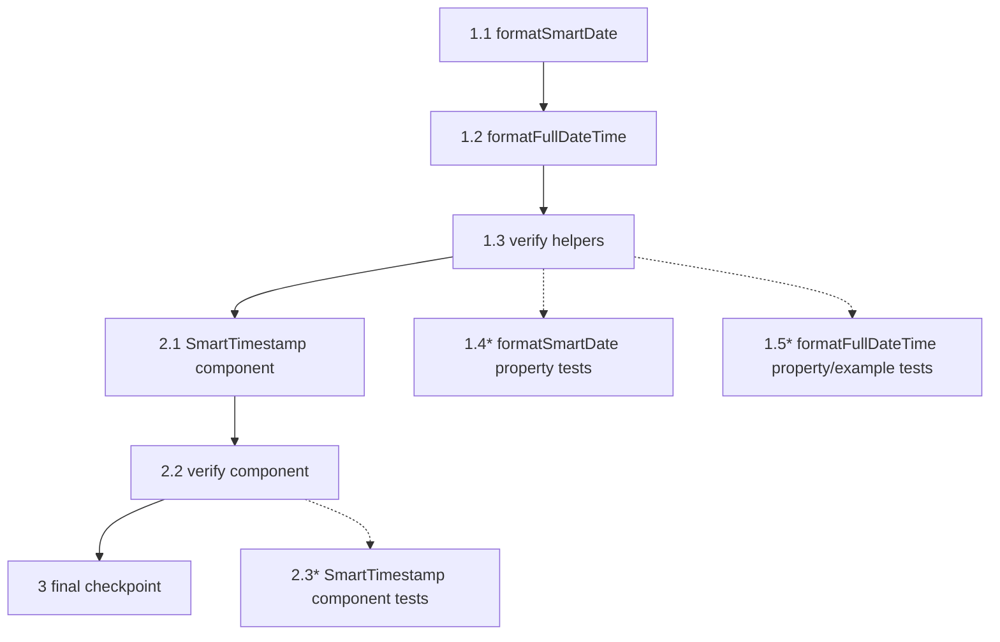

# Implementation Plan: Smart Timestamp

## Overview

Build a presentation-only `SmartTimestamp` React component for the Store Admin and Storefront frontend that renders a timestamp in a "smart" form (relative wording for ages under 7 days, absolute `YYYY-MM-DD` beyond that) with a hover/focus tooltip showing the full date and time in a chosen IANA timezone (default `Africa/Tripoli`). The work is delivered in two layers:

- **Layer 1 — pure helpers** added to `Apps/src/lib/utils/formatDate.ts`:
  - `formatSmartDate(date, locale)` returns the visible relative or absolute text.
  - `formatFullDateTime(date, locale, timezone)` returns the full tooltip text in the requested timezone via `Intl.DateTimeFormat`.
- **Layer 2 — presentational component** at `Apps/src/components/shared/SmartTimestamp.tsx` that composes the helpers with the existing shadcn `Tooltip` primitives.

The plan is bottom-up so each step is independently verifiable: helpers first (each branch covered, then totality and timezone fallback), then the component (locale resolution, tooltip rendering, invalid fallback). No timers, no Redux, no `TooltipProvider` mounted by the component itself. Integration into specific pages (orders table, etc.) is explicitly out of scope per the requirements doc and is deferred to a future spec.

Existing exports `formatDate`, `formatRelativeDate`, and `formatDateTime` in `formatDate.ts` MUST NOT be modified; the two new helpers are added as new named exports alongside them.

## Tasks

- [ ] 1. Helpers — extend `formatDate.ts`
  - [ ] 1.1 Add `formatSmartDate(date, locale)` to `Wasl_SaaS/Apps/src/lib/utils/formatDate.ts`
    - Export `type SmartDateLocale = "ar" | "en"` and `type SmartDateInput = string | Date | number | null | undefined` as new named exports
    - Export `function formatSmartDate(date: SmartDateInput, locale: SmartDateLocale): string`
    - Reuse the existing `ar` import from `date-fns/locale` and the existing `parseISO`, `isValid`, `format`, `formatDistanceToNow` imports (add any missing ones from `date-fns`)
    - Normalize input: `null` / `undefined` / empty string → invalid; `string` → `parseISO`; `number` → `new Date(n)` only when finite; `Date` → use as-is; anything else → invalid
    - Validate the normalized value with `isValid`; on failure return the literal empty string `""`
    - Capture `nowReference = new Date()` exactly once per call
    - Compute `ageMs = nowReference.getTime() - parsed.getTime()` and branch:
      - `ageMs < 0` (FutureWindow) → return `locale === "ar" ? "الآن" : "Just now"`
      - `0 <= ageMs < 86_400_000` (HoursWindow) → return `formatDistanceToNow(parsed, { addSuffix: true, locale: locale === "ar" ? ar : undefined })`
      - `86_400_000 <= ageMs < 604_800_000` (DaysWindow) → same call as HoursWindow
      - `ageMs >= 604_800_000` (AbsoluteWindow) → return `format(parsed, "yyyy-MM-dd")`
    - Wrap the entire body in `try/catch`; any thrown error is converted into `""` so the helper is total
    - Do NOT touch existing exports (`formatDate`, `formatRelativeDate`, `formatDateTime`)
    - _Requirements: 1.1, 1.2, 1.3, 1.4, 1.5, 2.1, 2.2, 2.3, 2.4, 3.1, 3.2, 3.3, 4.1, 4.2, 4.3, 5.1, 5.2, 5.3, 6.1, 6.2, 6.3, 6.4, 6.5, 20.1, 20.2_
    - _Implements: Property 1 (Relative-window equivalence), Property 2 (Absolute-window exactness), Property 3 (Future-window literal), Property 4 (Helper totality / invalid-input collapse — `formatSmartDate` side), Property 5 (Input-shape equivalence — `formatSmartDate` side)_

  - [ ] 1.2 Add `formatFullDateTime(date, locale, timezone)` to `Wasl_SaaS/Apps/src/lib/utils/formatDate.ts`
    - Export `function formatFullDateTime(date: SmartDateInput, locale: SmartDateLocale, timezone: string): string`
    - Reuse the same input normalization rules as `formatSmartDate`; on invalid input return `""`
    - Validate the timezone with a private `isValidTimeZone(tz)` helper that calls `new Intl.DateTimeFormat(undefined, { timeZone: tz })` inside `try/catch` and returns `false` on any thrown error
    - When `timezone` is invalid, fall back to the literal `"Africa/Tripoli"`; do NOT collapse the result to `""` for a bad timezone alone
    - Pick the Intl locale: `"ar-LY"` when `locale === "ar"` (renders `ص` / `م` natively), `"en-US"` otherwise (renders `AM` / `PM`)
    - Build two `Intl.DateTimeFormat` instances scoped to the resolved zone: one for the date parts (`weekday: "long", day: "numeric", month: "long", year: "numeric"`) and one for the time parts (`hour: "2-digit", minute: "2-digit", hour12: true`)
    - Use a private `partsByType(parts)` reducer to pull `{ weekday, day, month, year, hour, minute, dayPeriod }`; missing fields default to `""`
    - Assemble the template per locale:
      - `"ar"` → `` `${weekday} ${day} ${month} ${year} | ${hour}:${minute} ${dayPeriod}` ``
      - `"en"` → `` `${weekday}, ${month} ${day}, ${year} | ${hour}:${minute} ${dayPeriod}` ``
    - Wrap the entire body in `try/catch`; any thrown error becomes `""` so the helper is total
    - Do NOT add `date-fns-tz` or any other new npm dependency; rely on `Intl.DateTimeFormat` only
    - _Requirements: 7.1, 7.2, 7.3, 7.4, 8.1, 8.2, 8.3, 8.4, 9.1, 9.2, 9.3, 9.4, 10.1, 10.2, 10.3, 10.4, 11.1, 11.2, 11.3, 11.4, 11.5, 20.1, 20.2_
    - _Implements: Property 4 (Helper totality / invalid-input collapse — `formatFullDateTime` side), Property 5 (Input-shape equivalence — `formatFullDateTime` side), Property 6 (Arabic full date-time shape), Property 7 (English full date-time shape), Property 8 (Timezone fallback)_

  - [ ] 1.3 Verify the helpers compile cleanly
    - Run `getDiagnostics` on `Wasl_SaaS/Apps/src/lib/utils/formatDate.ts`
    - Run `npm run lint` in `Wasl_SaaS/Apps`
    - Confirm no new errors and that the existing `formatDate`, `formatRelativeDate`, `formatDateTime` exports are unchanged
    - _Requirements: 1.1, 1.3, 7.1, 7.3, 20.2_

  - [ ]* 1.4 Write property tests for `formatSmartDate`
    - File: `Wasl_SaaS/Apps/src/lib/utils/__tests__/formatSmartDate.spec.ts`
    - **Property 1: Relative-window equivalence**
    - **Property 2: Absolute-window exactness**
    - **Property 3: Future-window literal**
    - **Property 4 (left half): Helper totality and invalid-input collapse**
    - **Property 5 (left half): Input-shape equivalence**
    - **Validates: Requirements 2.1, 2.2, 2.3, 2.4, 3.1, 3.2, 3.3, 4.1, 4.2, 4.3, 5.1, 5.2, 5.3, 6.1, 6.2, 6.3, 6.4, 6.5**
    - One example per branch (future, hours, days, absolute, invalid) for fast feedback; pin the literals `"Just now"` and `"الآن"` for FutureWindow
    - Property: for any `Date` whose age is in `[0, 604_800_000)` and any locale, `formatSmartDate(date, locale)` equals the expected `formatDistanceToNow(...)` call against the same `nowReference` (mock `Date.now` to keep the comparison deterministic)
    - Property: for any `Date` whose age is `>= 604_800_000`, `formatSmartDate(date, "ar") === formatSmartDate(date, "en") === format(date, "yyyy-MM-dd")`
    - Property: for any value of any JavaScript type (use `fc.anything()` plus explicit generators for `null`, `undefined`, `""`, malformed strings, `NaN`, `Infinity`, `Invalid Date`), `formatSmartDate(v, locale)` returns a `string` and never throws; when `v` is an InvalidDate per the spec it returns exactly `""`
    - Property: for any valid `Date d` and any locale, `formatSmartDate(d, locale) === formatSmartDate(d.getTime(), locale) === formatSmartDate(d.toISOString(), locale)` against the same mocked `nowReference`
    - Each property MUST run at least 100 iterations and tag the test with `Feature: smart-timestamp, Property N: <text>`

  - [ ]* 1.5 Write property and example tests for `formatFullDateTime`
    - File: `Wasl_SaaS/Apps/src/lib/utils/__tests__/formatFullDateTime.spec.ts`
    - **Property 4 (right half): Helper totality and invalid-input collapse**
    - **Property 5 (right half): Input-shape equivalence**
    - **Property 6: Arabic full date-time shape**
    - **Property 7: English full date-time shape**
    - **Property 8: Timezone fallback**
    - **Validates: Requirements 8.1, 8.2, 8.3, 8.4, 9.1, 9.2, 9.3, 9.4, 10.1, 10.2, 10.3, 10.4, 11.1, 11.2, 11.3, 11.4, 11.5**
    - Example: UTC instant `2025-12-26T13:37:00Z` with `Africa/Tripoli` — Arabic output ends with `"02:37 م"` (per requirement 8.2/10.2 wording in the spec) and English output ends with `"02:37 PM"`
    - Example: an early-AM instant pinning `"02:37 ص"` for Arabic and `"02:37 AM"` for English (requirement 8.3 / 9.3)
    - Property: for any valid `DateInput` and any valid IANA timezone, `formatFullDateTime(date, "ar", tz)` matches `/^\S+\s+\S+\s+\S+\s+\d{4}\s+\|\s+\d{1,2}:\d{2}\s+(ص|م)$/`
    - Property: for any valid `DateInput` and any valid IANA timezone, `formatFullDateTime(date, "en", tz)` matches `/^\S+,\s+\S+\s+\d{1,2},\s+\d{4}\s+\|\s+\d{1,2}:\d{2}\s+(AM|PM)$/`
    - Property: for any value of any JavaScript type, `formatFullDateTime(v, locale, tz)` returns a `string` and never throws; on InvalidDate returns exactly `""`
    - Property: for any valid `Date d`, any locale, and any timezone, the three input shapes (`d`, `d.getTime()`, `d.toISOString()`) produce the same output
    - Property: for any valid `DateInput`, any locale, and any `badTz` from a curated list of invalid identifiers (`""`, `"Mars/Olympus"`, `"Not/AZone"`, garbage), `formatFullDateTime(date, locale, badTz) === formatFullDateTime(date, locale, "Africa/Tripoli")`
    - Each property MUST run at least 100 iterations and tag the test with `Feature: smart-timestamp, Property N: <text>`

- [ ] 2. Component — `SmartTimestamp.tsx`
  - [ ] 2.1 Create `Wasl_SaaS/Apps/src/components/shared/SmartTimestamp.tsx`
    - First line: `"use client"` directive
    - Imports: `useLocale` from `next-intl`; `formatSmartDate`, `formatFullDateTime`, `SmartDateInput`, `SmartDateLocale` from `@/lib/utils/formatDate`; `Tooltip`, `TooltipTrigger`, `TooltipContent` from `@/components/ui/tooltip`; `cn` from `@/lib/utils` (or wherever the project's `clsx` + `tailwind-merge` helper lives)
    - Export `interface SmartTimestampProps { date: SmartDateInput; locale?: SmartDateLocale; timezone?: string; className?: string }`
    - Export `function SmartTimestamp(props: SmartTimestampProps): ReactElement`
    - Locale resolution: call `useLocale()` unconditionally (Rules of Hooks); when `props.locale` is `"ar"` or `"en"` use it directly; otherwise coerce the hook value to `"en"` only when it strictly equals `"en"`, else `"ar"`
    - Resolve `tz = props.timezone ?? "Africa/Tripoli"`
    - Compute once per render: `visibleText = formatSmartDate(props.date, resolvedLocale)` and `tooltipText = formatFullDateTime(props.date, resolvedLocale, tz)`
    - Invalid-date branch: when both `visibleText === ""` AND `tooltipText === ""`, render `<span aria-label="—">—</span>` and stop (no `Tooltip` surface)
    - Valid branch: render `<Tooltip><TooltipTrigger asChild><span tabIndex={0} aria-label={tooltipText} title={tooltipText} className={cn(props.className)}>{visibleText}</span></TooltipTrigger><TooltipContent>{tooltipText}</TooltipContent></Tooltip>`
    - The `<span>` MUST stay non-interactive (no `<button>` upgrade); `tabIndex={0}` is the only interactivity affordance
    - Do NOT mount a `TooltipProvider`; rely on a provider mounted higher in the tree (document this as a precondition in the JSDoc)
    - Do NOT use `useState`, `useEffect`, `useLayoutEffect`, `useReducer`, `useRef` for scheduling, `setInterval`, `setTimeout`, `requestAnimationFrame`, `requestIdleCallback`, or any subscription on `window`/`document`/`navigator`
    - Add a JSDoc block above the export that documents the `TooltipProvider` precondition, the static (no-timer) behavior, and the `"—"` invalid fallback
    - _Requirements: 12.1, 12.2, 12.3, 12.4, 12.5, 12.6, 13.1, 13.2, 13.3, 13.4, 13.5, 14.1, 14.2, 14.3, 14.4, 15.1, 15.2, 15.3, 15.4, 16.1, 16.2, 16.3, 17.1, 17.2, 17.3, 17.4, 17.5, 18.1, 18.2, 18.3, 19.1, 19.2, 19.3, 19.4, 20.3, 20.4_
    - _Implements: Property 9 (SmartTimestamp valid render shape), Property 10 (SmartTimestamp invalid render shape), Property 11 (SmartTimestamp prop responsiveness)_

  - [ ] 2.2 Verify the component compiles, lints, and builds cleanly
    - Run `getDiagnostics` on `Wasl_SaaS/Apps/src/components/shared/SmartTimestamp.tsx`
    - Run `npm run lint` in `Wasl_SaaS/Apps`
    - Run `npm run build` in `Wasl_SaaS/Apps` to confirm types and `"use client"` boundary are clean
    - Confirm no consumer page (`OrdersPageClient.tsx`, etc.) was modified — integration is out of scope per requirement 20.4
    - _Requirements: 13.1, 13.5, 17.1, 18.3, 20.3, 20.4_

  - [ ]* 2.3 Write component tests for `SmartTimestamp`
    - File: `Wasl_SaaS/Apps/src/components/shared/__tests__/SmartTimestamp.spec.tsx`
    - **Property 9: SmartTimestamp valid render shape**
    - **Property 10: SmartTimestamp invalid render shape**
    - **Property 11: SmartTimestamp prop responsiveness**
    - **Validates: Requirements 12.6, 13.1, 13.2, 13.3, 13.4, 14.1, 14.2, 14.3, 15.1, 15.2, 15.3, 16.1, 16.2, 16.3, 17.4, 19.1, 19.2, 19.3**
    - All renders MUST be wrapped in a `TooltipProvider` from the project's shadcn export to satisfy the documented precondition
    - Mock `useLocale` from `next-intl` for the locale-fallback tests; assert the coercion rule (any value other than `"en"` resolves to `"ar"`)
    - Example: valid date renders a single `<span>` trigger whose text equals `formatSmartDate(date, locale)`, with `aria-label === title === formatFullDateTime(...)` and `tabIndex={0}`
    - Example: hover the trigger (Testing Library `userEvent.hover`) and assert the `TooltipContent` text becomes visible
    - Example: keyboard focus (Tab) opens the tooltip (requirement 14.2)
    - Example: invalid `date` (`null`, `undefined`, `""`, malformed string) renders exactly `<span aria-label="—">—</span>` with no Radix tooltip surface in the tree (requirement 16.1, 16.2, 16.3)
    - Example: omitted `locale` prop falls back to mocked `useLocale()` value; non-`"en"` returns coerce to `"ar"` (requirements 12.6, 19.2, 19.3)
    - Property: for any valid `DateInput`, any explicit locale, any string `timezone`, and any optional `className`, the rendered trigger satisfies the contract listed in Property 9 (text content, `aria-label`, `title`, `tabIndex`, optional className passthrough, presence of `TooltipContent`)
    - Property: for any InvalidDate input, the rendered tree contains exactly one `<span>` with `"—"` text and `aria-label="—"`, no `TooltipContent` element, and no thrown error during render
    - Property: for any two prop tuples `(date1, locale1, timezone1)` and `(date2, locale2, timezone2)`, re-rendering the component with the second tuple updates the trigger's visible text to `formatSmartDate(date2, resolvedLocale2)` and its `aria-label` to `formatFullDateTime(date2, resolvedLocale2, timezone2 ?? "Africa/Tripoli")` (no stale values)
    - Each property MUST run at least 100 iterations and tag the test with `Feature: smart-timestamp, Property N: <text>`

- [ ] 3. Final checkpoint — Ensure all tests pass and no diagnostics
  - Run `npm run lint` in `Wasl_SaaS/Apps`
  - Run `npm run build` in `Wasl_SaaS/Apps`
  - Run `npm run test` in `Wasl_SaaS/Apps` (covers any optional test sub-tasks that were implemented)
  - Confirm the existing `formatDate`, `formatRelativeDate`, `formatDateTime` exports retain their signatures and runtime behavior (requirement 20.2)
  - Confirm no consumer page was modified by this spec (requirement 20.4)
  - Ensure all tests pass, ask the user if questions arise.

## Notes

- Tasks marked with `*` are optional but recommended (tests). The required core implementation tasks are 1.1, 1.2, 1.3, 2.1, 2.2 plus the final checkpoint.
- No new npm dependency. The timezone-aware tooltip rendering uses `Intl.DateTimeFormat` only — `date-fns-tz` is intentionally not added (see design "Layer 1 / FormatFullDateTime" rationale).
- No timers, no auto-refresh, no Redux, no `TooltipProvider` mounted by the component itself. The `"smart" wording goes stale as time passes; that is by design (requirement 17.2, 18.1).
- The component is bilingual-by-default: with no `locale` prop, the `next-intl` `useLocale()` value is coerced to `"ar"` for any non-`"en"` value (requirement 19.3).
- The two helpers are total (`try/catch` boundary): every code path returns a `string`. An InvalidDate collapses to `""`; an invalid timezone falls back to `"Africa/Tripoli"` (the date itself may still be valid).
- Integration into `OrdersPageClient.tsx`, the orders table, or any other consumer page is explicitly out of scope here and is deferred to a future spec (requirement 20.4).
- Each property in the design is implemented by a specific task and (when marked with `*`) verified by a specific test sub-task — see the property cross-references on each task.

## Task Dependency Graph

The dependencies below ensure each helper is implemented and verified before the component consumes it. Tasks within a wave are independent and may run in parallel.



```json
{
  "waves": [
    { "id": 0, "tasks": ["1.1"] },
    { "id": 1, "tasks": ["1.2"] },
    { "id": 2, "tasks": ["1.3"] },
    { "id": 3, "tasks": ["1.4", "1.5", "2.1"] },
    { "id": 4, "tasks": ["2.2"] },
    { "id": 5, "tasks": ["2.3"] }
  ]
}
```

Critical path: 1.1 → 1.2 → 1.3 → 2.1 → 2.2 → 3.

Optional test tasks (1.4, 1.5, 2.3) attach to their parent verification step and do not block the critical path. 1.1 and 1.2 are serialized because both write to `formatDate.ts` (the workflow requires same-file writes to live in different waves to avoid conflicts).
