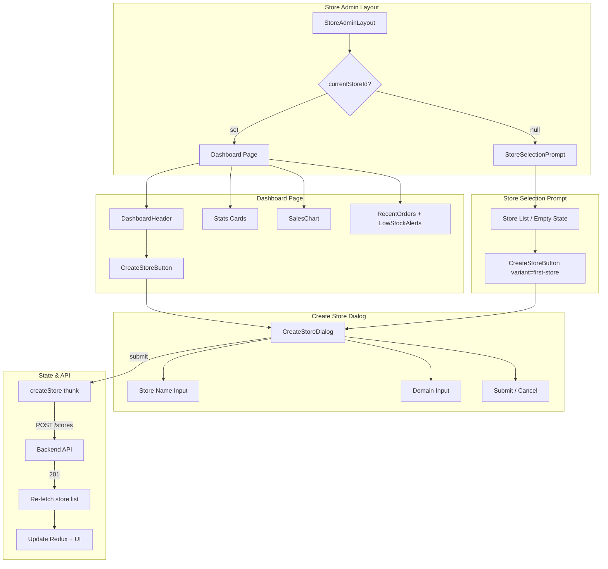
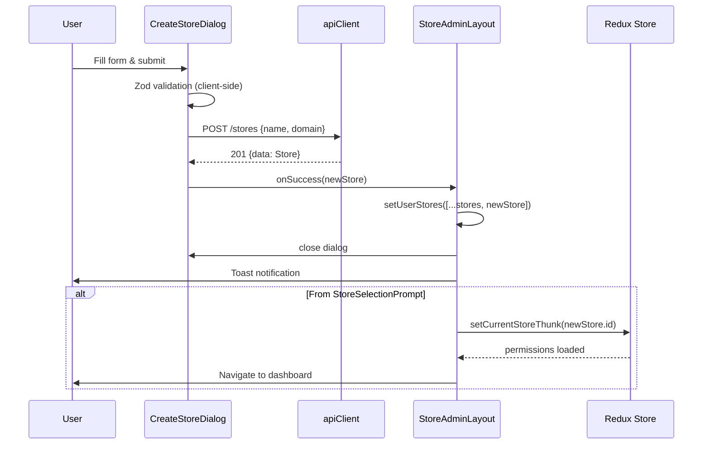

# Design Document: Store Admin Dashboard — Create Store

## Overview

This feature adds a "Create Store" flow to the Store Admin Dashboard, allowing merchants to create additional stores directly from the dashboard page or the store selection prompt. It includes a redesigned page header with a welcome section, a Create Store button with subscription plan limit enforcement, and a modal dialog with validated form fields for store name and domain.

The implementation follows existing patterns: React Hook Form + Zod for validation, Redux Toolkit for state, apiClient for API calls, next-intl for i18n, and shadcn/ui Dialog for the modal.

## Architecture



## Components and Interfaces

### New Components

| Component | Path | Responsibility |
|-----------|------|----------------|
| `DashboardHeader` | `src/components/layouts/DashboardHeader.tsx` | Page header with title, welcome message, and Create Store button |
| `CreateStoreButton` | `src/components/shared/CreateStoreButton.tsx` | Button with subscription limit logic, disabled state, and tooltip |
| `CreateStoreDialog` | `src/components/forms/CreateStoreDialog.tsx` | Modal dialog with form (name + domain), validation, submission, error handling |

### Modified Components

| Component | Path | Changes |
|-----------|------|---------|
| `StoreAdminDashboardPage` | `src/app/(store-admin)/admin/dashboard/page.tsx` | Add `DashboardHeader` above existing stats cards |
| `StoreSelectionPrompt` | `src/app/(store-admin)/layout.tsx` | Add `CreateStoreButton` in empty state section |
| `StoreAdminLayout` | `src/app/(store-admin)/layout.tsx` | Pass subscription/store-count data to children, re-fetch stores on creation |

### Component Interfaces

```typescript
// CreateStoreButton props
interface CreateStoreButtonProps {
  variant?: "default" | "first-store";
  storeCount: number;
  maxStores: number | null; // null = unlimited
  hasActiveSubscription: boolean;
  onOpenDialog: () => void;
}

// CreateStoreDialog props
interface CreateStoreDialogProps {
  open: boolean;
  onOpenChange: (open: boolean) => void;
  onSuccess: (newStore: Store) => void;
}

// DashboardHeader props
interface DashboardHeaderProps {
  userName: string | null;
  storeCount: number;
  maxStores: number | null;
  hasActiveSubscription: boolean;
  onStoreCreated: (newStore: Store) => void;
}
```

## Data Models

### API Request/Response

```typescript
// POST /stores — Create Store Request
interface CreateStoreRequest {
  name: string;   // 2-100 chars
  domain: string; // 3-63 chars, lowercase alphanumeric + hyphens
}

// POST /stores — Success Response (201)
interface CreateStoreResponse {
  success: true;
  data: Store;
  message: string;
}

// Store type (existing)
interface Store {
  id: number;
  name: string;
  domain: string;
  status: StoreStatus;
  currency_code: string;
  locale: string;
  created_at: string;
  updated_at: string;
}

// GET /auth/me/stores — includes subscription info
interface UserStoresResponse {
  success: true;
  data: Store[];
}

// Subscription info (fetched alongside stores or from user profile)
interface UserSubscriptionInfo {
  hasActiveSubscription: boolean;
  maxStores: number | null;
  currentStoreCount: number;
}
```

### Error Response Shapes

```typescript
// 409 Conflict
interface ConflictError {
  success: false;
  message: string;
  errors?: { field: string; message: string }[];
}

// 422 Validation Error
interface ValidationError {
  success: false;
  message: string;
  errors: { field: string; message: string }[];
}

// 403 Forbidden (store limit)
interface ForbiddenError {
  success: false;
  message: string;
  code?: "STORE_LIMIT_REACHED";
}
```

## State Management

### New Redux State

No new slice is needed. The feature uses:

1. **`auth.slice`** — existing `user` (for welcome message name) and `currentStoreId`
2. **Local component state** in `StoreAdminLayout` — `userStores`, `storesLoading` (already exists)
3. **Local state** in `CreateStoreDialog` — form state managed by React Hook Form, submission loading, error messages

### Data Flow for Store Creation



### Subscription Info Fetching

The subscription info (max_stores, current count, active status) will be fetched via a new endpoint or included in the existing `/auth/me/stores` response. The layout will compute:

```typescript
// Computed in StoreAdminLayout
const storeCount = userStores.filter(
  (s) => s.status !== "ARCHIVED" && !s.deleted_at
).length;

// Subscription info fetched from /auth/me/subscription or included in profile
const { maxStores, hasActiveSubscription } = subscriptionInfo;
```

## Validation Schema (Zod)

```typescript
// src/lib/validators/store.schema.ts
import { z } from "zod";

/**
 * Domain validation regex:
 * - Only lowercase a-z, 0-9, and hyphens
 * - Must start and end with a letter or digit
 * - No consecutive hyphens
 * - 3-63 characters
 */
const DOMAIN_REGEX = /^[a-z0-9](?:[a-z0-9]|-(?=[a-z0-9]))*[a-z0-9]$/;

// Single-char domains that are valid (3+ chars required, so this handles the 
// edge case where regex alone would accept 1-2 char matches)
export const createStoreSchema = z.object({
  name: z
    .string()
    .min(2, "validation.storeName.tooShort")
    .max(100, "validation.storeName.tooLong"),
  domain: z
    .string()
    .min(3, "validation.domain.tooShort")
    .max(63, "validation.domain.tooLong")
    .regex(DOMAIN_REGEX, "validation.domain.invalid"),
});

export type CreateStoreFormData = z.infer<typeof createStoreSchema>;
```

### Validation Rules Summary

| Field | Rule | Error Key |
|-------|------|-----------|
| `name` | Required, min 2 chars | `validation.storeName.tooShort` |
| `name` | Max 100 chars | `validation.storeName.tooLong` |
| `domain` | Required, min 3 chars | `validation.domain.tooShort` |
| `domain` | Max 63 chars | `validation.domain.tooLong` |
| `domain` | Lowercase alphanumeric + hyphens, no leading/trailing/consecutive hyphens | `validation.domain.invalid` |

## API Integration

### Endpoint

```
POST /stores
Authorization: Bearer <accessToken>
Content-Type: application/json

Body: { "name": "My Store", "domain": "my-store" }
```

### API Service Function

```typescript
// src/lib/api/services/store.service.ts (new file)
import { apiClient } from "@/lib/api/client";
import type { CreateStoreRequest, Store, ApiResponse } from "@/types";

export const storeService = {
  create: (data: CreateStoreRequest) =>
    apiClient<ApiResponse<Store>>("/stores", {
      method: "POST",
      body: data,
    }),

  getUserSubscriptionInfo: () =>
    apiClient<ApiResponse<UserSubscriptionInfo>>("/auth/me/subscription"),
};
```

### Error Handling Matrix

| HTTP Status | Cause | UI Behavior |
|-------------|-------|-------------|
| 201 | Success | Close dialog, toast, refresh store list |
| 403 | Store limit reached | General error above form |
| 409 | Domain already taken | Inline error below domain field |
| 422 | Validation errors | Map errors to respective fields |
| 5xx | Server error | General error above form, preserve data |
| Network | Connection failure | General error above form, preserve data |

## i18n Keys

### New Keys Required

```json
{
  "createStore": {
    "button": "Create Store",
    "buttonFirstStore": "Create Your First Store",
    "dialogTitle": "Create New Store",
    "dialogDescription": "Enter your store details to get started",
    "nameLabel": "Store Name",
    "namePlaceholder": "e.g., My Awesome Store",
    "domainLabel": "Store Domain",
    "domainPlaceholder": "e.g., my-store",
    "domainHint": "Your store will be accessible at {domain}.wasl.ly",
    "submitButton": "Create",
    "cancelButton": "Cancel",
    "creating": "Creating...",
    "successToast": "Store created successfully!",
    "errors": {
      "domainTaken": "This domain is already taken. Please choose another.",
      "storeLimitReached": "You have reached the maximum number of stores for your plan. Please upgrade to create more stores.",
      "noSubscription": "An active subscription is required to create stores.",
      "networkError": "Connection failed. Please check your internet and try again.",
      "serverError": "Something went wrong. Please try again later."
    },
    "tooltip": {
      "limitReached": "Store limit reached for your current plan. Upgrade to create more stores.",
      "noSubscription": "An active subscription is required to create stores."
    }
  },
  "dashboard": {
    "welcomeMessage": "Welcome back, {name}",
    "welcomeMessageGeneric": "Welcome back",
    "pageTitle": "Dashboard"
  },
  "validation": {
    "storeName": {
      "tooShort": "Store name must be at least 2 characters",
      "tooLong": "Store name must not exceed 100 characters"
    },
    "domain": {
      "tooShort": "Domain must be at least 3 characters",
      "tooLong": "Domain must not exceed 63 characters",
      "invalid": "Domain must contain only lowercase letters, digits, and hyphens. It must start and end with a letter or digit."
    }
  }
}
```

Arabic translations will mirror these keys in `messages/ar.json`.

## Correctness Properties

*A property is a characteristic or behavior that should hold true across all valid executions of a system — essentially, a formal statement about what the system should do. Properties serve as the bridge between human-readable specifications and machine-verifiable correctness guarantees.*

### Property 1: Store Name Validation Correctness

*For any* string `s`, the `createStoreSchema.shape.name` validation SHALL accept `s` if and only if `s.length >= 2 && s.length <= 100`. Strings shorter than 2 characters or longer than 100 characters SHALL be rejected with the appropriate error message.

**Validates: Requirements 2.2, 3.1, 3.4**

### Property 2: Store Domain Validation Correctness

*For any* string `s`, the `createStoreSchema.shape.domain` validation SHALL accept `s` if and only if ALL of the following hold:
- `s.length >= 3 && s.length <= 63`
- `s` contains only lowercase letters (a-z), digits (0-9), and hyphens (-)
- `s` does not start with a hyphen
- `s` does not end with a hyphen
- `s` does not contain consecutive hyphens (--)

**Validates: Requirements 2.3, 3.2, 3.3, 3.5, 3.6**

### Property 3: Store Limit Button State Correctness

*For any* combination of `storeCount` (non-negative integer), `maxStores` (positive integer or null), and `hasActiveSubscription` (boolean), the Create Store button disabled state SHALL be:
- Disabled when `hasActiveSubscription` is false
- Disabled when `maxStores` is not null AND `storeCount >= maxStores`
- Enabled when `hasActiveSubscription` is true AND (`maxStores` is null OR `storeCount < maxStores`)

**Validates: Requirements 5.1, 5.3, 5.4, 5.5, 7.4**

## Error Handling

### Client-Side Errors

| Error Type | Handling |
|------------|----------|
| Zod validation failure | Display inline error below the respective field; prevent form submission |
| Store limit exceeded (client check) | Prevent dialog from opening; show tooltip on disabled button |
| No active subscription | Prevent dialog from opening; show tooltip on disabled button |

### Server-Side Errors

| Error Type | HTTP Code | Handling |
|------------|-----------|----------|
| Domain conflict | 409 | Inline error below domain field: "This domain is already taken" |
| Validation error | 422 | Map `errors[]` array to form fields using `setError()` from React Hook Form |
| Store limit | 403 | General error banner above form: "Store limit reached" |
| Server error | 5xx | General error banner: "Something went wrong" |
| Network/timeout | — | General error banner: "Connection failed"; 10s timeout via AbortController |

### Error Recovery

- All server errors preserve form data (no reset on error)
- Submit and cancel buttons re-enabled after error
- User can retry immediately after fixing the issue
- Toast notifications for transient success messages (auto-dismiss 5s)

## Accessibility Considerations

| Requirement | Implementation |
|-------------|----------------|
| Screen reader label | `aria-label` on Create Store button matching locale |
| Keyboard navigation | Button reachable via Tab; dialog traps focus when open |
| Disabled state | `aria-disabled="true"` (not `disabled` attribute) to keep button in tab order; tooltip on focus |
| Dialog semantics | `role="dialog"`, `aria-modal="true"`, `aria-labelledby` pointing to dialog title |
| Error announcements | `aria-describedby` linking inputs to error messages; `aria-live="polite"` on error regions |
| Focus management | Focus moves to first input on dialog open; returns to trigger button on close |
| RTL support | CSS logical properties (`margin-inline-start`, `padding-inline-end`) throughout |

## Testing Strategy

### Property-Based Tests (fast-check + Vitest)

Property-based testing is appropriate for this feature because the validation logic involves pure functions with large input spaces (arbitrary strings for name/domain, arbitrary numbers for store limits).

- **Library**: fast-check (already in project dependencies)
- **Minimum iterations**: 100 per property
- **Tag format**: `Feature: store-admin-dashboard-create-store, Property {N}: {description}`

Each correctness property maps to a single property-based test:
1. Name validation — generate random strings, verify acceptance/rejection matches length rules
2. Domain validation — generate random strings, verify acceptance/rejection matches all domain rules
3. Store limit button state — generate random (count, maxStores, hasSubscription) tuples, verify disabled state

### Unit Tests (Vitest + Testing Library)

- `CreateStoreDialog` renders correctly with all fields
- Cancel closes dialog and resets form
- Submit with valid data calls API
- Error responses display correct messages (409, 422, 403, 5xx)
- Loading state disables buttons
- Success closes dialog and calls onSuccess callback
- `CreateStoreButton` renders enabled/disabled based on props
- `DashboardHeader` displays welcome message with/without name
- Tooltip shows on disabled button hover/focus

### Integration Tests

- Full flow: open dialog → fill form → submit → verify store list updated
- Store creation from StoreSelectionPrompt → auto-selects new store → navigates to dashboard
- API error handling end-to-end with mocked responses

### E2E Tests (Playwright)

- Create store happy path (dashboard)
- Create store happy path (store selection prompt)
- Validation error display
- Store limit enforcement (disabled button + tooltip)
- RTL layout verification
