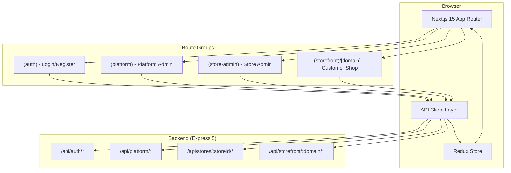
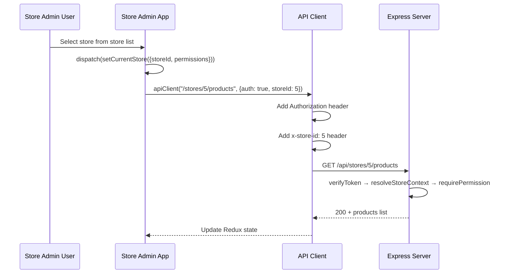
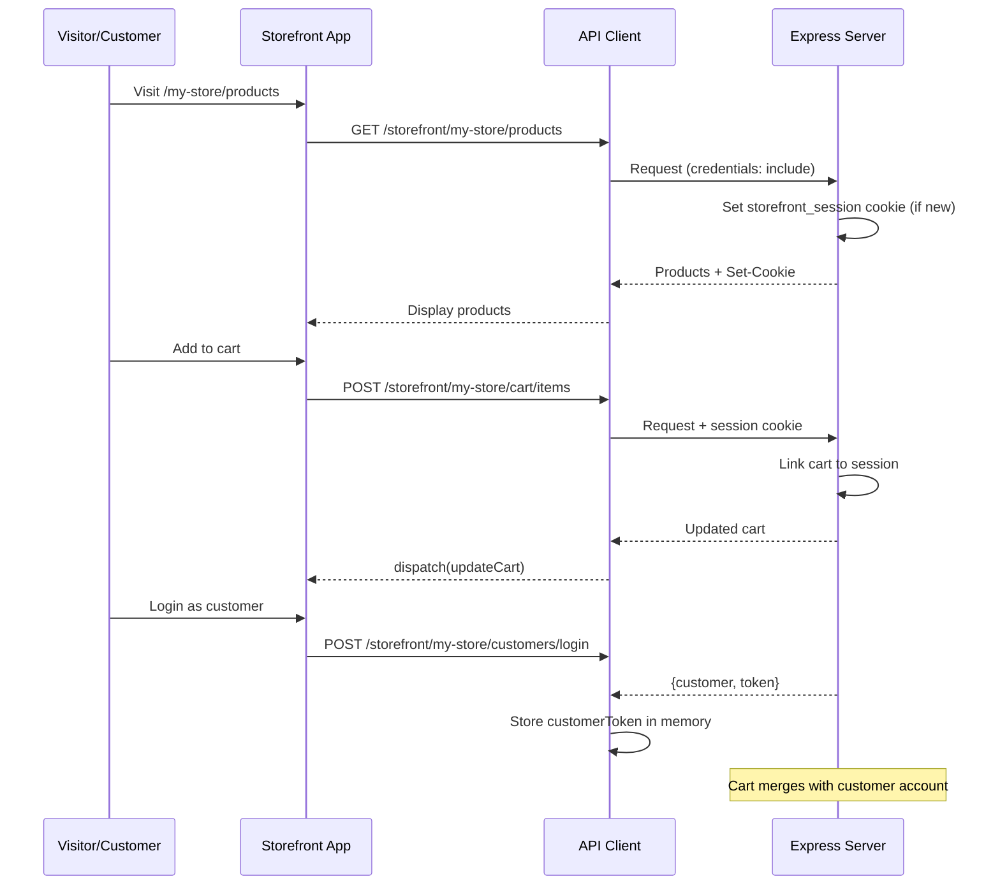

# Design Document: Wasl SaaS Frontend

## Overview

Wasl SaaS Frontend is a comprehensive multi-tenant e-commerce platform built with Next.js 15 App Router, serving three distinct interfaces: Platform Admin Dashboard (platform owner management), Store Admin Dashboard (merchant control panel), and Storefront (customer-facing shop). The application communicates with an Express 5 backend via RESTful APIs, implementing dual JWT authentication systems (Admin JWT with refresh tokens for dashboard users, Customer JWT for storefront shoppers), role-based access control (RBAC), and multi-tenancy through store-scoped headers and domain-based URL routing.

The architecture follows a layer-based pattern with Redux Toolkit for predictable state management, React Hook Form + Zod for type-safe form validation, TanStack Table for data-heavy views, and shadcn/ui + Tailwind CSS for a consistent, themeable design system supporting RTL (Arabic) and LTR (English) layouts with dark/light mode.

## Architecture

### High-Level System Architecture



### Authentication Flow Architecture

```mermaid
sequenceDiagram
    participant U as User/Browser
    participant MW as Next.js Middleware
    participant App as Client Component
    participant API as API Client
    participant S as Express Server

    U->>MW: Navigate to protected route
    MW->>MW: Check refresh_token cookie
    alt No cookie
        MW-->>U: Redirect to /login
    else Has cookie
        MW-->>App: Allow access
    end

    App->>API: apiClient(endpoint, {auth: true})
    API->>API: Attach accessToken from memory
    API->>S: Request + Authorization header
    
    alt Token valid
        S-->>API: 200 + data
        API-->>App: Parsed response
    else Token expired (401)
        API->>S: POST /auth/refresh (cookie)
        alt Refresh success
            S-->>API: New accessToken
            API->>API: Store new token in memory
            API->>S: Retry original request
            S-->>API: 200 + data
            API-->>App: Parsed response
        else Refresh failed
            API->>API: Clear token
            API-->>U: Redirect to /login
        end
    end
```



### Store Admin Multi-Tenancy Flow



### Storefront Session & Cart Flow



## Components and Interfaces

### Component 1: API Client (`lib/api/client.ts`)

**Purpose**: Centralized HTTP client wrapping native fetch with automatic token management, refresh logic, and multi-tenancy headers.

```typescript
interface FetchOptions extends Omit<RequestInit, "headers"> {
  auth?: boolean;
  storeId?: number;
  customerToken?: string;
  headers?: Record<string, string>;
}

interface ApiClientInterface {
  // Core request method
  request<T>(endpoint: string, options?: FetchOptions): Promise<ApiResponse<T>>;
  
  // Token management
  setAccessToken(token: string | null): void;
  getAccessToken(): string | null;
  setCustomerToken(token: string | null): void;
  getCustomerToken(): string | null;
  
  // Refresh mechanism
  attemptRefresh(): Promise<boolean>;
}
```

**Responsibilities**:
- Attach Authorization header when `auth: true`
- Attach `x-store-id` header when `storeId` provided
- Auto-refresh on 401 responses (single retry)
- Redirect to login on refresh failure
- Parse JSON responses into typed `ApiResponse<T>`
- Include credentials for cookie-based refresh tokens

### Component 2: Redux Store (`lib/store/`)

**Purpose**: Centralized, predictable state management with domain-specific slices and async thunks.

```typescript
interface RootState {
  auth: AuthState;
  products: ProductsState;
  orders: OrdersState;
  categories: CategoriesState;
  customers: CustomersState;
  coupons: CouponsState;
  inventory: InventoryState;
  members: MembersState;
  platform: PlatformState;
  cart: CartState;
  ui: UIState;
}

interface AuthState {
  user: User | null;
  isAuthenticated: boolean;
  loading: boolean;
  error: string | null;
  permissions: string[];
  currentStoreId: number | null;
}

interface ProductsState {
  items: Product[];
  currentProduct: Product | null;
  meta: PaginationMeta | null;
  loading: boolean;
  error: string | null;
}

interface CartState {
  items: CartItem[];
  subtotal: number;
  discount: number;
  total: number;
  coupon: AppliedCoupon | null;
  loading: boolean;
}

interface PlatformState {
  users: { items: User[]; meta: PaginationMeta | null; loading: boolean };
  stores: { items: Store[]; meta: PaginationMeta | null; loading: boolean };
  plans: { items: Plan[]; loading: boolean };
  stats: DashboardStats | null;
}

interface UIState {
  sidebarCollapsed: boolean;
  activeModal: string | null;
  toasts: Toast[];
  locale: "ar" | "en";
  direction: "rtl" | "ltr";
}
```

**Responsibilities**:
- Maintain application state across all three interfaces
- Handle async API calls via thunks with loading/error states
- Provide typed selectors for component consumption
- Manage optimistic updates for cart operations

### Component 3: Next.js Middleware (`middleware.ts`)

**Purpose**: Route protection and redirection based on authentication state.

```typescript
interface MiddlewareConfig {
  publicPaths: string[];
  authPaths: string[];
  platformPaths: string[];
  storeAdminPaths: string[];
  storefrontPattern: RegExp;
}

// Middleware decision logic
type MiddlewareDecision = 
  | { action: "allow" }
  | { action: "redirect"; destination: string };
```

**Responsibilities**:
- Check `refresh_token` cookie presence for auth state
- Redirect authenticated users away from login/register
- Redirect unauthenticated users to login from protected routes
- Allow storefront routes without authentication
- Skip API routes, static files, and images

### Component 4: Permission Guard (`hooks/usePermission.ts`)

**Purpose**: Client-side permission checking for UI element visibility and route access.

```typescript
interface PermissionGuardInterface {
  usePermission(permission: string): boolean;
  usePermissions(permissions: string[]): boolean;
  useHasAnyPermission(permissions: string[]): boolean;
}

// Component wrapper
interface PermissionGateProps {
  permission: string;
  children: React.ReactNode;
  fallback?: React.ReactNode;
}
```

**Responsibilities**:
- Read permissions from Redux auth state
- Conditionally render UI elements based on user permissions
- Provide both hook and component-based APIs
- Support single and multiple permission checks

### Component 5: Form System (`components/forms/`)

**Purpose**: Type-safe form handling with Zod validation integrated with React Hook Form.

```typescript
interface FormComponentProps<T extends z.ZodSchema> {
  schema: T;
  defaultValues?: Partial<z.infer<T>>;
  onSubmit: (data: z.infer<T>) => Promise<void>;
  serverErrors?: Record<string, string>;
}

// Reusable form field component
interface FormFieldProps {
  name: string;
  label: string;
  type?: "text" | "email" | "password" | "number" | "textarea" | "select";
  placeholder?: string;
  options?: { value: string; label: string }[];
  required?: boolean;
  disabled?: boolean;
}
```

**Responsibilities**:
- Client-side validation with Zod schemas
- Server-side error mapping to form fields (422 responses)
- Loading states during submission
- RTL-aware field layout
- Accessible form controls with proper labels and error messages

### Component 6: Data Table System (`components/tables/`)

**Purpose**: Reusable, sortable, filterable data tables powered by TanStack Table.

```typescript
interface DataTableProps<T> {
  columns: ColumnDef<T>[];
  data: T[];
  meta?: PaginationMeta;
  loading?: boolean;
  onPageChange?: (page: number) => void;
  onSortChange?: (sortBy: string, sortOrder: "asc" | "desc") => void;
  onRowAction?: (action: string, row: T) => void;
  searchable?: boolean;
  onSearch?: (query: string) => void;
  emptyMessage?: string;
}

interface ColumnDef<T> {
  id: string;
  header: string;
  accessorKey?: keyof T;
  cell?: (row: T) => React.ReactNode;
  sortable?: boolean;
  filterable?: boolean;
}
```

**Responsibilities**:
- Server-side pagination with meta information
- Column sorting with backend integration
- Row actions (edit, delete, view, status change)
- Loading skeletons during data fetch
- Empty state display
- Responsive layout for mobile

## Data Models

### User & Authentication

```typescript
interface User {
  id: number;
  name: string;
  email: string;
  phone: string;
  avatar_url: string | null;
  system_role: SystemRole;
  is_active: boolean;
  last_login_at: string | null;
  created_at: string;
  updated_at: string;
}

type SystemRole = "USER" | "SUPPORT" | "PLATFORM_ADMIN" | "PLATFORM_OWNER";

interface Customer {
  id: number;
  store_id: number;
  first_name: string;
  last_name: string | null;
  email: string;
  phone: string | null;
  status: CustomerStatus;
  total_orders: number;
  total_spent: string;
  created_at: string;
}

type CustomerStatus = "ACTIVE" | "BLOCKED" | "ARCHIVED";
```

**Validation Rules**:
- `name`: 2-100 characters
- `email`: valid email format
- `phone`: regex `+?[0-9]{7,15}`
- `password`: 8-128 characters
- `system_role`: only PLATFORM_OWNER can assign PLATFORM_ADMIN

### Store & Settings

```typescript
interface Store {
  id: number;
  name: string;
  domain: string;
  status: StoreStatus;
  owner_id: number;
  logo_url: string | null;
  favicon_url: string | null;
  description: string | null;
  meta_title: string | null;
  meta_description: string | null;
  support_email: string | null;
  support_phone: string | null;
  social_links: Record<string, string> | null;
  created_at: string;
  updated_at: string;
}

type StoreStatus = "DRAFT" | "ACTIVE" | "SUSPENDED" | "ARCHIVED";

// Status transitions
const STORE_STATUS_TRANSITIONS: Record<StoreStatus, StoreStatus[]> = {
  DRAFT: ["ACTIVE"],
  ACTIVE: ["SUSPENDED", "ARCHIVED"],
  SUSPENDED: ["ACTIVE", "ARCHIVED"],
  ARCHIVED: [],
};
```

**Validation Rules**:
- `name`: 2-100 characters
- `domain`: 3-63 characters, lowercase, numbers and hyphens only
- Status transitions must follow the state machine

### Product & Variants

```typescript
interface Product {
  id: number;
  name: string;
  slug: string;
  description: string | null;
  short_description: string | null;
  status: ProductStatus;
  base_price: string; // Decimal as string
  compare_at_price: string | null;
  cost_price: string | null;
  track_inventory: boolean;
  has_variants: boolean;
  is_published: boolean;
  published_at: string | null;
  categories?: Category[];
  media?: ProductMedia[];
  variants?: ProductVariant[];
  created_at: string;
  updated_at: string;
}

type ProductStatus = "DRAFT" | "ACTIVE" | "ARCHIVED";

interface ProductVariant {
  id: number;
  product_id: number;
  title: string;
  sku: string;
  barcode: string | null;
  price: string | null;
  compare_at_price: string | null;
  is_default: boolean;
  is_active: boolean;
  option_values?: OptionValue[];
  inventory?: InventoryLevel;
}

interface ProductOption {
  id: number;
  name: string;
  position: number;
  values: OptionValue[];
}

interface OptionValue {
  id: number;
  value: string;
  position: number;
}

interface ProductMedia {
  id: number;
  url: string;
  alt_text: string | null;
  sort_order: number;
}
```

**Validation Rules**:
- `name`: required, 2-200 characters
- `slug`: auto-generated or manual, unique per store
- `base_price`: positive decimal
- `sku`: unique per store
- Media: max 5MB per image, auto-converted to WebP

### Order & Checkout

```typescript
interface Order {
  id: number;
  order_number: string;
  store_id: number;
  customer_id: number | null;
  status: OrderStatus;
  payment_status: PaymentStatus;
  source: OrderSource;
  subtotal: string;
  discount_amount: string;
  shipping_amount: string;
  total: string;
  currency: string;
  customer_name: string;
  customer_phone: string;
  customer_email: string | null;
  shipping_address: Address;
  payment_method: PaymentMethod;
  notes_from_customer: string | null;
  internal_notes: OrderNote[];
  items: OrderItem[];
  timeline: TimelineEvent[];
  created_at: string;
  updated_at: string;
}

type OrderStatus = 
  | "DRAFT" | "PENDING" | "CONFIRMED" | "PROCESSING" 
  | "PREPARING" | "SHIPPED" | "IN_TRANSIT" 
  | "OUT_FOR_DELIVERY" | "DELIVERED" | "CANCELED" | "RETURNED";

type PaymentStatus = 
  | "UNPAID" | "PENDING" | "PARTIALLY_PAID" 
  | "PAID" | "FAILED" | "REFUNDED" | "PARTIALLY_REFUNDED";

type PaymentMethod = "CASH_ON_DELIVERY" | "CARD" | "BANK_TRANSFER" | "WALLET" | "MANUAL";
type OrderSource = "STOREFRONT" | "ADMIN" | "MANUAL" | "INSTAGRAM" | "FACEBOOK" | "TIKTOK";

// Order status state machine
const ORDER_STATUS_TRANSITIONS: Record<OrderStatus, OrderStatus[]> = {
  DRAFT: ["PENDING", "CANCELED"],
  PENDING: ["CONFIRMED", "CANCELED"],
  CONFIRMED: ["PROCESSING", "CANCELED"],
  PROCESSING: ["PREPARING", "CANCELED"],
  PREPARING: ["SHIPPED", "CANCELED"],
  SHIPPED: ["IN_TRANSIT", "CANCELED"],
  IN_TRANSIT: ["OUT_FOR_DELIVERY", "CANCELED"],
  OUT_FOR_DELIVERY: ["DELIVERED", "CANCELED"],
  DELIVERED: ["RETURNED"],
  CANCELED: [],
  RETURNED: [],
};
```

### Cart (Storefront)

```typescript
interface Cart {
  id: number;
  items: CartItem[];
  subtotal: string;
  discount_amount: string;
  total: string;
  coupon: AppliedCoupon | null;
  item_count: number;
}

interface CartItem {
  id: number;
  product_id: number;
  variant_id: number;
  quantity: number;
  unit_price: string;
  total_price: string;
  product: {
    name: string;
    slug: string;
    media: ProductMedia[];
  };
  variant: {
    title: string;
    sku: string;
  };
}

interface AppliedCoupon {
  code: string;
  type: "PERCENTAGE" | "FIXED";
  value: number;
  discount_amount: string;
}
```

### Category (Tree Structure)

```typescript
interface Category {
  id: number;
  name: string;
  slug: string;
  description: string | null;
  parent_id: number | null;
  image_url: string | null;
  sort_order: number;
  is_active: boolean;
  children?: Category[];
  product_count?: number;
}
```

### Inventory

```typescript
interface InventoryLevel {
  variant_id: number;
  available_quantity: number;
  total_quantity: number;
  reserved_quantity: number;
  low_stock_threshold: number;
}

interface InventoryMovement {
  id: number;
  variant_id: number;
  type: InventoryMovementType;
  quantity_change: number;
  reason: string | null;
  created_at: string;
}

type InventoryMovementType = 
  | "IN" | "ADJUSTMENT_IN" | "OUT" | "ADJUSTMENT_OUT"
  | "RESERVED" | "RELEASED" | "RETURNED";
```

### Coupon

```typescript
interface Coupon {
  id: number;
  code: string;
  type: "PERCENTAGE" | "FIXED";
  value: number;
  minimum_order_amount: number | null;
  maximum_discount_amount: number | null;
  usage_limit: number | null;
  usage_limit_per_customer: number | null;
  usage_count: number;
  starts_at: string | null;
  ends_at: string | null;
  is_active: boolean;
  created_at: string;
}
```

### Plan & Subscription (Platform)

```typescript
interface Plan {
  id: number;
  code: string;
  name: string;
  price_monthly: string;
  price_yearly: string | null;
  features: Record<string, unknown>;
  is_active: boolean;
  created_at: string;
}

interface Subscription {
  id: number;
  store_id: number;
  plan_id: number;
  status: SubscriptionStatus;
  billing_cycle: BillingCycle;
  current_period_start: string;
  current_period_end: string;
  plan?: Plan;
  store?: Store;
}

type SubscriptionStatus = "TRIALING" | "ACTIVE" | "PAST_DUE" | "CANCELED" | "EXPIRED";
type BillingCycle = "MONTHLY" | "YEARLY";
```


## Algorithmic Pseudocode

### Token Refresh Algorithm

```typescript
// API Client — Auto-refresh on 401
async function apiClientRequest<T>(
  endpoint: string,
  options: FetchOptions = {}
): Promise<ApiResponse<T>> {
  const { auth = false, storeId, customerToken, headers: customHeaders, ...fetchOptions } = options;

  const headers: Record<string, string> = {
    "Content-Type": "application/json",
    ...customHeaders,
  };

  // Attach appropriate auth header
  if (auth && accessToken) {
    headers["Authorization"] = `Bearer ${accessToken}`;
  } else if (customerToken) {
    headers["Authorization"] = `Bearer ${customerToken}`;
  }

  // Attach store context header
  if (storeId) {
    headers["x-store-id"] = String(storeId);
  }

  const response = await fetch(`${API_BASE_URL}${endpoint}`, {
    ...fetchOptions,
    headers,
    credentials: "include",
  });

  // Auto-refresh on 401 (only for admin auth, not customer)
  if (response.status === 401 && auth && !options._isRetry) {
    const refreshed = await attemptRefresh();
    if (refreshed) {
      return apiClientRequest<T>(endpoint, { ...options, _isRetry: true });
    }
    // Refresh failed — redirect to login
    setAccessToken(null);
    if (typeof window !== "undefined") {
      window.location.href = "/login";
    }
    throw new Error("Session expired");
  }

  const result = await response.json();

  if (!response.ok) {
    throw result; // Throw ApiError for caller to handle
  }

  return result;
}
```

**Preconditions:**
- `endpoint` is a valid API path starting with `/`
- `API_BASE_URL` is configured and reachable
- If `auth: true`, an accessToken should exist in memory (or refresh will be attempted)

**Postconditions:**
- Returns typed `ApiResponse<T>` on success
- Throws `ApiError` on non-401 failures
- On 401: attempts refresh exactly once, retries original request if successful
- On refresh failure: clears token, redirects to login, throws error

**Loop Invariants:**
- Maximum one retry per request (guarded by `_isRetry` flag)
- Token state is consistent: either valid token in memory or null

### Order Status Transition Algorithm

```typescript
// Validates and executes order status transitions
function canTransitionTo(currentStatus: OrderStatus, targetStatus: OrderStatus): boolean {
  const allowedTransitions = ORDER_STATUS_TRANSITIONS[currentStatus];
  return allowedTransitions.includes(targetStatus);
}

function getAvailableTransitions(currentStatus: OrderStatus): OrderStatus[] {
  return ORDER_STATUS_TRANSITIONS[currentStatus];
}

// Used in Order detail page to show available action buttons
function getOrderActions(order: Order): OrderAction[] {
  const actions: OrderAction[] = [];
  const available = getAvailableTransitions(order.status);

  for (const status of available) {
    if (status === "CANCELED") {
      actions.push({ type: "cancel", label: "إلغاء الطلب", variant: "destructive" });
    } else {
      actions.push({
        type: "transition",
        targetStatus: status,
        label: ORDER_STATUS_LABELS[status],
        variant: "default",
      });
    }
  }

  return actions;
}
```

**Preconditions:**
- `currentStatus` is a valid `OrderStatus` enum value
- `ORDER_STATUS_TRANSITIONS` map is complete and covers all statuses

**Postconditions:**
- `canTransitionTo` returns `true` only for valid transitions per state machine
- `getAvailableTransitions` returns empty array for terminal states (CANCELED, RETURNED)
- `getOrderActions` returns UI-ready action descriptors

### Category Tree Builder Algorithm

```typescript
// Transforms flat category list into nested tree structure
function buildCategoryTree(categories: Category[]): Category[] {
  const map = new Map<number, Category & { children: Category[] }>();
  const roots: Category[] = [];

  // First pass: create map with empty children arrays
  for (const cat of categories) {
    map.set(cat.id, { ...cat, children: [] });
  }

  // Second pass: link children to parents
  for (const cat of categories) {
    const node = map.get(cat.id)!;
    if (cat.parent_id === null) {
      roots.push(node);
    } else {
      const parent = map.get(cat.parent_id);
      if (parent) {
        parent.children.push(node);
      } else {
        // Orphan — treat as root
        roots.push(node);
      }
    }
  }

  // Sort by sort_order at each level
  const sortChildren = (nodes: Category[]): Category[] => {
    nodes.sort((a, b) => a.sort_order - b.sort_order);
    for (const node of nodes) {
      if (node.children && node.children.length > 0) {
        sortChildren(node.children);
      }
    }
    return nodes;
  };

  return sortChildren(roots);
}
```

**Preconditions:**
- `categories` is a flat array of Category objects from the API
- Each category has a unique `id`
- `parent_id` references a valid category id or is null (root)

**Postconditions:**
- Returns array of root categories, each with nested `children`
- All categories appear exactly once in the tree
- Children are sorted by `sort_order` at every level
- Orphaned categories (invalid parent_id) become roots

**Loop Invariants:**
- After first pass: every category has an entry in the map
- After second pass: every category is either a root or linked to its parent

### Cart Operations Algorithm

```typescript
// Optimistic cart update with rollback on failure
async function addToCart(
  domain: string,
  productId: number,
  variantId: number,
  quantity: number
): Promise<void> {
  // Optimistic update
  const optimisticItem: CartItem = {
    id: Date.now(), // temporary ID
    product_id: productId,
    variant_id: variantId,
    quantity,
    unit_price: "0",
    total_price: "0",
    product: { name: "Loading...", slug: "", media: [] },
    variant: { title: "", sku: "" },
  };

  dispatch(cartSlice.actions.addItemOptimistic(optimisticItem));

  try {
    const response = await apiClient<Cart>(
      `/storefront/${domain}/cart/items`,
      {
        method: "POST",
        body: JSON.stringify({ product_id: productId, variant_id: variantId, quantity }),
      }
    );
    // Replace optimistic state with server response
    dispatch(cartSlice.actions.setCart(response.data));
  } catch (error) {
    // Rollback optimistic update
    dispatch(cartSlice.actions.removeItemOptimistic(optimisticItem.id));
    throw error;
  }
}

// Update quantity (0 = remove)
async function updateCartItemQuantity(
  domain: string,
  itemId: number,
  quantity: number
): Promise<void> {
  if (quantity === 0) {
    await removeCartItem(domain, itemId);
    return;
  }

  const previousQuantity = selectCartItemQuantity(store.getState(), itemId);
  dispatch(cartSlice.actions.updateQuantityOptimistic({ itemId, quantity }));

  try {
    const response = await apiClient<Cart>(
      `/storefront/${domain}/cart/items/${itemId}`,
      {
        method: "PATCH",
        body: JSON.stringify({ quantity }),
      }
    );
    dispatch(cartSlice.actions.setCart(response.data));
  } catch (error) {
    dispatch(cartSlice.actions.updateQuantityOptimistic({ itemId, quantity: previousQuantity }));
    throw error;
  }
}
```

**Preconditions:**
- `domain` is a valid store domain string
- `productId` and `variantId` reference existing, active products/variants
- `quantity` is a positive integer (or 0 for removal)
- Session cookie is present (set automatically by backend)

**Postconditions:**
- On success: cart state matches server response exactly
- On failure: cart state rolls back to pre-operation state
- UI reflects optimistic update immediately (no loading delay for user)

### Permission-Based UI Rendering Algorithm

```typescript
// Determines which sidebar items and actions to show based on user permissions
function buildSidebarItems(permissions: string[]): SidebarItem[] {
  const allItems: SidebarItem[] = [
    { path: "/dashboard", label: "لوحة التحكم", icon: "LayoutDashboard", permission: "dashboard:view" },
    { path: "/products", label: "المنتجات", icon: "Package", permission: "product:view" },
    { path: "/categories", label: "الفئات", icon: "FolderTree", permission: "category:view" },
    { path: "/orders", label: "الطلبات", icon: "ShoppingCart", permission: "order:view" },
    { path: "/customers", label: "العملاء", icon: "Users", permission: "customer:view" },
    { path: "/coupons", label: "الكوبونات", icon: "Ticket", permission: "coupon:view" },
    { path: "/inventory", label: "المخزون", icon: "Warehouse", permission: "inventory:view" },
    { path: "/members", label: "الأعضاء", icon: "UserPlus", permission: "member:view" },
    { path: "/roles", label: "الأدوار", icon: "Shield", permission: "role:view" },
    { path: "/settings", label: "الإعدادات", icon: "Settings", permission: "store:view" },
  ];

  return allItems.filter((item) => permissions.includes(item.permission));
}

// Check if user can perform action on a resource
function canPerformAction(
  permissions: string[],
  module: string,
  action: string
): boolean {
  return permissions.includes(`${module}:${action}`);
}
```

**Preconditions:**
- `permissions` is an array of permission strings in format `module:action`
- Permission strings are loaded from the user's membership in the current store

**Postconditions:**
- Only items the user has permission to view are returned
- Empty permissions array results in empty sidebar (no access)
- Owner role sees all items (has all permissions)

## Key Functions with Formal Specifications

### Function: `attemptRefresh()`

```typescript
async function attemptRefresh(): Promise<boolean>
```

**Preconditions:**
- A valid `refresh_token` httpOnly cookie exists in the browser
- The backend `/auth/refresh` endpoint is reachable

**Postconditions:**
- Returns `true` if refresh succeeded and new accessToken is stored in memory
- Returns `false` if refresh failed (expired cookie, network error)
- On success: `getAccessToken()` returns the new token
- On failure: no side effects on current token state

### Function: `dispatch(loginThunk(credentials))`

```typescript
const loginThunk = createAsyncThunk<AuthResponse, LoginPayload>(
  "auth/login",
  async (payload, { rejectWithValue }) => { ... }
);
```

**Preconditions:**
- `payload.identifier` is non-empty (email or phone)
- `payload.password` is non-empty (8+ characters)

**Postconditions:**
- On success: `state.auth.user` is populated, `state.auth.isAuthenticated === true`, accessToken stored in memory, refresh_token cookie set by server
- On rejection: `state.auth.error` contains error message, `state.auth.isAuthenticated === false`
- Loading state transitions: `idle → loading → idle`

### Function: `buildCategoryTree(categories)`

```typescript
function buildCategoryTree(categories: Category[]): Category[]
```

**Preconditions:**
- Input is a flat array of categories (may be empty)
- Each category has unique `id` field

**Postconditions:**
- Output is a nested tree where each node's `children` contains its direct children
- `∀ cat ∈ input: cat appears exactly once in output tree`
- Root nodes have `parent_id === null`
- Children sorted by `sort_order` ascending at every level

### Function: `canTransitionTo(current, target)`

```typescript
function canTransitionTo(currentStatus: OrderStatus, targetStatus: OrderStatus): boolean
```

**Preconditions:**
- Both parameters are valid `OrderStatus` enum values

**Postconditions:**
- Returns `true` iff `target ∈ ORDER_STATUS_TRANSITIONS[current]`
- Terminal states (CANCELED, RETURNED) always return `false` for any target
- Consistent with backend validation (prevents invalid API calls)

### Function: `apiClient<T>(endpoint, options)`

```typescript
async function apiClient<T>(endpoint: string, options?: FetchOptions): Promise<ApiResponse<T>>
```

**Preconditions:**
- `endpoint` starts with `/`
- If `options.auth === true`, token refresh mechanism is available
- If `options.storeId` provided, user has membership in that store

**Postconditions:**
- Returns `ApiResponse<T>` with `success: true` and typed `data` field
- Throws `ApiError` object (with `success: false`) on any non-2xx response (except 401 which triggers refresh)
- Maximum one automatic retry per request
- All requests include `credentials: "include"` for cookie handling

## Example Usage

### Authentication Flow

```typescript
// Login page component
"use client";
import { useForm } from "react-hook-form";
import { zodResolver } from "@hookform/resolvers/zod";
import { loginSchema, LoginFormData } from "@/lib/validators/auth.schema";
import { useAppDispatch, useAppSelector } from "@/lib/store/hooks";
import { loginThunk } from "@/lib/store/slices/auth.thunks";
import { selectAuthLoading, selectAuthError } from "@/lib/store/slices/auth.slice";
import { useRouter } from "next/navigation";

export function LoginForm() {
  const dispatch = useAppDispatch();
  const router = useRouter();
  const loading = useAppSelector(selectAuthLoading);
  const error = useAppSelector(selectAuthError);

  const { register, handleSubmit, formState: { errors } } = useForm<LoginFormData>({
    resolver: zodResolver(loginSchema),
  });

  const onSubmit = async (data: LoginFormData) => {
    const result = await dispatch(loginThunk(data));
    if (loginThunk.fulfilled.match(result)) {
      const user = result.payload.user;
      if (user.system_role === "PLATFORM_ADMIN" || user.system_role === "PLATFORM_OWNER") {
        router.push("/platform/dashboard");
      } else {
        router.push("/dashboard");
      }
    }
  };

  return (
    <form onSubmit={handleSubmit(onSubmit)} className="space-y-4">
      <FormField label="البريد أو رقم الهاتف" error={errors.identifier?.message}>
        <Input {...register("identifier")} placeholder="email@example.com" />
      </FormField>
      <FormField label="كلمة المرور" error={errors.password?.message}>
        <Input type="password" {...register("password")} />
      </FormField>
      {error && <Alert variant="destructive">{error}</Alert>}
      <Button type="submit" loading={loading} className="w-full">
        تسجيل الدخول
      </Button>
    </form>
  );
}
```

### Store Admin — Products List with Permissions

```typescript
"use client";
import { useEffect } from "react";
import { useAppDispatch, useAppSelector } from "@/lib/store/hooks";
import { fetchProductsThunk } from "@/lib/store/slices/products.thunks";
import { selectProducts, selectProductsMeta, selectProductsLoading } from "@/lib/store/slices/products.slice";
import { usePermission } from "@/hooks/usePermission";
import { DataTable } from "@/components/tables/DataTable";
import { productColumns } from "./columns";

export function ProductsPageClient() {
  const dispatch = useAppDispatch();
  const products = useAppSelector(selectProducts);
  const meta = useAppSelector(selectProductsMeta);
  const loading = useAppSelector(selectProductsLoading);
  const canCreate = usePermission("product:create");

  useEffect(() => {
    dispatch(fetchProductsThunk({ page: 1, limit: 20 }));
  }, [dispatch]);

  return (
    <div className="space-y-4">
      <div className="flex items-center justify-between">
        <h1 className="text-2xl font-bold">المنتجات</h1>
        {canCreate && (
          <Button asChild>
            <Link href="/products/new">إضافة منتج</Link>
          </Button>
        )}
      </div>
      <DataTable
        columns={productColumns}
        data={products}
        meta={meta}
        loading={loading}
        onPageChange={(page) => dispatch(fetchProductsThunk({ page, limit: 20 }))}
      />
    </div>
  );
}
```

### Storefront — Cart with Optimistic Updates

```typescript
"use client";
import { useAppDispatch, useAppSelector } from "@/lib/store/hooks";
import { addToCartThunk } from "@/lib/store/slices/cart.thunks";
import { selectCartItems, selectCartTotal } from "@/lib/store/slices/cart.slice";
import { useParams } from "next/navigation";

export function AddToCartButton({ productId, variantId }: Props) {
  const dispatch = useAppDispatch();
  const { domain } = useParams<{ domain: string }>();
  const [quantity, setQuantity] = useState(1);

  const handleAdd = async () => {
    try {
      await dispatch(addToCartThunk({ domain, productId, variantId, quantity })).unwrap();
      toast.success("تمت الإضافة للسلة");
    } catch (error) {
      toast.error("فشل في الإضافة");
    }
  };

  return (
    <div className="flex items-center gap-2">
      <QuantitySelector value={quantity} onChange={setQuantity} min={1} />
      <Button onClick={handleAdd}>أضف للسلة</Button>
    </div>
  );
}
```

### Platform Admin — Store Status Management

```typescript
"use client";
import { useState } from "react";
import { STORE_STATUS_TRANSITIONS } from "@/lib/constants/enums";
import { platformService } from "@/lib/api/services/platform.service";

export function StoreStatusControl({ store }: { store: Store }) {
  const [loading, setLoading] = useState(false);
  const availableStatuses = STORE_STATUS_TRANSITIONS[store.status];

  const handleStatusChange = async (newStatus: StoreStatus) => {
    setLoading(true);
    try {
      await platformService.updateStoreStatus(store.id, newStatus);
      toast.success("تم تحديث حالة المتجر");
      router.refresh();
    } catch (error) {
      toast.error(getErrorMessage(error));
    } finally {
      setLoading(false);
    }
  };

  return (
    <div className="flex gap-2">
      {availableStatuses.map((status) => (
        <Button
          key={status}
          variant={status === "SUSPENDED" ? "destructive" : "default"}
          onClick={() => handleStatusChange(status)}
          disabled={loading}
        >
          {STORE_STATUS_LABELS[status]}
        </Button>
      ))}
    </div>
  );
}
```

## Correctness Properties

*A property is a characteristic or behavior that should hold true across all valid executions of a system — essentially, a formal statement about what the system should do. Properties serve as the bridge between human-readable specifications and machine-verifiable correctness guarantees.*

### Property 1: Token Refresh Idempotency

*For any* API request that receives a 401 response, the refresh mechanism SHALL fire at most once, and the original request SHALL be retried at most once. `∀ request R: retryCount(R) ≤ 1`

**Validates: Requirements 1.4, 26.4**

### Property 2: Auth State Consistency

*For any* auth state, if `isAuthenticated === true` then `user !== null`. Conversely, after logout, `isAuthenticated === false` AND `user === null` AND `permissions === []` AND `currentStoreId === null`.

**Validates: Requirements 1.3, 27.2**

### Property 3: Permission Guard Correctness

*For any* permission string P and any permissions array A stored in auth state, `usePermission(P)` returns `true` if and only if `P ∈ A`. A UI element guarded by a permission is rendered if and only if the user possesses that permission.

**Validates: Requirements 15.1, 15.3**

### Property 4: Sidebar Permission Filtering

*For any* permissions array, `buildSidebarItems(permissions)` returns only items whose required permission string is contained in the permissions array, and no items whose permission is absent.

**Validates: Requirement 15.2**

### Property 5: Order Status Machine Validity

*For any* order status, `getAvailableTransitions(status)` returns only statuses that are in `ORDER_STATUS_TRANSITIONS[status]`. Terminal states (CANCELED, RETURNED) always return an empty array. `canTransitionTo(current, target)` returns `true` if and only if `target ∈ ORDER_STATUS_TRANSITIONS[current]`.

**Validates: Requirements 9.2, 9.3, 9.6**

### Property 6: Store Status Machine Validity

*For any* store status, the available transitions are exactly those defined in `STORE_STATUS_TRANSITIONS[status]`. For any (current, target) pair not in the transitions map, the transition SHALL be prevented.

**Validates: Requirements 4.2, 4.3**

### Property 7: Cart Optimistic Rollback

*For any* cart operation that fails (add, update quantity, remove), the cart state after the failure SHALL equal the cart state before the operation was attempted. `∀ op ∈ CartOps: failure(op) ⟹ state_after(op) === state_before(op)`

**Validates: Requirement 17.2**

### Property 8: Category Tree Completeness

*For any* flat array of categories, `buildCategoryTree(categories)` produces a tree where every input category appears exactly once, children are sorted by `sort_order` at each level, and categories with invalid `parent_id` values are placed as root nodes.

**Validates: Requirements 8.1, 8.4**

### Property 9: Store Context Header Attachment

*For any* API request made to a Store Admin endpoint with a `storeId` parameter, the request headers SHALL contain `x-store-id` with a value equal to `String(storeId)`, and the URL path SHALL contain `/stores/{storeId}/`.

**Validates: Requirements 6.2, 6.3, 26.2**

### Property 10: API Client Credentials Inclusion

*For any* request made through the API client, the fetch options SHALL include `credentials: "include"` to support httpOnly cookie transmission for refresh tokens and storefront session cookies.

**Validates: Requirements 17.5, 26.3**

### Property 11: Locale-Direction Consistency

*For any* locale value, when `locale === "ar"` then `direction === "rtl"`, and when `locale === "en"` then `direction === "ltr"`. The document direction attribute SHALL always match the UIState direction.

**Validates: Requirements 23.1, 23.2**

### Property 12: Pagination and Sort Query Generation

*For any* valid pagination parameters (page ≥ 1, limit ≥ 1, limit ≤ 100) and optional sort parameters (sortBy, sortOrder), the generated request URL query string SHALL contain the correct `page`, `limit`, `sortBy`, and `sortOrder` values.

**Validates: Requirements 3.5, 22.1, 22.2**

### Property 13: Middleware Route Protection

*For any* protected route path (platform or store-admin), an unauthenticated user SHALL be redirected to `/login`. *For any* auth page path (login, register), an authenticated user SHALL be redirected to the appropriate dashboard. *For any* storefront route, access SHALL be allowed regardless of authentication state. *For any* API route, static file, or image path, the middleware SHALL not redirect.

**Validates: Requirements 2.1, 2.2, 2.3, 2.4**

### Property 14: Validation Error Field Mapping

*For any* 422 response containing an error array where each error has a `path` property, the Form_System SHALL map each error's `path[0]` value to the corresponding form field and display the error message inline.

**Validates: Requirement 21.2**

### Property 15: Thunk Loading State Transitions

*For any* async thunk dispatch, the corresponding slice SHALL transition from `loading: false` to `loading: true` on pending, then back to `loading: false` on fulfilled or rejected. On rejection, the `error` field SHALL contain the error message.

**Validates: Requirements 27.2, 27.3**

## Error Handling

### Error Scenario 1: Token Expiration (401)

**Condition**: Access token expires during user session (after 15 minutes)
**Response**: API client automatically attempts refresh via httpOnly cookie
**Recovery**: If refresh succeeds, original request is retried transparently. If refresh fails, user is redirected to login page with session expired message.

### Error Scenario 2: Permission Denied (403)

**Condition**: User attempts action without required permission
**Response**: Display toast notification "ليس لديك صلاحية" (Access denied)
**Recovery**: No retry. UI should prevent this via `usePermission` hook, but 403 is handled as fallback.

### Error Scenario 3: Validation Error (422)

**Condition**: Form submission with invalid data that passes client validation but fails server validation
**Response**: Parse `error` array from response, map each `path[0]` to form field, display inline error messages
**Recovery**: User corrects fields and resubmits. Form retains valid field values.

### Error Scenario 4: Conflict (409)

**Condition**: Duplicate resource creation (email already registered, domain already taken, SKU already exists)
**Response**: Display specific conflict message from server response
**Recovery**: User modifies conflicting field and retries.

### Error Scenario 5: Rate Limiting (429)

**Condition**: User exceeds rate limit (e.g., 5 login attempts in 15 minutes)
**Response**: Display "طلبات كثيرة، حاول لاحقاً" with countdown timer if `Retry-After` header present
**Recovery**: Disable submit button until rate limit window expires.

### Error Scenario 6: Network Error

**Condition**: No internet connection or server unreachable
**Response**: Display persistent banner "خطأ في الاتصال" at top of page
**Recovery**: Auto-retry on network restoration (via `navigator.onLine` event). Show retry button.

### Error Scenario 7: Stale Data (Optimistic Update Failure)

**Condition**: Cart or inventory operation fails after optimistic UI update
**Response**: Rollback UI to previous state, display error toast
**Recovery**: User can retry the operation. Cart state is re-fetched from server to ensure consistency.

## Testing Strategy

### Unit Testing Approach

- **Framework**: Vitest + React Testing Library
- **Coverage Target**: 80% for services, hooks, and utility functions
- **Key Test Cases**:
  - API client: token attachment, refresh logic, error parsing
  - Redux slices: state transitions for all thunk states (pending/fulfilled/rejected)
  - Validators: Zod schema validation for all form schemas
  - Utilities: `buildCategoryTree`, `canTransitionTo`, `formatCurrency`, `formatDate`
  - Hooks: `usePermission` with various permission sets
  - Components: Form submission, table rendering, permission gates

### Property-Based Testing Approach

**Property Test Library**: fast-check

- **Category Tree**: For any flat list of categories, `buildCategoryTree` produces a tree where every input category appears exactly once
- **Order Status Machine**: For any valid status, `getAvailableTransitions` returns only statuses reachable in one step
- **Pagination**: For any valid pagination params, the request URL contains correct query parameters
- **Permission Filter**: For any permission set, `buildSidebarItems` returns only items whose permission is in the set

### Integration Testing Approach

- **Framework**: Playwright for E2E tests
- **Key Flows**:
  - Complete auth flow: register → login → refresh → logout
  - Store admin CRUD: create product → add variants → upload media → publish
  - Order lifecycle: create order → transition through statuses → deliver
  - Storefront checkout: browse → add to cart → apply coupon → checkout
  - Permission enforcement: login as staff → verify restricted actions are hidden

## Performance Considerations

- **Code Splitting**: Each route group `(platform)`, `(store-admin)`, `(storefront)` is independently code-split by Next.js App Router
- **Server Components**: Page shells are Server Components; only interactive parts (forms, tables, modals) are Client Components
- **Image Optimization**: Next.js `<Image>` component with WebP format (backend auto-converts)
- **Pagination**: All list views use server-side pagination (default 20 items/page)
- **Debounced Search**: Product search in storefront debounced at 300ms
- **Memoization**: Redux selectors with `createSelector` for derived data (cart totals, filtered lists)
- **Lazy Loading**: Modals and heavy components loaded with `dynamic()` imports
- **Bundle Size**: shadcn/ui components are tree-shakeable (only import what's used)

## Security Considerations

- **XSS Prevention**: Access token stored in-memory only (never localStorage/sessionStorage)
- **CSRF Protection**: Refresh token in httpOnly, Secure, SameSite=Strict cookie
- **Input Sanitization**: All user inputs validated with Zod before submission
- **Permission Enforcement**: Dual-layer — UI hides unauthorized actions + backend rejects unauthorized requests
- **Rate Limiting**: Frontend respects 429 responses with backoff
- **Content Security**: No `dangerouslySetInnerHTML` without sanitization
- **Secure Headers**: Next.js security headers configured in `next.config.js`
- **Environment Variables**: Sensitive values in `.env.local`, only `NEXT_PUBLIC_*` exposed to client

## Dependencies

| Package | Version | Purpose |
|---------|---------|---------|
| next | 15+ | Framework (App Router, SSR, RSC) |
| react / react-dom | 19+ | UI library |
| typescript | 5+ | Type safety |
| @reduxjs/toolkit | 2+ | State management |
| react-redux | 9+ | React bindings for Redux |
| tailwindcss | 4+ | Utility-first CSS |
| shadcn/ui | latest | Headless UI components |
| zod | 4+ | Schema validation |
| react-hook-form | 7+ | Form management |
| @hookform/resolvers | 3+ | Zod resolver for RHF |
| @tanstack/react-table | 8+ | Headless data tables |
| next-themes | 0.4+ | Dark/light mode |
| next-intl | 3+ | Internationalization (ar/en) |
| lucide-react | latest | Icons |
| clsx + tailwind-merge | latest | Class name utilities |
| date-fns | 3+ | Date formatting |
| sonner | latest | Toast notifications |
| fast-check | 3+ | Property-based testing |
| vitest | 2+ | Unit testing |
| @testing-library/react | 16+ | Component testing |
| playwright | latest | E2E testing |
