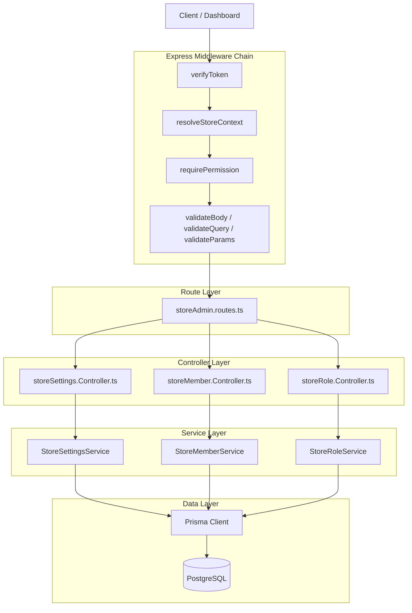
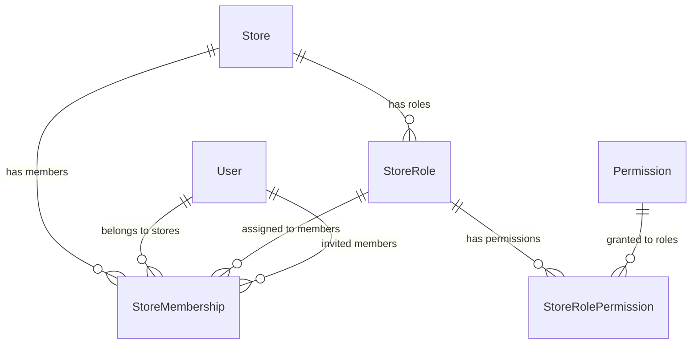

# Design Document: Phase 2 — Store Setup, Members & Roles

## Overview

Phase 2 introduces the Store Administration layer, enabling store owners and authorized members to manage store settings, team members, and roles with granular permissions. This phase builds directly on the Phase 1 infrastructure (authentication, token service, store creation) and leverages the existing `resolveStoreContext` and `requirePermission` middlewares for RBAC enforcement.

The design follows the established controller → service → Prisma pattern, with three new service classes:
- **StoreSettingsService** — CRUD for store configuration (general, branding, SEO, contact)
- **StoreMemberService** — Member lifecycle (list, invite, get, update role, remove, resend invitation)
- **StoreRoleService** — Role management (list, create, get, update, delete, permission assignment)

All endpoints are scoped under `/api/stores/:storeId/` and require the `x-store-id` header for store context resolution.

## Architecture



### Request Flow

1. Client sends request with `Authorization: Bearer <token>` and `x-store-id: <id>` headers
2. `verifyToken` validates the JWT and attaches `req.user`
3. `resolveStoreContext` validates membership, store status, and loads permissions into `req.permissions`
4. `requirePermission(code)` checks the specific permission for the endpoint
5. `validateBody/Query/Params` validates input against Zod schemas
6. Controller extracts validated data and delegates to the service
7. Service executes business logic via Prisma and returns results
8. Controller formats response using `sendSuccess` / `sendPaginated`

## Components and Interfaces

### Route Definitions

All store-admin routes are mounted at `/api/stores/:storeId` in the main router. The route file applies `verifyToken` and `resolveStoreContext` globally, then each endpoint applies its own `requirePermission` and validation middleware.

```
POST   /api/stores/:storeId  →  storeAdmin.routes.ts

Middleware chain (applied to all routes):
  verifyToken → resolveStoreContext

Settings:
  GET    /settings                          → requirePermission('store:view')    → getSettings
  PATCH  /settings/general                  → requirePermission('store:update')  → updateGeneral
  PATCH  /settings/branding                 → requirePermission('store:update')  → updateBranding
  PATCH  /settings/seo                      → requirePermission('store:update')  → updateSeo
  PATCH  /settings/contact                  → requirePermission('store:update')  → updateContact

Members:
  GET    /members                           → requirePermission('member:view')   → listMembers
  POST   /members/invite                    → requirePermission('member:invite') → inviteMember
  GET    /members/:memberId                 → requirePermission('member:view')   → getMember
  PATCH  /members/:memberId/role            → requirePermission('member:update') → updateMemberRole
  DELETE /members/:memberId                 → requirePermission('member:remove') → removeMember
  POST   /members/:memberId/resend-invite   → requirePermission('member:invite') → resendInvitation

Roles:
  GET    /roles                             → requirePermission('role:view')     → listRoles
  POST   /roles                             → requirePermission('role:create')   → createRole
  GET    /roles/:roleId                     → requirePermission('role:view')     → getRole
  PATCH  /roles/:roleId                     → requirePermission('role:update')   → updateRole
  DELETE /roles/:roleId                     → requirePermission('role:delete')   → deleteRole
  PUT    /roles/:roleId/permissions         → requirePermission('role:update')   → updateRolePermissions
```

### Controller Layer

#### StoreSettingsController (`src/controllers/store-admin/storeSettings.Controller.ts`)

```typescript
interface StoreSettingsController {
  getSettings(req: AppRequest, res: Response): Promise<void>;
  updateGeneral(req: AppRequest, res: Response): Promise<void>;
  updateBranding(req: AppRequest, res: Response): Promise<void>;
  updateSeo(req: AppRequest, res: Response): Promise<void>;
  updateContact(req: AppRequest, res: Response): Promise<void>;
}
```

#### StoreMemberController (`src/controllers/store-admin/storeMember.Controller.ts`)

```typescript
interface StoreMemberController {
  list(req: AppRequest, res: Response): Promise<void>;
  invite(req: AppRequest, res: Response): Promise<void>;
  getById(req: AppRequest, res: Response): Promise<void>;
  updateRole(req: AppRequest, res: Response): Promise<void>;
  remove(req: AppRequest, res: Response): Promise<void>;
  resendInvitation(req: AppRequest, res: Response): Promise<void>;
}
```

#### StoreRoleController (`src/controllers/store-admin/storeRole.Controller.ts`)

```typescript
interface StoreRoleController {
  list(req: AppRequest, res: Response): Promise<void>;
  create(req: AppRequest, res: Response): Promise<void>;
  getById(req: AppRequest, res: Response): Promise<void>;
  update(req: AppRequest, res: Response): Promise<void>;
  remove(req: AppRequest, res: Response): Promise<void>;
  updatePermissions(req: AppRequest, res: Response): Promise<void>;
}
```

### Service Layer

#### StoreSettingsService (`src/services/store-admin/storeSettings.Service.ts`)

```typescript
class StoreSettingsService {
  async getSettings(storeId: number): Promise<Store>;
  async updateGeneral(storeId: number, data: UpdateGeneralInput): Promise<Store>;
  async updateBranding(storeId: number, data: UpdateBrandingInput): Promise<Store>;
  async updateSeo(storeId: number, data: UpdateSeoInput): Promise<Store>;
  async updateContact(storeId: number, data: UpdateContactInput): Promise<Store>;
}
```

#### StoreMemberService (`src/services/store-admin/storeMember.Service.ts`)

```typescript
interface MemberListParams {
  storeId: number;
  page: number;
  limit: number;
  status?: MembershipStatus;
  search?: string;
}

class StoreMemberService {
  async list(params: MemberListParams): Promise<PaginatedResult<MemberWithRelations>>;
  async invite(storeId: number, data: InviteMemberInput, invitedByUserId: number): Promise<MemberWithRelations>;
  async getById(storeId: number, memberId: number): Promise<MemberWithRelations>;
  async updateRole(storeId: number, memberId: number, roleId: number): Promise<MemberWithRelations>;
  async remove(storeId: number, memberId: number, actorUserId: number): Promise<void>;
  async resendInvitation(storeId: number, memberId: number): Promise<void>;
}
```

#### StoreRoleService (`src/services/store-admin/storeRole.Service.ts`)

```typescript
class StoreRoleService {
  async list(storeId: number): Promise<RoleWithMemberCount[]>;
  async create(storeId: number, data: CreateRoleInput): Promise<StoreRole>;
  async getById(storeId: number, roleId: number): Promise<RoleWithPermissions>;
  async update(storeId: number, roleId: number, data: UpdateRoleInput): Promise<StoreRole>;
  async remove(storeId: number, roleId: number): Promise<void>;
  async updatePermissions(storeId: number, roleId: number, permissionIds: number[]): Promise<RoleWithPermissions>;
}
```

### Validation Schemas (`src/validators/storeAdmin.validators.ts`)

```typescript
// Settings
const updateGeneralSchema = z.object({
  name: z.string().min(2).max(100).optional(),
  currency_code: z.string().regex(/^[A-Z]{3}$/).optional(),
  locale: z.string().min(2).max(10).regex(/^[a-z]{2}(-[A-Z]{2})?$/).optional(),
  timezone: z.string().max(50).optional(),
});

const updateBrandingSchema = z.object({
  logo: z.string().url().max(2048).nullable().optional(),
  favicon: z.string().url().max(2048).nullable().optional(),
  description: z.string().max(1000).nullable().optional(),
});

const updateSeoSchema = z.object({
  meta_title: z.string().max(70).nullable().optional(),
  meta_description: z.string().max(160).nullable().optional(),
});

const updateContactSchema = z.object({
  support_email: z.string().email().nullable().optional(),
  support_phone: z.string().regex(/^\+?\d{7,15}$/).nullable().optional(),
  facebook_url: z.string().url().max(2048).nullable().optional(),
  instagram_url: z.string().url().max(2048).nullable().optional(),
  tiktok_url: z.string().url().max(2048).nullable().optional(),
});

// Members
const inviteMemberSchema = z.object({
  email: z.string().email(),
  role_id: z.number().int().positive(),
});

const updateMemberRoleSchema = z.object({
  role_id: z.number().int().positive(),
});

// Roles
const createRoleSchema = z.object({
  name: z.string().min(2).max(50),
  description: z.string().max(255).optional(),
});

const updateRoleSchema = z.object({
  name: z.string().min(2).max(50).optional(),
  description: z.string().max(255).nullable().optional(),
});

const updateRolePermissionsSchema = z.object({
  permission_ids: z.array(z.number().int().positive()).min(0).max(200),
});

// Shared params
const memberIdParamSchema = z.object({
  storeId: z.coerce.number().int().positive(),
  memberId: z.coerce.number().int().positive(),
});

const roleIdParamSchema = z.object({
  storeId: z.coerce.number().int().positive(),
  roleId: z.coerce.number().int().positive(),
});

const memberListQuerySchema = z.object({
  page: z.coerce.number().int().positive().default(1),
  limit: z.coerce.number().int().min(1).max(100).default(20),
  status: z.nativeEnum(MembershipStatus).optional(),
  search: z.string().optional(),
});
```

### Slug Generation Utility

A pure utility function for generating URL-safe slugs from role names:

```typescript
// src/utils/slugify.ts
function slugify(name: string): string {
  return name
    .toLowerCase()
    .trim()
    .replace(/[^a-z0-9\s-]/g, '')  // remove special characters
    .replace(/\s+/g, '-')           // replace spaces with hyphens
    .replace(/-+/g, '-')            // collapse multiple hyphens
    .replace(/^-|-$/g, '');         // trim leading/trailing hyphens
}
```

## Data Models

The design uses existing Prisma models without schema changes. Key models and their relationships:

### Store (settings target)

| Field | Type | Notes |
|-------|------|-------|
| id | Int (PK) | Auto-increment |
| name | String | 2-100 chars |
| domain | String (unique) | Store subdomain |
| custom_domain | String? | Optional custom domain |
| status | StoreStatus | DRAFT, ACTIVE, SUSPENDED, ARCHIVED |
| currency_code | String | Default "LYD" |
| locale | String | Default "ar-LY" |
| timezone | String | Default "Africa/Tripoli" |
| logo | String? | URL |
| favicon | String? | URL |
| description | String? | Max 1000 chars |
| facebook_url | String? | URL |
| instagram_url | String? | URL |
| tiktok_url | String? | URL |
| support_email | String? | Email |
| support_phone | String? | Phone |
| meta_title | String? | Max 70 chars |
| meta_description | String? | Max 160 chars |
| created_at | DateTime | Auto |
| updated_at | DateTime | Auto-updated |

### StoreRole

| Field | Type | Notes |
|-------|------|-------|
| id | Int (PK) | Auto-increment |
| store_id | Int (FK) | References Store |
| name | String | 2-50 chars |
| slug | String | Auto-generated from name |
| description | String? | Max 255 chars |
| is_default | Boolean | Default false |
| is_protected | Boolean | Default false; true for system roles |
| created_at | DateTime | Auto |
| updated_at | DateTime | Auto-updated |

**Unique constraint:** `(store_id, slug)`

### StoreMembership

| Field | Type | Notes |
|-------|------|-------|
| id | Int (PK) | Auto-increment |
| store_id | Int (FK) | References Store |
| user_id | Int (FK) | References User |
| role_id | Int (FK) | References StoreRole |
| status | MembershipStatus | ACTIVE, INVITED, SUSPENDED |
| invited_by_user_id | Int? (FK) | References User (inviter) |
| joined_at | DateTime? | Set when status becomes ACTIVE |
| created_at | DateTime | Auto |
| updated_at | DateTime | Auto-updated |

**Unique constraint:** `(store_id, user_id)`

### StoreRolePermission (join table)

| Field | Type | Notes |
|-------|------|-------|
| role_id | Int (PK, FK) | References StoreRole |
| permission_id | Int (PK, FK) | References Permission |
| assigned_at | DateTime | Auto |

### Permission (platform-level, read-only in this phase)

| Field | Type | Notes |
|-------|------|-------|
| id | Int (PK) | Auto-increment |
| code | String (unique) | e.g., "store:view", "member:invite" |
| module | String | e.g., "store", "member", "role" |
| action | String | e.g., "view", "update", "delete" |
| description | String? | Human-readable description |

### Key Relationships




## Correctness Properties

*A property is a characteristic or behavior that should hold true across all valid executions of a system — essentially, a formal statement about what the system should do. Properties serve as the bridge between human-readable specifications and machine-verifiable correctness guarantees.*

### Property 1: Partial update preserves unchanged fields

*For any* store and any valid partial update payload (general, branding, SEO, or contact), after applying the update, all fields NOT included in the payload SHALL remain unchanged from their previous values, and all fields included in the payload SHALL reflect the new values.

**Validates: Requirements 2.1, 3.1, 4.1, 5.1**

### Property 2: Zod schema validation correctness

*For any* input string or value, the Zod validation schemas SHALL accept all inputs that satisfy the defined constraints (length, format, type) and reject all inputs that violate any constraint, returning field-level error details on rejection.

**Validates: Requirements 2.2, 3.2, 4.2, 5.2, 7.2, 13.2, 15.2, 17.2, 19.1–19.7**

### Property 3: Pagination metadata consistency

*For any* member list query with page and limit parameters, the returned pagination metadata SHALL satisfy: `totalPages == ceil(total / limit)`, `data.length <= limit`, and `data.length == min(limit, total - (page - 1) * limit)` when page is within range.

**Validates: Requirements 6.1, 6.4**

### Property 4: Status filter correctness

*For any* member list query with a status filter, ALL returned membership records SHALL have a status field equal to the specified filter value, and NO records with a different status SHALL appear in the results.

**Validates: Requirements 6.2**

### Property 5: Search filter correctness

*For any* member list query with a search term, ALL returned membership records SHALL have the search term appearing as a substring (case-insensitive) in at least one of: user name, user email, or user phone.

**Validates: Requirements 6.3**

### Property 6: Invitation creates correct membership

*For any* valid invitation request (existing user email, valid store role_id, user not already a member), the created StoreMembership SHALL have status=INVITED, the specified role_id, and invited_by_user_id set to the inviting user's ID.

**Validates: Requirements 7.1**

### Property 7: Owner role immutability

*For any* role update attempt targeting the store's original owner membership (role slug "owner" AND invited_by_user_id is null), the operation SHALL be rejected with a 403 error regardless of the requested role_id.

**Validates: Requirements 9.4**

### Property 8: Owner removal protection

*For any* removal attempt targeting the store's original owner membership (role slug "owner" AND invited_by_user_id is null), the operation SHALL be rejected with a 403 error regardless of which user initiates the removal.

**Validates: Requirements 10.2**

### Property 9: Self-removal prevention

*For any* authenticated user attempting to remove the membership associated with their own user_id, the operation SHALL be rejected with a 403 error regardless of their role or permissions.

**Validates: Requirements 10.3**

### Property 10: Resend restricted to INVITED status

*For any* membership with status other than INVITED (i.e., ACTIVE or SUSPENDED), a resend invitation request SHALL be rejected with a 400 error.

**Validates: Requirements 11.2**

### Property 11: Slug generation correctness

*For any* role name input, the generated slug SHALL be: lowercase, contain only characters matching `[a-z0-9-]`, have no leading or trailing hyphens, have no consecutive hyphens, and be derivable from the original name by lowercasing and replacing spaces/special characters with hyphens.

**Validates: Requirements 13.3, 15.1**

### Property 12: Slug uniqueness enforcement

*For any* two role names that produce the same slug within the same store, the second create or update operation SHALL be rejected with a 409 Conflict error.

**Validates: Requirements 13.4, 15.4**

### Property 13: Protected role immutability

*For any* StoreRole with is_protected=true, update and delete operations SHALL be rejected with a 403 error regardless of the update payload or the requesting user's permissions.

**Validates: Requirements 15.3, 16.2**

### Property 14: Role with members cannot be deleted

*For any* StoreRole that has at least one StoreMembership record referencing it, a delete operation SHALL be rejected with a 409 Conflict error.

**Validates: Requirements 16.3**

### Property 15: Permission set replacement is exact

*For any* valid array of permission_ids applied to a role, after the update the role's StoreRolePermission records SHALL contain exactly the specified permission_ids — no more, no less — regardless of what permissions were previously assigned. Applying the same array twice SHALL produce the same result (idempotence).

**Validates: Requirements 17.1**

### Property 16: Role member count accuracy

*For any* store role, the member count returned in the list/detail response SHALL equal the actual number of StoreMembership records with that role_id in the current store.

**Validates: Requirements 12.2**

## Error Handling

### Error Response Format

All errors follow the existing `AppError` pattern and are processed by the global `errorHandler` middleware:

```json
{
  "success": false,
  "error": "Error message or field-level details",
  "message": "Human-readable description"
}
```

### Validation Errors (422)

Zod validation failures are caught by the error middleware and formatted as:

```json
{
  "success": false,
  "error": [
    { "path": ["field_name"], "message": "Validation message" }
  ],
  "message": "Validation failed"
}
```

### Error Codes by Domain

| Domain | Error | Status | Message |
|--------|-------|--------|---------|
| Settings | Store not found | 404 | "Store not found" |
| Members | User not found | 404 | "User with this email not found" |
| Members | Role not in store | 404 | "Role not found in this store" |
| Members | Already a member | 409 | "User is already a member of this store" |
| Members | Owner role change | 403 | "Cannot change the store owner's role" |
| Members | Owner removal | 403 | "Cannot remove the store owner" |
| Members | Self-removal | 403 | "Cannot remove yourself from the store" |
| Members | Not INVITED status | 400 | "Can only resend invitation for members with INVITED status" |
| Members | Member not found | 404 | "Member not found" |
| Roles | Protected role modify | 403 | "Cannot modify a protected role" |
| Roles | Protected role delete | 403 | "Cannot delete a protected role" |
| Roles | Slug conflict | 409 | "A role with this name already exists in this store" |
| Roles | Has members | 409 | "Cannot delete a role that has members assigned to it" |
| Roles | Invalid permissions | 400 | "One or more permission IDs are invalid" |
| Roles | Role not found | 404 | "Role not found" |
| Auth | No token | 401 | "No token provided" |
| Auth | Invalid token | 401 | "Unauthorized" |
| Auth | No permission | 403 | "You don't have {code} permission" |
| Auth | Not a member | 403 | "Access denied: You are not a member of this store" |
| Auth | Store suspended | 403 | "Store is suspended/archived" |

### Error Handling Strategy

- **Service layer** throws `AppError` instances with appropriate status codes
- **Controller layer** does not catch errors — they propagate to the global error handler via `asyncHandler`
- **Validation middleware** passes `ZodError` to `next()`, which the error handler formats
- **Prisma unique constraint violations** are caught in the service layer and converted to `AppError.conflict()`
- **Order of checks** in member removal: permission → existence → self-removal → owner protection → deletion

## Testing Strategy

### Testing Framework Setup

Since the project doesn't have a test framework yet, the implementation should add:
- **Vitest** as the test runner (fast, TypeScript-native, compatible with the project)
- **fast-check** for property-based testing (mature, well-maintained, TypeScript-first)

### Unit Tests (Example-Based)

Unit tests cover specific scenarios, edge cases, and integration points:

- **StoreSettingsService**: Get settings returns all fields; update with empty body is no-op
- **StoreMemberService**: Invite flow happy path; get member by ID; resend for INVITED member
- **StoreRoleService**: List roles with member counts; get role with permissions; create role happy path
- **Error conditions**: All 404/409/403 scenarios listed in Error Handling
- **Middleware integration**: Verify middleware chain order (verifyToken → resolveStoreContext → requirePermission)

### Property-Based Tests

Property tests verify universal correctness properties using **fast-check** with minimum 100 iterations per property:

| Property | Test Focus | Generator Strategy |
|----------|-----------|-------------------|
| Property 1 | Partial update preservation | Random subsets of valid field values |
| Property 2 | Schema validation | Random strings/numbers at boundary lengths |
| Property 3 | Pagination math | Random total counts and page/limit params |
| Property 4 | Status filtering | Random member sets with mixed statuses |
| Property 5 | Search filtering | Random member data and search substrings |
| Property 6 | Invitation correctness | Random valid user/role combinations |
| Property 7 | Owner role immutability | Random role_ids against owner membership |
| Property 8 | Owner removal protection | Random actors attempting owner removal |
| Property 9 | Self-removal prevention | Random users attempting self-removal |
| Property 10 | Resend status check | Random non-INVITED statuses |
| Property 11 | Slug generation | Random Unicode strings, special chars, spaces |
| Property 12 | Slug uniqueness | Pairs of names producing same slug |
| Property 13 | Protected role immutability | Random update/delete on protected roles |
| Property 14 | Role deletion with members | Roles with varying member counts |
| Property 15 | Permission set replacement | Random permission ID arrays, applied twice |
| Property 16 | Member count accuracy | Random membership distributions across roles |

### Test Configuration

```typescript
// Property test tag format
// Feature: phase2-store-setup-members-roles, Property {N}: {title}

// Minimum iterations
fc.assert(fc.property(...), { numRuns: 100 });
```

### Integration Tests

Integration tests verify the full HTTP request/response cycle:
- Middleware chain enforcement (auth → store context → permission)
- End-to-end CRUD flows for settings, members, and roles
- Cross-store isolation (member of store A cannot access store B)
- Concurrent operations (two users updating the same role simultaneously)
