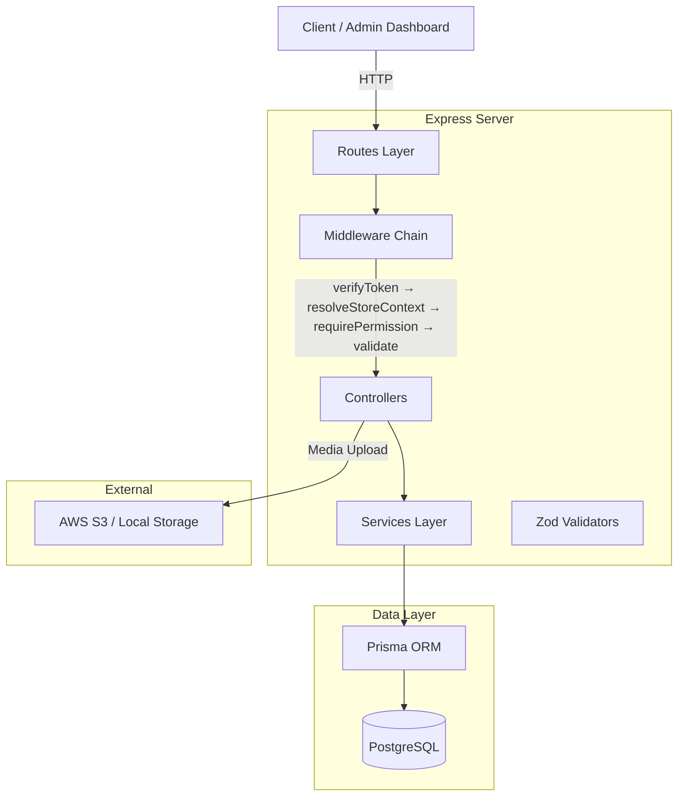
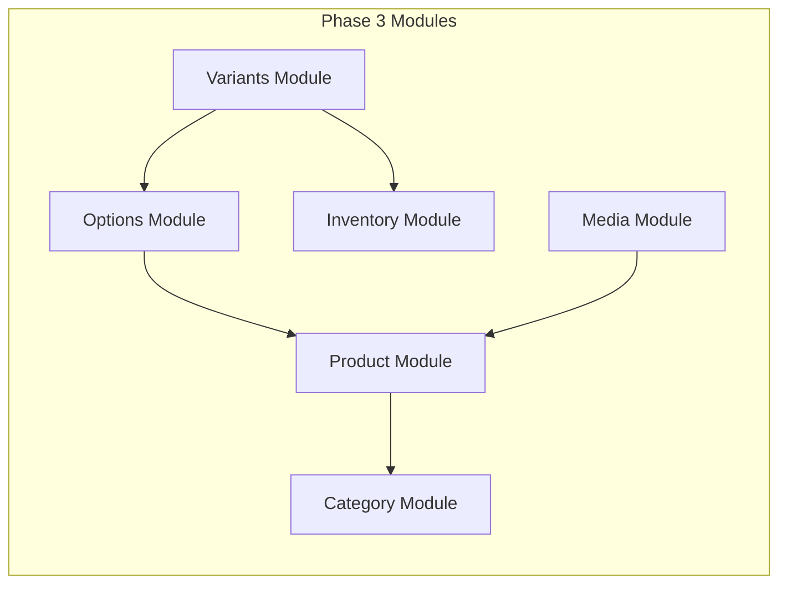
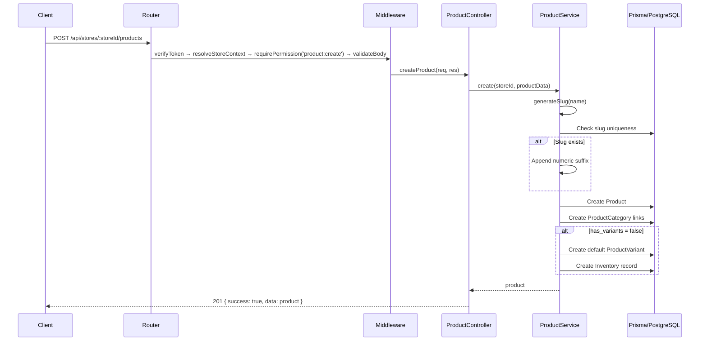
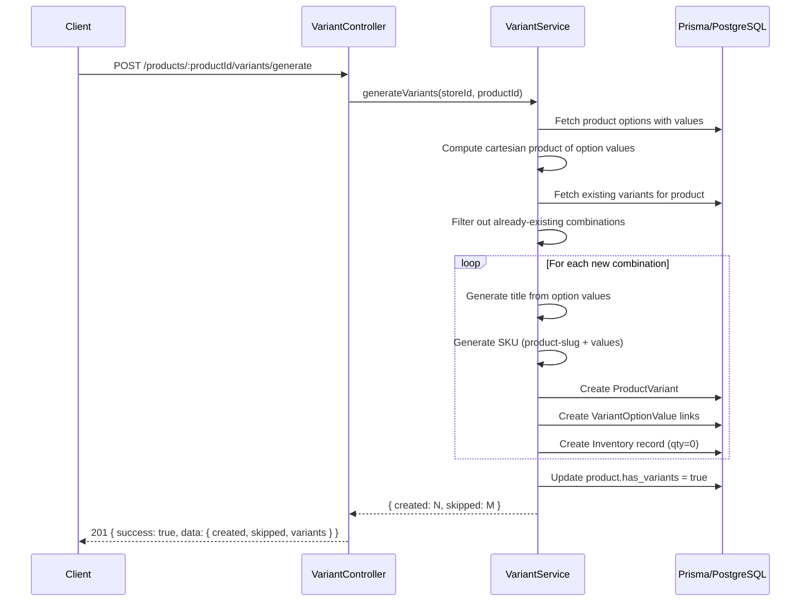
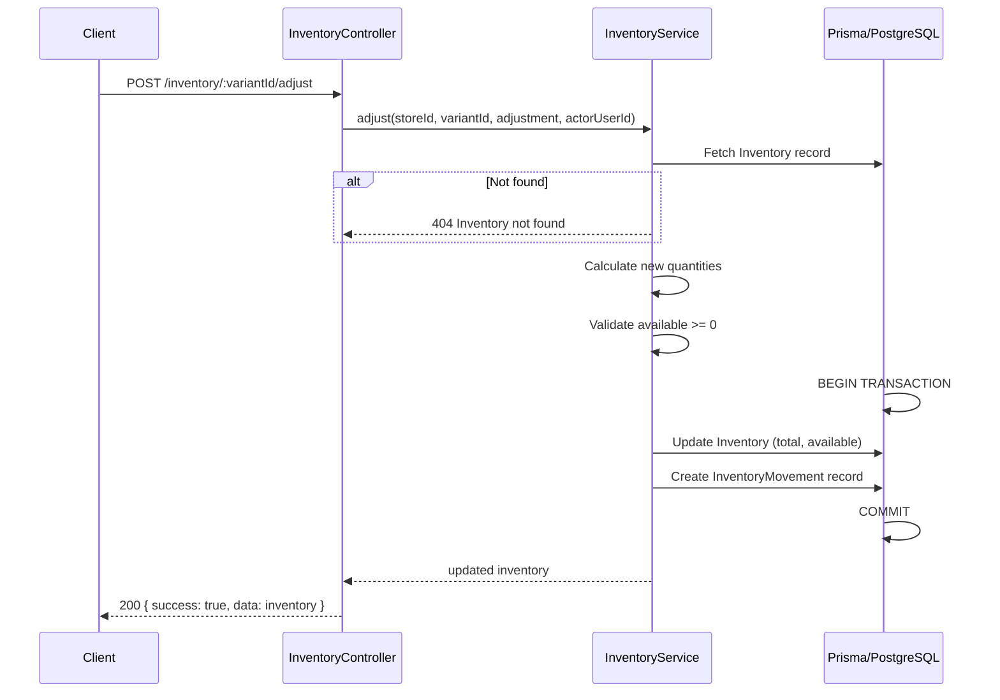
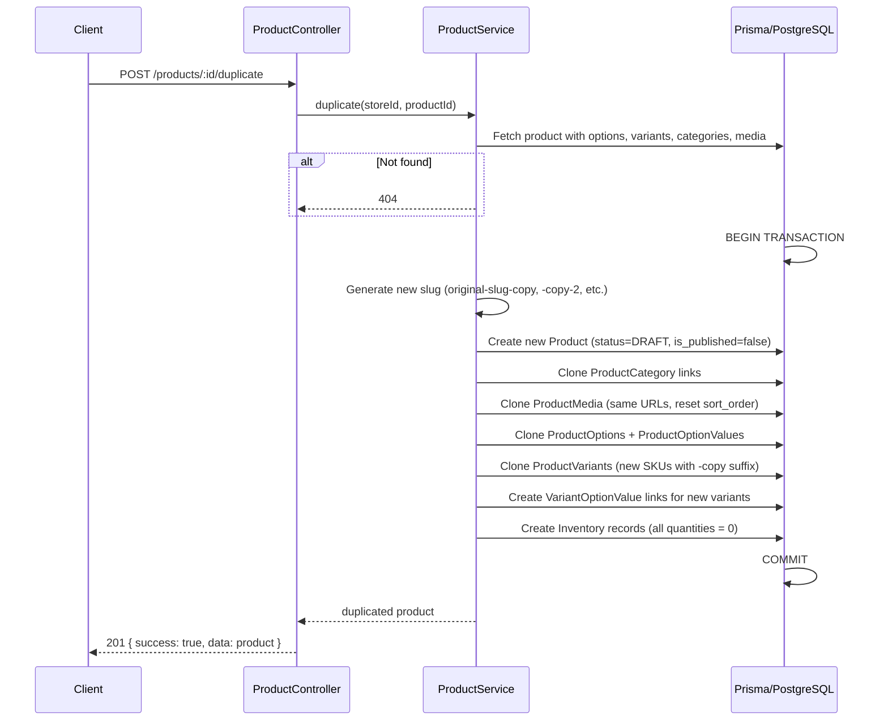

# Design Document: Phase 3 — Full Product Catalog

## Overview

Phase 3 implements the complete product catalog system for the Wasl SaaS multi-store e-commerce platform. This includes category management with tree structures, full product CRUD with publishing workflows, product options and variant generation, inventory tracking with movement history, and media management.

The system is multi-tenant — all entities are scoped by `store_id` and accessed through the `resolveStoreContext` middleware. The architecture follows the established monolith pattern with modular controllers, dedicated services for business logic, Zod validation schemas, and Prisma as the ORM layer.

Key capabilities: hierarchical categories with drag-and-drop reordering, automatic variant generation from option combinations (cartesian product), real-time inventory sync (`available = total - reserved`), product duplication with full clone, and full-text search across product name, description, and SKU.

## Architecture



### Module Decomposition



## Components and Interfaces

### Component 1: Category Module

**Purpose**: Manages hierarchical product categories with tree structure, reordering, and slug-based lookups.

**Files**:
- `src/controllers/store-admin/category.Controller.ts`
- `src/services/store-admin/category.Service.ts`
- `src/validators/catalog.validators.ts` (category schemas)
- `src/routes/catalog.routes.ts`

**Responsibilities**:
- CRUD operations for categories scoped by store
- Tree structure management (parent-child relationships)
- Bulk reorder with sort_order updates
- Slug generation and uniqueness enforcement per store
- Cascade handling when deleting categories with children

### Component 2: Product Module

**Purpose**: Core product management including CRUD, status transitions, publishing, duplication, and filtered listing.

**Files**:
- `src/controllers/store-admin/product.Controller.ts`
- `src/services/store-admin/product.Service.ts`
- `src/validators/catalog.validators.ts` (product schemas)

**Responsibilities**:
- Full CRUD with multi-tenant isolation
- Status management (DRAFT → ACTIVE → ARCHIVED)
- Publish/unpublish with timestamp tracking
- Product duplication (clone product + options + variants, reset inventory)
- Filtered listing with pagination (status, category, price range, search)
- Full-text search on name, description, SKU

### Component 3: Product Options Module

**Purpose**: Manages product options (e.g., Size, Color) and their values (e.g., S/M/L, Red/Blue).

**Files**:
- `src/controllers/store-admin/productOption.Controller.ts`
- `src/services/store-admin/productOption.Service.ts`

**Responsibilities**:
- CRUD for options per product
- CRUD for option values per option
- Position/ordering management
- Validation that option names are unique per product
- Validation that option values are unique per option

### Component 4: Variants Module

**Purpose**: Manages product variants created from option value combinations, including bulk generation.

**Files**:
- `src/controllers/store-admin/productVariant.Controller.ts`
- `src/services/store-admin/productVariant.Service.ts`

**Responsibilities**:
- CRUD for individual variants
- Bulk variant generation (cartesian product of all option values)
- SKU and barcode uniqueness enforcement per store
- Default variant management
- Auto-create Inventory record for each new variant

### Component 5: Inventory Module

**Purpose**: Stock management per variant with adjustment tracking and low-stock alerts.

**Files**:
- `src/controllers/store-admin/inventory.Controller.ts`
- `src/services/store-admin/inventory.Service.ts`

**Responsibilities**:
- View inventory levels (total, available, reserved)
- Adjust inventory with movement recording
- Low-stock alerts based on configurable thresholds
- Movement history with actor tracking
- Invariant enforcement: `available = total - reserved`

### Component 6: Media Module

**Purpose**: Product image/media management with upload, reorder, and alt text.

**Files**:
- `src/controllers/store-admin/productMedia.Controller.ts`
- `src/services/store-admin/productMedia.Service.ts`

**Responsibilities**:
- Upload media files (S3 or local)
- Update alt text and metadata
- Reorder media (sort_order)
- Delete media with storage cleanup

## Data Models

### Category (existing in Prisma schema)

```typescript
interface Category {
  id: number;
  store_id: number;
  name: string;
  slug: string;           // unique per store
  parent_id: number | null;
  image_url: string | null;
  sort_order: number;
  is_active: boolean;
  created_at: Date;
  updated_at: Date;
}
```

**Validation Rules**:
- `name`: 2-100 characters, required
- `slug`: auto-generated from name, unique per store_id
- `parent_id`: must reference existing category in same store (or null for root)
- `sort_order`: non-negative integer
- Max tree depth: 3 levels (root → child → grandchild)

### Product (existing in Prisma schema)

```typescript
interface Product {
  id: number;
  store_id: number;
  name: string;
  slug: string;              // unique per store
  description: string | null;
  short_description: string | null;
  status: 'DRAFT' | 'ACTIVE' | 'ARCHIVED';
  base_price: Decimal;
  compare_at_price: Decimal | null;
  cost_price: Decimal | null;
  track_inventory: boolean;
  has_variants: boolean;
  is_published: boolean;
  published_at: Date | null;
  created_at: Date;
  updated_at: Date;
}
```

**Validation Rules**:
- `name`: 2-200 characters, required
- `base_price`: positive decimal, required
- `compare_at_price`: must be greater than base_price if provided
- `cost_price`: non-negative decimal if provided
- `status` transitions: DRAFT → ACTIVE, ACTIVE → ARCHIVED, ARCHIVED → DRAFT

### ProductVariant (existing in Prisma schema)

```typescript
interface ProductVariant {
  id: number;
  store_id: number;
  product_id: number;
  title: string;
  sku: string;               // unique per store
  barcode: string | null;    // unique per store (if provided)
  price: Decimal | null;     // overrides product base_price
  compare_at_price: Decimal | null;
  cost_price: Decimal | null;
  weight_grams: number | null;
  sort_order: number;
  is_default: boolean;
  is_active: boolean;
  created_at: Date;
  updated_at: Date;
}
```

**Validation Rules**:
- `sku`: required, 1-100 chars, unique per store
- `barcode`: optional, unique per store if provided
- `price`: non-negative decimal if provided
- Only one variant per product can be `is_default = true`

### Inventory (existing in Prisma schema)

```typescript
interface Inventory {
  id: number;
  store_id: number;
  variant_id: number;        // unique per store
  total_quantity: number;
  available_quantity: number;
  reserved_quantity: number;
  low_stock_threshold: number;
  updated_at: Date;
}
```

**Invariant**: `available_quantity = total_quantity - reserved_quantity`

### InventoryMovement (existing in Prisma schema)

```typescript
interface InventoryMovement {
  id: number;
  store_id: number;
  variant_id: number;
  order_id: number | null;
  actor_user_id: number | null;
  type: 'IN' | 'ADJUSTMENT_IN' | 'OUT' | 'ADJUSTMENT_OUT' | 'RESERVED' | 'RELEASED' | 'RETURNED';
  quantity_change: number;
  reason: string | null;
  reference_type: string | null;
  reference_id: number | null;
  created_at: Date;
}
```

## Sequence Diagrams

### Product Creation Flow



### Variant Generation Flow



### Inventory Adjustment Flow



### Product Duplication Flow




## Key Functions with Formal Specifications

### CategoryService

```typescript
class CategoryService {
  /**
   * Lists categories for a store as a flat list or tree structure.
   */
  async list(storeId: number, options: { flat?: boolean; parentId?: number | null }): Promise<Category[]>;

  /**
   * Creates a new category with auto-generated slug.
   */
  async create(storeId: number, data: CreateCategoryInput): Promise<Category>;

  /**
   * Gets a single category by ID within a store.
   */
  async getById(storeId: number, categoryId: number): Promise<Category>;

  /**
   * Updates a category. Validates parent_id to prevent circular references.
   */
  async update(storeId: number, categoryId: number, data: UpdateCategoryInput): Promise<Category>;

  /**
   * Deletes a category. Reassigns children to parent (or root).
   */
  async delete(storeId: number, categoryId: number): Promise<void>;

  /**
   * Bulk reorders categories by updating sort_order.
   */
  async reorder(storeId: number, items: { id: number; sort_order: number; parent_id?: number | null }[]): Promise<void>;
}
```

**create() Formal Specification:**

**Preconditions:**
- `storeId` is a valid, active store ID
- `data.name` is a non-empty string (2-100 chars)
- If `data.parent_id` is provided, it must reference an existing category in the same store
- Tree depth after insertion must not exceed 3 levels

**Postconditions:**
- A new Category record exists with a unique slug within the store
- `slug` is derived from `name` via slugify; if collision, numeric suffix appended
- `sort_order` defaults to max(sort_order) + 1 among siblings
- Returns the created category

**reorder() Formal Specification:**

**Preconditions:**
- All `items[].id` must reference existing categories in the store
- All `items[].sort_order` must be non-negative integers
- If `parent_id` is provided, it must not create circular references
- Tree depth constraint must be maintained

**Postconditions:**
- Each category's `sort_order` (and optionally `parent_id`) is updated
- No other category fields are modified
- Operation is atomic (all-or-nothing via transaction)

---

### ProductService

```typescript
class ProductService {
  /**
   * Lists products with pagination, filtering, and search.
   */
  async list(storeId: number, params: ProductListParams): Promise<PaginatedResult<Product>>;

  /**
   * Creates a product with optional category assignments.
   * Auto-creates a default variant if has_variants=false.
   */
  async create(storeId: number, data: CreateProductInput): Promise<Product>;

  /**
   * Gets a product with all relations (categories, options, variants, media).
   */
  async getById(storeId: number, productId: number): Promise<Product>;

  /**
   * Updates product fields. Handles slug regeneration if name changes.
   */
  async update(storeId: number, productId: number, data: UpdateProductInput): Promise<Product>;

  /**
   * Deletes a product and all related entities (cascade).
   */
  async delete(storeId: number, productId: number): Promise<void>;

  /**
   * Updates product status with transition validation.
   */
  async updateStatus(storeId: number, productId: number, status: ProductStatus): Promise<Product>;

  /**
   * Publishes or unpublishes a product.
   */
  async publish(storeId: number, productId: number, publish: boolean): Promise<Product>;

  /**
   * Duplicates a product with all relations. Resets inventory to 0.
   */
  async duplicate(storeId: number, productId: number): Promise<Product>;
}
```

**create() Formal Specification:**

**Preconditions:**
- `storeId` is a valid, active store
- `data.name` is 2-200 chars
- `data.base_price` > 0
- If `data.compare_at_price` provided: `compare_at_price > base_price`
- If `data.category_ids` provided: all must exist in the same store

**Postconditions:**
- Product created with status=DRAFT, is_published=false
- Slug generated from name, unique within store
- ProductCategory join records created for each category_id
- If `has_variants=false`: one default ProductVariant created with SKU = slugified product name, and one Inventory record with all quantities = 0
- Returns product with relations

**duplicate() Formal Specification:**

**Preconditions:**
- Source product exists in the store
- Source product is not in a deleted state

**Postconditions:**
- New product created with status=DRAFT, is_published=false, published_at=null
- Name = original name + " (Copy)", slug = original-slug-copy (with numeric suffix if needed)
- All ProductCategory links cloned
- All ProductMedia cloned (same URLs, new records)
- All ProductOptions and ProductOptionValues cloned
- All ProductVariants cloned with new SKUs (original-sku-copy suffix)
- All VariantOptionValue links recreated for new variants
- All Inventory records created with total=0, available=0, reserved=0
- Original product is unchanged

---

### ProductVariantService

```typescript
class ProductVariantService {
  /**
   * Lists all variants for a product.
   */
  async list(storeId: number, productId: number): Promise<ProductVariant[]>;

  /**
   * Creates a single variant with option value links.
   */
  async create(storeId: number, productId: number, data: CreateVariantInput): Promise<ProductVariant>;

  /**
   * Gets a variant by ID.
   */
  async getById(storeId: number, variantId: number): Promise<ProductVariant>;

  /**
   * Updates variant fields (price, SKU, barcode, weight, etc.).
   */
  async update(storeId: number, variantId: number, data: UpdateVariantInput): Promise<ProductVariant>;

  /**
   * Deletes a variant. Cannot delete the last/default variant.
   */
  async delete(storeId: number, variantId: number): Promise<void>;

  /**
   * Sets a variant as the default for its product.
   */
  async setDefault(storeId: number, variantId: number): Promise<ProductVariant>;

  /**
   * Generates all variant combinations from product options.
   */
  async generateVariants(storeId: number, productId: number): Promise<GenerateResult>;
}
```

**generateVariants() Formal Specification:**

**Preconditions:**
- Product exists in the store
- Product has at least 1 option with at least 1 value each
- Product options have been defined before calling generate

**Postconditions:**
- Cartesian product of all option values computed
- For each combination not already existing as a variant:
  - New ProductVariant created with title = "Value1 / Value2 / ..."
  - SKU auto-generated as `{product-slug}-{value1}-{value2}` (slugified)
  - VariantOptionValue links created
  - Inventory record created with all quantities = 0
- Existing variant combinations are skipped (idempotent)
- Product.has_variants set to true
- Returns count of created and skipped variants

**Loop Invariant (generation loop):**
- All previously created variants have unique SKUs within the store
- All previously created variants have corresponding Inventory records
- No duplicate VariantOptionValue combinations exist

---

### InventoryService

```typescript
class InventoryService {
  /**
   * Lists inventory for all variants in a store with pagination.
   */
  async list(storeId: number, params: InventoryListParams): Promise<PaginatedResult<Inventory>>;

  /**
   * Gets low-stock items (available_quantity <= low_stock_threshold).
   */
  async getLowStock(storeId: number, params: PaginationParams): Promise<PaginatedResult<Inventory>>;

  /**
   * Gets inventory for a specific variant.
   */
  async getByVariantId(storeId: number, variantId: number): Promise<Inventory>;

  /**
   * Adjusts inventory with movement recording.
   */
  async adjust(storeId: number, variantId: number, data: AdjustInventoryInput, actorUserId: number): Promise<Inventory>;

  /**
   * Lists all inventory movements for a store.
   */
  async listMovements(storeId: number, params: MovementListParams): Promise<PaginatedResult<InventoryMovement>>;

  /**
   * Lists movements for a specific variant.
   */
  async getVariantMovements(storeId: number, variantId: number, params: PaginationParams): Promise<PaginatedResult<InventoryMovement>>;
}
```

**adjust() Formal Specification:**

**Preconditions:**
- Inventory record exists for the variant in the store
- `data.type` is one of: IN, ADJUSTMENT_IN, OUT, ADJUSTMENT_OUT
- `data.quantity` is a positive integer
- For OUT/ADJUSTMENT_OUT: current `available_quantity >= data.quantity`

**Postconditions:**
- For IN/ADJUSTMENT_IN: `total_quantity += quantity`, `available_quantity += quantity`
- For OUT/ADJUSTMENT_OUT: `total_quantity -= quantity`, `available_quantity -= quantity`
- Invariant maintained: `available_quantity = total_quantity - reserved_quantity`
- InventoryMovement record created with actor, type, quantity_change, reason
- `quantity_change` is positive for IN types, negative for OUT types
- Operation is atomic (transaction)

**Invariant:**
- At all times: `inventory.available_quantity = inventory.total_quantity - inventory.reserved_quantity`
- `inventory.available_quantity >= 0`
- `inventory.total_quantity >= 0`
- `inventory.reserved_quantity >= 0`

## Algorithmic Pseudocode

### Algorithm 1: Variant Generation (Cartesian Product)

```typescript
async function generateVariants(storeId: number, productId: number): Promise<GenerateResult> {
  // Step 1: Fetch product with options and values
  const product = await prisma.product.findFirst({
    where: { id: productId, store_id: storeId },
    include: {
      options: {
        orderBy: { position: 'asc' },
        include: { values: { orderBy: { position: 'asc' } } }
      },
      variants: {
        include: { option_values: true }
      }
    }
  });

  if (!product) throw AppError.notFound('Product not found');
  if (product.options.length === 0) throw AppError.badRequest('Product has no options defined');

  // Step 2: Compute cartesian product
  const optionValueArrays = product.options.map(opt => opt.values);
  const combinations = cartesianProduct(optionValueArrays);

  // Step 3: Identify existing combinations (by option_value_id sets)
  const existingCombinations = new Set(
    product.variants.map(v => 
      v.option_values.map(ov => ov.option_value_id).sort().join(',')
    )
  );

  // Step 4: Create new variants for missing combinations
  let created = 0;
  let skipped = 0;

  await prisma.$transaction(async (tx) => {
    for (const combination of combinations) {
      const key = combination.map(v => v.id).sort().join(',');
      
      if (existingCombinations.has(key)) {
        skipped++;
        continue;
      }

      // Generate title: "Red / Large / Cotton"
      const title = combination.map(v => v.value).join(' / ');
      
      // Generate SKU: product-slug-red-large-cotton
      const skuBase = `${product.slug}-${combination.map(v => slugify(v.value)).join('-')}`;
      const sku = await ensureUniqueSku(tx, storeId, skuBase);

      // Create variant
      const variant = await tx.productVariant.create({
        data: {
          store_id: storeId,
          product_id: productId,
          title,
          sku,
          price: null, // inherits from product.base_price
          is_default: created === 0 && product.variants.length === 0,
          is_active: true,
          sort_order: product.variants.length + created,
        }
      });

      // Create option value links
      await tx.variantOptionValue.createMany({
        data: combination.map(v => ({
          store_id: storeId,
          variant_id: variant.id,
          option_value_id: v.id,
        }))
      });

      // Create inventory record
      await tx.inventory.create({
        data: {
          store_id: storeId,
          variant_id: variant.id,
          total_quantity: 0,
          available_quantity: 0,
          reserved_quantity: 0,
          low_stock_threshold: 5,
        }
      });

      created++;
    }

    // Update product.has_variants
    if (created > 0) {
      await tx.product.update({
        where: { id: productId },
        data: { has_variants: true }
      });
    }
  });

  return { created, skipped, total: combinations.length };
}

/**
 * Computes cartesian product of arrays.
 * Input: [[Red, Blue], [S, M, L]] 
 * Output: [[Red,S], [Red,M], [Red,L], [Blue,S], [Blue,M], [Blue,L]]
 */
function cartesianProduct<T>(arrays: T[][]): T[][] {
  if (arrays.length === 0) return [[]];
  
  return arrays.reduce<T[][]>(
    (acc, curr) => acc.flatMap(combo => curr.map(item => [...combo, item])),
    [[]]
  );
}

/**
 * Ensures SKU uniqueness by appending numeric suffix if needed.
 */
async function ensureUniqueSku(tx: any, storeId: number, baseSku: string): Promise<string> {
  let sku = baseSku;
  let suffix = 1;
  
  while (await tx.productVariant.findFirst({ where: { store_id: storeId, sku } })) {
    sku = `${baseSku}-${suffix}`;
    suffix++;
  }
  
  return sku;
}
```

### Algorithm 2: Category Tree Builder

```typescript
/**
 * Builds a nested tree structure from flat category list.
 * Uses a single-pass hash map approach for O(n) performance.
 */
function buildCategoryTree(categories: Category[]): CategoryTreeNode[] {
  const map = new Map<number, CategoryTreeNode>();
  const roots: CategoryTreeNode[] = [];

  // First pass: create nodes
  for (const cat of categories) {
    map.set(cat.id, { ...cat, children: [] });
  }

  // Second pass: link parents to children
  for (const cat of categories) {
    const node = map.get(cat.id)!;
    if (cat.parent_id && map.has(cat.parent_id)) {
      map.get(cat.parent_id)!.children.push(node);
    } else {
      roots.push(node);
    }
  }

  // Sort children by sort_order at each level
  const sortChildren = (nodes: CategoryTreeNode[]) => {
    nodes.sort((a, b) => a.sort_order - b.sort_order);
    nodes.forEach(n => sortChildren(n.children));
  };
  sortChildren(roots);

  return roots;
}

interface CategoryTreeNode extends Category {
  children: CategoryTreeNode[];
}
```

**Preconditions:**
- `categories` is a flat array of all categories for a store
- Each category has a valid `id` and optional `parent_id`

**Postconditions:**
- Returns array of root nodes (parent_id = null)
- Each node's `children` array contains its direct children
- Children are sorted by `sort_order` at every level
- All categories from input appear exactly once in the tree

**Loop Invariant:**
- After first pass: every category has a corresponding node in the map
- After second pass: every node is either a root or linked to its parent

### Algorithm 3: Inventory Adjustment

```typescript
async function adjustInventory(
  storeId: number,
  variantId: number,
  data: AdjustInventoryInput,
  actorUserId: number
): Promise<Inventory> {
  return await prisma.$transaction(async (tx) => {
    // Fetch current inventory with lock (SELECT FOR UPDATE via raw query or serializable)
    const inventory = await tx.inventory.findFirst({
      where: { store_id: storeId, variant_id: variantId }
    });

    if (!inventory) {
      throw AppError.notFound('Inventory record not found for this variant');
    }

    // Calculate new quantities based on movement type
    let newTotal = inventory.total_quantity;
    let newAvailable = inventory.available_quantity;
    let quantityChange: number;

    switch (data.type) {
      case 'IN':
      case 'ADJUSTMENT_IN':
        newTotal += data.quantity;
        newAvailable += data.quantity;
        quantityChange = data.quantity;
        break;

      case 'OUT':
      case 'ADJUSTMENT_OUT':
        if (inventory.available_quantity < data.quantity) {
          throw AppError.badRequest(
            `Insufficient stock. Available: ${inventory.available_quantity}, Requested: ${data.quantity}`
          );
        }
        newTotal -= data.quantity;
        newAvailable -= data.quantity;
        quantityChange = -data.quantity;
        break;

      default:
        throw AppError.badRequest('Invalid adjustment type');
    }

    // ASSERT: newAvailable === newTotal - inventory.reserved_quantity
    // ASSERT: newAvailable >= 0
    // ASSERT: newTotal >= 0

    // Update inventory
    const updated = await tx.inventory.update({
      where: { id: inventory.id },
      data: {
        total_quantity: newTotal,
        available_quantity: newAvailable,
      }
    });

    // Record movement
    await tx.inventoryMovement.create({
      data: {
        store_id: storeId,
        variant_id: variantId,
        actor_user_id: actorUserId,
        type: data.type,
        quantity_change: quantityChange,
        reason: data.reason || null,
        reference_type: data.reference_type || null,
        reference_id: data.reference_id || null,
      }
    });

    return updated;
  });
}
```

### Algorithm 4: Product Full-Text Search

```typescript
/**
 * Searches products using PostgreSQL full-text search capabilities.
 * Searches across: product name, description, short_description, and variant SKUs.
 */
async function searchProducts(
  storeId: number,
  query: string,
  params: PaginationParams
): Promise<PaginatedResult<Product>> {
  const searchTerms = query.trim().split(/\s+/).join(' & ');
  
  const where = {
    store_id: storeId,
    OR: [
      { name: { contains: query, mode: 'insensitive' as const } },
      { description: { contains: query, mode: 'insensitive' as const } },
      { short_description: { contains: query, mode: 'insensitive' as const } },
      { variants: { some: { sku: { contains: query, mode: 'insensitive' as const } } } },
    ]
  };

  const [data, total] = await Promise.all([
    prisma.product.findMany({
      where,
      include: {
        categories: { include: { category: true } },
        media: { orderBy: { sort_order: 'asc' }, take: 1 },
        variants: { where: { is_active: true }, take: 1 },
      },
      skip: (params.page - 1) * params.limit,
      take: params.limit,
      orderBy: { created_at: 'desc' },
    }),
    prisma.product.count({ where }),
  ]);

  return {
    data,
    meta: {
      total,
      page: params.page,
      limit: params.limit,
      totalPages: Math.ceil(total / params.limit),
    }
  };
}
```

### Algorithm 5: Product Duplication

```typescript
async function duplicateProduct(storeId: number, productId: number): Promise<Product> {
  const source = await prisma.product.findFirst({
    where: { id: productId, store_id: storeId },
    include: {
      categories: true,
      media: { orderBy: { sort_order: 'asc' } },
      options: {
        orderBy: { position: 'asc' },
        include: { values: { orderBy: { position: 'asc' } } }
      },
      variants: {
        include: { option_values: true }
      }
    }
  });

  if (!source) throw AppError.notFound('Product not found');

  return await prisma.$transaction(async (tx) => {
    // 1. Generate unique slug
    const newName = `${source.name} (Copy)`;
    const baseSlug = slugify(newName);
    const slug = await ensureUniqueSlug(tx, storeId, baseSlug);

    // 2. Create new product
    const newProduct = await tx.product.create({
      data: {
        store_id: storeId,
        name: newName,
        slug,
        description: source.description,
        short_description: source.short_description,
        status: 'DRAFT',
        base_price: source.base_price,
        compare_at_price: source.compare_at_price,
        cost_price: source.cost_price,
        track_inventory: source.track_inventory,
        has_variants: source.has_variants,
        is_published: false,
        published_at: null,
      }
    });

    // 3. Clone category links
    if (source.categories.length > 0) {
      await tx.productCategory.createMany({
        data: source.categories.map(pc => ({
          store_id: storeId,
          product_id: newProduct.id,
          category_id: pc.category_id,
        }))
      });
    }

    // 4. Clone media
    if (source.media.length > 0) {
      await tx.productMedia.createMany({
        data: source.media.map((m, idx) => ({
          store_id: storeId,
          product_id: newProduct.id,
          url: m.url,
          alt_text: m.alt_text,
          sort_order: idx,
        }))
      });
    }

    // 5. Clone options and values (need ID mapping for variant links)
    const optionValueMap = new Map<number, number>(); // oldValueId → newValueId

    for (const option of source.options) {
      const newOption = await tx.productOption.create({
        data: {
          store_id: storeId,
          product_id: newProduct.id,
          name: option.name,
          position: option.position,
        }
      });

      for (const value of option.values) {
        const newValue = await tx.productOptionValue.create({
          data: {
            store_id: storeId,
            option_id: newOption.id,
            value: value.value,
            position: value.position,
          }
        });
        optionValueMap.set(value.id, newValue.id);
      }
    }

    // 6. Clone variants with new SKUs and inventory
    for (const variant of source.variants) {
      const newSku = await ensureUniqueSku(tx, storeId, `${variant.sku}-copy`);

      const newVariant = await tx.productVariant.create({
        data: {
          store_id: storeId,
          product_id: newProduct.id,
          title: variant.title,
          sku: newSku,
          barcode: null, // Reset barcode (must be unique)
          price: variant.price,
          compare_at_price: variant.compare_at_price,
          cost_price: variant.cost_price,
          weight_grams: variant.weight_grams,
          sort_order: variant.sort_order,
          is_default: variant.is_default,
          is_active: variant.is_active,
        }
      });

      // Clone variant-option-value links
      for (const vov of variant.option_values) {
        const newValueId = optionValueMap.get(vov.option_value_id);
        if (newValueId) {
          await tx.variantOptionValue.create({
            data: {
              store_id: storeId,
              variant_id: newVariant.id,
              option_value_id: newValueId,
            }
          });
        }
      }

      // Create fresh inventory (all zeros)
      await tx.inventory.create({
        data: {
          store_id: storeId,
          variant_id: newVariant.id,
          total_quantity: 0,
          available_quantity: 0,
          reserved_quantity: 0,
          low_stock_threshold: 5,
        }
      });
    }

    return newProduct;
  });
}
```

## Example Usage

### Creating a Product with Options and Generating Variants

```typescript
// 1. Create product
const product = await productService.create(storeId, {
  name: 'Classic T-Shirt',
  base_price: 25.00,
  description: 'A comfortable cotton t-shirt',
  category_ids: [categoryId],
  track_inventory: true,
  has_variants: true,
});

// 2. Add options
const colorOption = await productOptionService.create(storeId, product.id, {
  name: 'Color',
  position: 0,
});

const sizeOption = await productOptionService.create(storeId, product.id, {
  name: 'Size',
  position: 1,
});

// 3. Add option values
await productOptionService.addValue(storeId, colorOption.id, { value: 'Red', position: 0 });
await productOptionService.addValue(storeId, colorOption.id, { value: 'Blue', position: 1 });
await productOptionService.addValue(storeId, sizeOption.id, { value: 'S', position: 0 });
await productOptionService.addValue(storeId, sizeOption.id, { value: 'M', position: 1 });
await productOptionService.addValue(storeId, sizeOption.id, { value: 'L', position: 2 });

// 4. Generate all variant combinations (2 colors × 3 sizes = 6 variants)
const result = await productVariantService.generateVariants(storeId, product.id);
// result = { created: 6, skipped: 0, total: 6 }
// Variants: "Red / S", "Red / M", "Red / L", "Blue / S", "Blue / M", "Blue / L"

// 5. Adjust inventory for a variant
await inventoryService.adjust(storeId, variantId, {
  type: 'IN',
  quantity: 50,
  reason: 'Initial stock',
}, actorUserId);

// 6. Publish the product
await productService.publish(storeId, product.id, true);
```

### Category Tree Operations

```typescript
// Create root category
const clothing = await categoryService.create(storeId, { name: 'Clothing' });

// Create child categories
const mens = await categoryService.create(storeId, { name: 'Men', parent_id: clothing.id });
const womens = await categoryService.create(storeId, { name: 'Women', parent_id: clothing.id });
const shirts = await categoryService.create(storeId, { name: 'Shirts', parent_id: mens.id });

// Get tree structure
const tree = await categoryService.list(storeId, { flat: false });
// tree = [{ ...clothing, children: [{ ...mens, children: [shirts] }, { ...womens, children: [] }] }]

// Reorder
await categoryService.reorder(storeId, [
  { id: womens.id, sort_order: 0 },
  { id: mens.id, sort_order: 1 },
]);
```


## Zod Validation Schemas

```typescript
// ─── Category Schemas ────────────────────────────────────────────────────────

export const createCategorySchema = z.object({
  name: z.string().min(2).max(100),
  parent_id: z.number().int().positive().nullable().optional(),
  image_url: z.string().url().max(2048).nullable().optional(),
  is_active: z.boolean().optional().default(true),
});

export const updateCategorySchema = z.object({
  name: z.string().min(2).max(100).optional(),
  parent_id: z.number().int().positive().nullable().optional(),
  image_url: z.string().url().max(2048).nullable().optional(),
  is_active: z.boolean().optional(),
});

export const reorderCategoriesSchema = z.object({
  items: z.array(z.object({
    id: z.number().int().positive(),
    sort_order: z.number().int().min(0),
    parent_id: z.number().int().positive().nullable().optional(),
  })).min(1).max(500),
});

export const categoryListQuerySchema = z.object({
  page: z.coerce.number().int().positive().default(1),
  limit: z.coerce.number().int().min(1).max(100).default(20),
  parent_id: z.coerce.number().int().positive().nullable().optional(),
  flat: z.enum(['true', 'false']).optional().default('false'),
  is_active: z.enum(['true', 'false']).optional(),
});

// ─── Product Schemas ─────────────────────────────────────────────────────────

export const createProductSchema = z.object({
  name: z.string().min(2).max(200),
  description: z.string().max(5000).nullable().optional(),
  short_description: z.string().max(500).nullable().optional(),
  base_price: z.number().positive(),
  compare_at_price: z.number().positive().nullable().optional(),
  cost_price: z.number().min(0).nullable().optional(),
  track_inventory: z.boolean().optional().default(true),
  has_variants: z.boolean().optional().default(false),
  category_ids: z.array(z.number().int().positive()).optional().default([]),
});

export const updateProductSchema = z.object({
  name: z.string().min(2).max(200).optional(),
  description: z.string().max(5000).nullable().optional(),
  short_description: z.string().max(500).nullable().optional(),
  base_price: z.number().positive().optional(),
  compare_at_price: z.number().positive().nullable().optional(),
  cost_price: z.number().min(0).nullable().optional(),
  track_inventory: z.boolean().optional(),
  category_ids: z.array(z.number().int().positive()).optional(),
});

export const updateProductStatusSchema = z.object({
  status: z.enum(['DRAFT', 'ACTIVE', 'ARCHIVED']),
});

export const publishProductSchema = z.object({
  publish: z.boolean(),
});

export const productListQuerySchema = z.object({
  page: z.coerce.number().int().positive().default(1),
  limit: z.coerce.number().int().min(1).max(100).default(20),
  status: z.enum(['DRAFT', 'ACTIVE', 'ARCHIVED']).optional(),
  category_id: z.coerce.number().int().positive().optional(),
  min_price: z.coerce.number().min(0).optional(),
  max_price: z.coerce.number().min(0).optional(),
  search: z.string().max(200).optional(),
  sort_by: z.enum(['name', 'price', 'created_at', 'updated_at']).optional().default('created_at'),
  sort_order: z.enum(['asc', 'desc']).optional().default('desc'),
  is_published: z.enum(['true', 'false']).optional(),
});

// ─── Product Option Schemas ──────────────────────────────────────────────────

export const createOptionSchema = z.object({
  name: z.string().min(1).max(50),
  position: z.number().int().min(0).optional(),
});

export const updateOptionSchema = z.object({
  name: z.string().min(1).max(50).optional(),
  position: z.number().int().min(0).optional(),
});

export const createOptionValueSchema = z.object({
  value: z.string().min(1).max(100),
  position: z.number().int().min(0).optional(),
});

export const updateOptionValueSchema = z.object({
  value: z.string().min(1).max(100).optional(),
  position: z.number().int().min(0).optional(),
});

// ─── Variant Schemas ─────────────────────────────────────────────────────────

export const createVariantSchema = z.object({
  title: z.string().min(1).max(200),
  sku: z.string().min(1).max(100),
  barcode: z.string().max(100).nullable().optional(),
  price: z.number().min(0).nullable().optional(),
  compare_at_price: z.number().min(0).nullable().optional(),
  cost_price: z.number().min(0).nullable().optional(),
  weight_grams: z.number().int().min(0).nullable().optional(),
  is_active: z.boolean().optional().default(true),
  option_value_ids: z.array(z.number().int().positive()).optional().default([]),
});

export const updateVariantSchema = z.object({
  title: z.string().min(1).max(200).optional(),
  sku: z.string().min(1).max(100).optional(),
  barcode: z.string().max(100).nullable().optional(),
  price: z.number().min(0).nullable().optional(),
  compare_at_price: z.number().min(0).nullable().optional(),
  cost_price: z.number().min(0).nullable().optional(),
  weight_grams: z.number().int().min(0).nullable().optional(),
  is_active: z.boolean().optional(),
});

// ─── Inventory Schemas ───────────────────────────────────────────────────────

export const adjustInventorySchema = z.object({
  type: z.enum(['IN', 'ADJUSTMENT_IN', 'OUT', 'ADJUSTMENT_OUT']),
  quantity: z.number().int().positive(),
  reason: z.string().max(500).optional(),
  reference_type: z.string().max(50).optional(),
  reference_id: z.number().int().positive().optional(),
});

export const inventoryListQuerySchema = z.object({
  page: z.coerce.number().int().positive().default(1),
  limit: z.coerce.number().int().min(1).max(100).default(20),
  search: z.string().max(200).optional(),
  low_stock_only: z.enum(['true', 'false']).optional(),
});

export const movementListQuerySchema = z.object({
  page: z.coerce.number().int().positive().default(1),
  limit: z.coerce.number().int().min(1).max(100).default(50),
  type: z.enum(['IN', 'ADJUSTMENT_IN', 'OUT', 'ADJUSTMENT_OUT', 'RESERVED', 'RELEASED', 'RETURNED']).optional(),
  from_date: z.coerce.date().optional(),
  to_date: z.coerce.date().optional(),
});

// ─── Media Schemas ───────────────────────────────────────────────────────────

export const updateMediaSchema = z.object({
  alt_text: z.string().max(500).nullable().optional(),
});

export const reorderMediaSchema = z.object({
  items: z.array(z.object({
    id: z.number().int().positive(),
    sort_order: z.number().int().min(0),
  })).min(1).max(50),
});

// ─── Param Schemas ───────────────────────────────────────────────────────────

export const storeIdParamSchema = z.object({
  storeId: z.coerce.number().int().positive(),
});

export const categoryIdParamSchema = z.object({
  storeId: z.coerce.number().int().positive(),
  id: z.coerce.number().int().positive(),
});

export const productIdParamSchema = z.object({
  storeId: z.coerce.number().int().positive(),
  id: z.coerce.number().int().positive(),
});

export const productMediaIdParamSchema = z.object({
  storeId: z.coerce.number().int().positive(),
  productId: z.coerce.number().int().positive(),
  id: z.coerce.number().int().positive(),
});

export const productOptionIdParamSchema = z.object({
  storeId: z.coerce.number().int().positive(),
  productId: z.coerce.number().int().positive(),
  optionId: z.coerce.number().int().positive(),
});

export const optionValueIdParamSchema = z.object({
  storeId: z.coerce.number().int().positive(),
  productId: z.coerce.number().int().positive(),
  optionId: z.coerce.number().int().positive(),
  valueId: z.coerce.number().int().positive(),
});

export const variantIdParamSchema = z.object({
  storeId: z.coerce.number().int().positive(),
  id: z.coerce.number().int().positive(),
});

export const inventoryVariantIdParamSchema = z.object({
  storeId: z.coerce.number().int().positive(),
  variantId: z.coerce.number().int().positive(),
});
```

## Correctness Properties

*A property is a characteristic or behavior that should hold true across all valid executions of a system — essentially, a formal statement about what the system should do. Properties serve as the bridge between human-readable specifications and machine-verifiable correctness guarantees.*

### Property 1: Inventory Invariant

*For any* inventory record, after any sequence of adjustments, the available_quantity SHALL equal total_quantity minus reserved_quantity, AND all three quantities (total, available, reserved) SHALL be non-negative.

**Validates: Requirements 32.3, 32.4, 32.5, 32.6**

### Property 2: Inventory Movement Consistency

*For any* variant, the sum of all InventoryMovement quantity_change values SHALL equal the current total_quantity of the variant's inventory record, and each movement's quantity_change sign SHALL be positive for IN/ADJUSTMENT_IN types and negative for OUT/ADJUSTMENT_OUT types.

**Validates: Requirements 32.7, 32.8**

### Property 3: Variant SKU Uniqueness

*For any* two product variants within the same store, if they are distinct records, their SKU values SHALL be different.

**Validates: Requirements 23.3, 25.3, 28.3**

### Property 4: Category Slug Uniqueness

*For any* two categories within the same store, if they are distinct records, their slug values SHALL be different. The slug generation function SHALL always produce a URL-safe, non-empty string for any valid name input.

**Validates: Requirements 2.3, 2.4, 4.3**

### Property 5: Product Slug Uniqueness

*For any* two products within the same store, if they are distinct records, their slug values SHALL be different. The slug generation function SHALL always produce a URL-safe, non-empty string for any valid name input.

**Validates: Requirements 8.3, 10.3**

### Property 6: Category Tree Acyclicity

*For any* category in the store, following the chain of parent_id references SHALL always terminate at null (no cycles). No category SHALL appear in its own ancestor chain.

**Validates: Requirements 4.4, 6.4**

### Property 7: Category Tree Depth Limit

*For any* category in the store, the depth (number of ancestor levels from root) SHALL not exceed 3 levels.

**Validates: Requirements 2.6, 4.5, 6.5**

### Property 8: Variant Generation Completeness and Idempotence

*For any* product with N options having V1, V2, ..., VN values respectively, after calling generateVariants, the total number of variants SHALL equal V1 × V2 × ... × VN (the cartesian product). Running generateVariants a second time on the same product SHALL create zero new variants (idempotent).

**Validates: Requirements 28.1, 28.6**

### Property 9: Default Variant Uniqueness

*For any* product, at most one variant SHALL have is_default set to true at any point in time.

**Validates: Requirements 26.3, 27.1**

### Property 10: Multi-Tenant Data Isolation

*For any* API request scoped to a store_id, all entities in the response SHALL have a store_id matching the requesting store. No query SHALL return data belonging to a different store.

**Validates: Requirements 41.1, 41.2, 41.3, 41.4, 41.5, 41.6**

### Property 11: Product Duplication Integrity

*For any* product duplication operation, the source product SHALL remain completely unchanged, the duplicate SHALL have status=DRAFT and is_published=false, and all inventory records for the duplicate's variants SHALL have total_quantity=0, available_quantity=0, and reserved_quantity=0.

**Validates: Requirements 14.2, 14.3, 14.6, 14.8**

### Property 12: Product Status Transition Validity

*For any* product status change request, only the transitions DRAFT→ACTIVE, ACTIVE→ARCHIVED, and ARCHIVED→DRAFT SHALL succeed. All other transitions SHALL be rejected.

**Validates: Requirements 12.3, 12.4**

### Property 13: Category Child Reparenting on Delete

*For any* category deletion where the category has children, all child categories SHALL be reassigned to the deleted category's parent (or to root if the deleted category had no parent), and the tree SHALL remain acyclic and within depth limits after the operation.

**Validates: Requirement 5.2**

### Property 14: Product Creation Defaults

*For any* newly created product, the status SHALL be DRAFT and is_published SHALL be false. If has_variants is false, exactly one default variant SHALL be created with an associated inventory record having all quantities set to 0.

**Validates: Requirements 8.1, 8.6**

### Property 15: Low-Stock Filter Correctness

*For any* low-stock query result, every returned inventory record SHALL have available_quantity less than or equal to its low_stock_threshold.

**Validates: Requirement 30.1**

## Error Handling

### Error Scenario 1: Duplicate Slug

**Condition**: Creating/updating a category or product results in a slug collision within the same store
**Response**: Auto-append numeric suffix (e.g., `t-shirt-2`, `t-shirt-3`)
**Recovery**: Transparent to user — no error thrown, unique slug generated automatically

### Error Scenario 2: Insufficient Inventory

**Condition**: OUT/ADJUSTMENT_OUT adjustment where `quantity > available_quantity`
**Response**: 400 Bad Request with message: "Insufficient stock. Available: X, Requested: Y"
**Recovery**: User must reduce quantity or perform an IN adjustment first

### Error Scenario 3: Invalid Status Transition

**Condition**: Attempting an invalid product status change (e.g., DRAFT → ARCHIVED directly)
**Response**: 400 Bad Request with message: "Invalid status transition from X to Y"
**Recovery**: User must follow valid transition path (DRAFT → ACTIVE → ARCHIVED)

### Error Scenario 4: Category Circular Reference

**Condition**: Setting a category's parent_id to itself or one of its descendants
**Response**: 400 Bad Request with message: "Cannot set parent: would create circular reference"
**Recovery**: User must choose a different parent category

### Error Scenario 5: Category Depth Exceeded

**Condition**: Moving/creating a category that would exceed 3-level depth limit
**Response**: 400 Bad Request with message: "Maximum category depth (3 levels) exceeded"
**Recovery**: User must restructure category hierarchy

### Error Scenario 6: Delete Last Variant

**Condition**: Attempting to delete the only remaining variant of a product
**Response**: 400 Bad Request with message: "Cannot delete the last variant of a product"
**Recovery**: User must create another variant first, or delete the entire product

### Error Scenario 7: SKU/Barcode Conflict

**Condition**: Creating/updating a variant with a SKU or barcode that already exists in the store
**Response**: 409 Conflict with message: "SKU already exists in this store" or "Barcode already exists in this store"
**Recovery**: User must provide a unique SKU/barcode

### Error Scenario 8: Option Name Conflict

**Condition**: Creating an option with a name that already exists for the product
**Response**: 409 Conflict with message: "Option with this name already exists for this product"
**Recovery**: User must choose a different option name

### Error Scenario 9: Delete Category with Products

**Condition**: Deleting a category that has products assigned to it
**Response**: Category is deleted, ProductCategory links are cascade-deleted (products remain)
**Recovery**: No action needed — products simply lose that category assignment

### Error Scenario 10: Variant Generation with No Options

**Condition**: Calling generateVariants on a product with no options defined
**Response**: 400 Bad Request with message: "Product has no options defined. Add options and values first."
**Recovery**: User must create options and values before generating variants

## Testing Strategy

### Unit Testing Approach

**Key test cases:**
- `cartesianProduct()` utility: empty arrays, single option, multiple options, large combinations
- `buildCategoryTree()`: flat list, nested tree, orphaned nodes, circular reference detection
- `slugify()` + uniqueness: special characters, Arabic text, collision handling
- Inventory calculation: all movement types, boundary conditions (zero stock)
- Status transition validation: all valid/invalid transitions

### Property-Based Testing Approach

**Property Test Library**: fast-check

**Properties to test:**
- Inventory invariant holds after any sequence of adjustments
- Variant generation produces exactly `∏(option_values_count)` combinations
- Category tree builder produces valid tree from any flat input
- Slug generation always produces URL-safe, non-empty strings
- Product duplication preserves all data except status/inventory

### Integration Testing Approach

**Key integration tests:**
- Full product lifecycle: create → add options → generate variants → adjust inventory → publish → duplicate
- Category CRUD with tree operations and reordering
- Concurrent inventory adjustments (race condition testing)
- Multi-tenant isolation: store A cannot access store B's data
- Cascade deletes: deleting product removes variants, inventory, media, options

## Performance Considerations

### Database Indexes (already defined in Prisma schema)
- `Category`: `@@index([store_id, parent_id])` — tree queries
- `Product`: `@@index([store_id, status, is_published])` — filtered listing
- `ProductVariant`: `@@index([product_id])`, `@@index([store_id, is_default])`, `@@index([store_id, product_id, is_active])`
- `Inventory`: `@@index([store_id, variant_id])`, `@@index([store_id, available_quantity])` — low stock queries
- `InventoryMovement`: `@@index([store_id, type, created_at])`, `@@index([variant_id])`

### Query Optimization
- Product listing: use `select` to limit fields, eager-load only first media image
- Category tree: single query to fetch all categories, build tree in-memory (O(n))
- Variant generation: batch `createMany` where possible, single transaction
- Inventory low-stock: indexed query on `available_quantity <= low_stock_threshold`

### Pagination
- All list endpoints use cursor-based or offset pagination
- Default limit: 20, max limit: 100
- Total count query runs in parallel with data query

### Bulk Operations
- Variant generation: single transaction, batch inserts
- Category reorder: single transaction, batch updates
- Media reorder: single transaction, batch updates
- Product bulk delete/publish: batched in groups of 50

## Security Considerations

### Multi-Tenant Isolation
- Every query includes `store_id` filter from `resolveStoreContext` middleware
- Composite unique constraints enforce per-store uniqueness (slug, SKU, barcode)
- Cross-store access is impossible at the data layer

### Permission Model
- `category:view` — list/get categories
- `category:create` — create categories
- `category:update` — update/reorder categories
- `category:delete` — delete categories
- `product:view` — list/get products, variants, options, media, inventory
- `product:create` — create products, options, variants, media, generate variants, duplicate
- `product:update` — update products, options, variants, media, publish/unpublish, status change
- `product:delete` — delete products, options, variants, media
- `inventory:view` — view inventory levels and movements
- `inventory:adjust` — perform inventory adjustments

### Input Validation
- All inputs validated via Zod schemas before reaching controllers
- Numeric IDs coerced and validated as positive integers
- String lengths bounded to prevent abuse
- URLs validated for format (media, image_url)

### File Upload Security (Media)
- File type validation (images only: jpg, png, webp, gif)
- File size limit (5MB per image)
- Filename sanitization
- S3 signed URLs for private access if needed

## Dependencies

### Internal Dependencies
- `src/configs/prisma.ts` — Prisma client instance
- `src/utils/AppError.ts` — Error class with static factory methods
- `src/utils/asyncHandler.ts` — Async error wrapper for controllers
- `src/utils/apiResponse.ts` — `sendSuccess`, `sendPaginated` response helpers
- `src/utils/slugify.ts` — URL-safe slug generation
- `src/middlewares/auth.Middleware.ts` — `verifyToken`, `resolveStoreContext`, `requirePermission`
- `src/middlewares/validate.Middleware.ts` — `validateBody`, `validateQuery`, `validateParams`
- `src/types/index.ts` — `AppRequest`, `PaginatedResult`, `PaginationMeta`

### External Dependencies
- `zod` — Schema validation
- `@prisma/client` — Database ORM
- `multer` — File upload handling (for media)
- `@aws-sdk/client-s3` — S3 upload (if using AWS)
- `sharp` — Image optimization/resizing (optional)

### New Files to Create
- `src/controllers/store-admin/category.Controller.ts`
- `src/controllers/store-admin/product.Controller.ts`
- `src/controllers/store-admin/productOption.Controller.ts`
- `src/controllers/store-admin/productVariant.Controller.ts`
- `src/controllers/store-admin/productMedia.Controller.ts`
- `src/controllers/store-admin/inventory.Controller.ts`
- `src/services/store-admin/category.Service.ts`
- `src/services/store-admin/product.Service.ts`
- `src/services/store-admin/productOption.Service.ts`
- `src/services/store-admin/productVariant.Service.ts`
- `src/services/store-admin/productMedia.Service.ts`
- `src/services/store-admin/inventory.Service.ts`
- `src/validators/catalog.validators.ts`
- `src/routes/catalog.routes.ts`

## API Route Structure

```typescript
// src/routes/catalog.routes.ts
const router = Router({ mergeParams: true });

// Apply auth + store context to all catalog routes
router.use(verifyToken, resolveStoreContext);

// ─── Categories ──────────────────────────────────────────────────────────────
router.get('/categories', requirePermission('category:view'), categoryController.list);
router.post('/categories', requirePermission('category:create'), validateBody(createCategorySchema), categoryController.create);
router.get('/categories/:id', requirePermission('category:view'), validateParams(categoryIdParamSchema), categoryController.getById);
router.patch('/categories/:id', requirePermission('category:update'), validateParams(categoryIdParamSchema), validateBody(updateCategorySchema), categoryController.update);
router.delete('/categories/:id', requirePermission('category:delete'), validateParams(categoryIdParamSchema), categoryController.delete);
router.patch('/categories/reorder', requirePermission('category:update'), validateBody(reorderCategoriesSchema), categoryController.reorder);

// ─── Products ────────────────────────────────────────────────────────────────
router.get('/products', requirePermission('product:view'), validateQuery(productListQuerySchema), productController.list);
router.post('/products', requirePermission('product:create'), validateBody(createProductSchema), productController.create);
router.get('/products/:id', requirePermission('product:view'), validateParams(productIdParamSchema), productController.getById);
router.patch('/products/:id', requirePermission('product:update'), validateParams(productIdParamSchema), validateBody(updateProductSchema), productController.update);
router.delete('/products/:id', requirePermission('product:delete'), validateParams(productIdParamSchema), productController.delete);
router.patch('/products/:id/status', requirePermission('product:update'), validateParams(productIdParamSchema), validateBody(updateProductStatusSchema), productController.updateStatus);
router.post('/products/:id/publish', requirePermission('product:update'), validateParams(productIdParamSchema), validateBody(publishProductSchema), productController.publish);
router.post('/products/:id/duplicate', requirePermission('product:create'), validateParams(productIdParamSchema), productController.duplicate);

// ─── Product Options ─────────────────────────────────────────────────────────
router.get('/products/:productId/options', requirePermission('product:view'), productOptionController.list);
router.post('/products/:productId/options', requirePermission('product:create'), validateBody(createOptionSchema), productOptionController.create);
router.patch('/products/:productId/options/:optionId', requirePermission('product:update'), validateParams(productOptionIdParamSchema), validateBody(updateOptionSchema), productOptionController.update);
router.delete('/products/:productId/options/:optionId', requirePermission('product:delete'), validateParams(productOptionIdParamSchema), productOptionController.delete);
router.post('/products/:productId/options/:optionId/values', requirePermission('product:create'), validateParams(productOptionIdParamSchema), validateBody(createOptionValueSchema), productOptionController.addValue);
router.patch('/products/:productId/options/:optionId/values/:valueId', requirePermission('product:update'), validateParams(optionValueIdParamSchema), validateBody(updateOptionValueSchema), productOptionController.updateValue);
router.delete('/products/:productId/options/:optionId/values/:valueId', requirePermission('product:delete'), validateParams(optionValueIdParamSchema), productOptionController.deleteValue);

// ─── Product Variants ────────────────────────────────────────────────────────
router.get('/products/:productId/variants', requirePermission('product:view'), productVariantController.list);
router.post('/products/:productId/variants', requirePermission('product:create'), validateBody(createVariantSchema), productVariantController.create);
router.post('/products/:productId/variants/generate', requirePermission('product:create'), productVariantController.generate);
router.get('/variants/:id', requirePermission('product:view'), validateParams(variantIdParamSchema), productVariantController.getById);
router.patch('/variants/:id', requirePermission('product:update'), validateParams(variantIdParamSchema), validateBody(updateVariantSchema), productVariantController.update);
router.delete('/variants/:id', requirePermission('product:delete'), validateParams(variantIdParamSchema), productVariantController.delete);
router.patch('/variants/:id/default', requirePermission('product:update'), validateParams(variantIdParamSchema), productVariantController.setDefault);

// ─── Product Media ───────────────────────────────────────────────────────────
router.post('/products/:productId/media', requirePermission('product:create'), productMediaController.upload);
router.patch('/products/:productId/media/:id', requirePermission('product:update'), validateParams(productMediaIdParamSchema), validateBody(updateMediaSchema), productMediaController.update);
router.delete('/products/:productId/media/:id', requirePermission('product:delete'), validateParams(productMediaIdParamSchema), productMediaController.delete);
router.patch('/products/:productId/media/reorder', requirePermission('product:update'), validateBody(reorderMediaSchema), productMediaController.reorder);

// ─── Inventory ───────────────────────────────────────────────────────────────
router.get('/inventory', requirePermission('inventory:view'), validateQuery(inventoryListQuerySchema), inventoryController.list);
router.get('/inventory/low-stock', requirePermission('inventory:view'), validateQuery(inventoryListQuerySchema), inventoryController.getLowStock);
router.get('/inventory/movements', requirePermission('inventory:view'), validateQuery(movementListQuerySchema), inventoryController.listMovements);
router.get('/inventory/movements/:variantId', requirePermission('inventory:view'), validateParams(inventoryVariantIdParamSchema), validateQuery(movementListQuerySchema), inventoryController.getVariantMovements);
router.get('/inventory/:variantId', requirePermission('inventory:view'), validateParams(inventoryVariantIdParamSchema), inventoryController.getByVariantId);
router.post('/inventory/:variantId/adjust', requirePermission('inventory:adjust'), validateParams(inventoryVariantIdParamSchema), validateBody(adjustInventorySchema), inventoryController.adjust);

export default router;
```

### Route Registration in Main App

```typescript
// src/index.ts (addition)
import catalogRoutes from './routes/catalog.routes';

// Mount under /api/stores/:storeId
app.use('/api/stores/:storeId', catalogRoutes);
```
