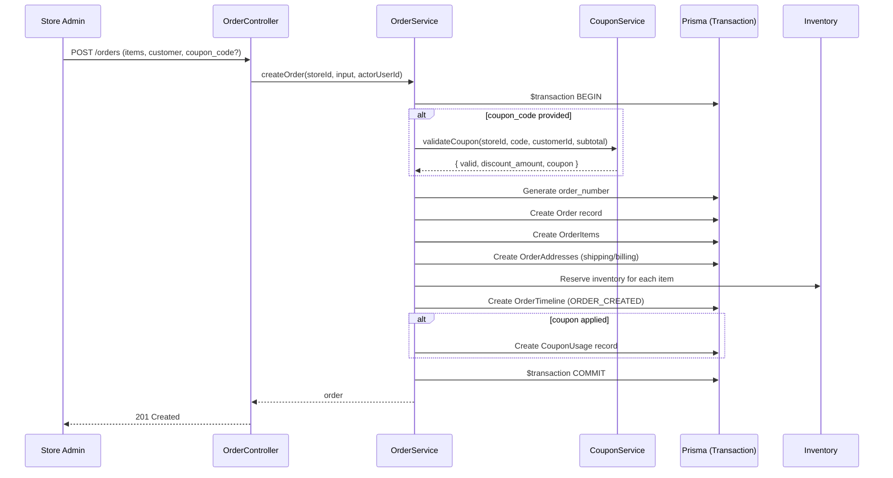
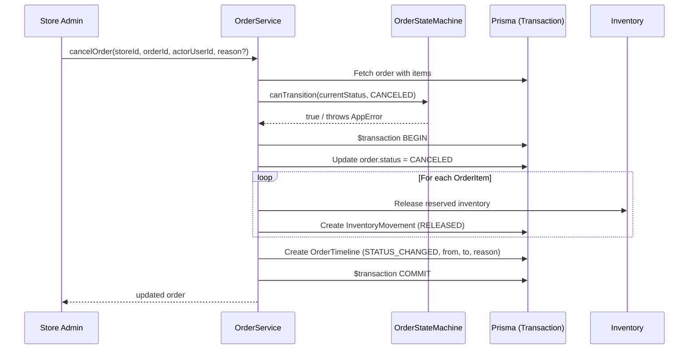
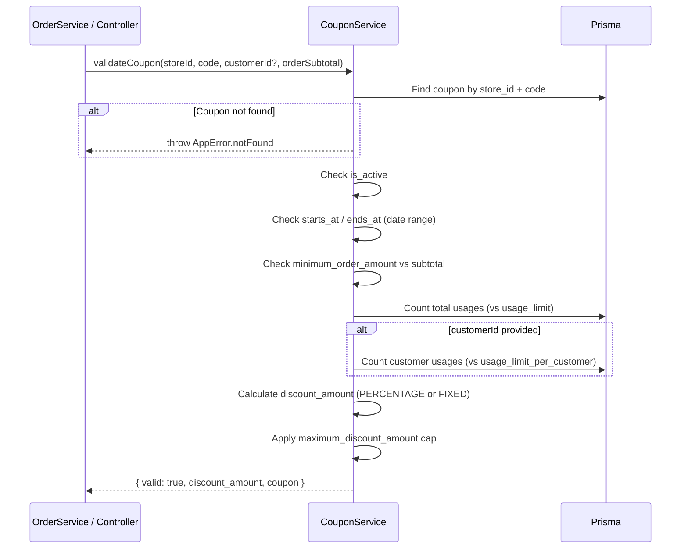
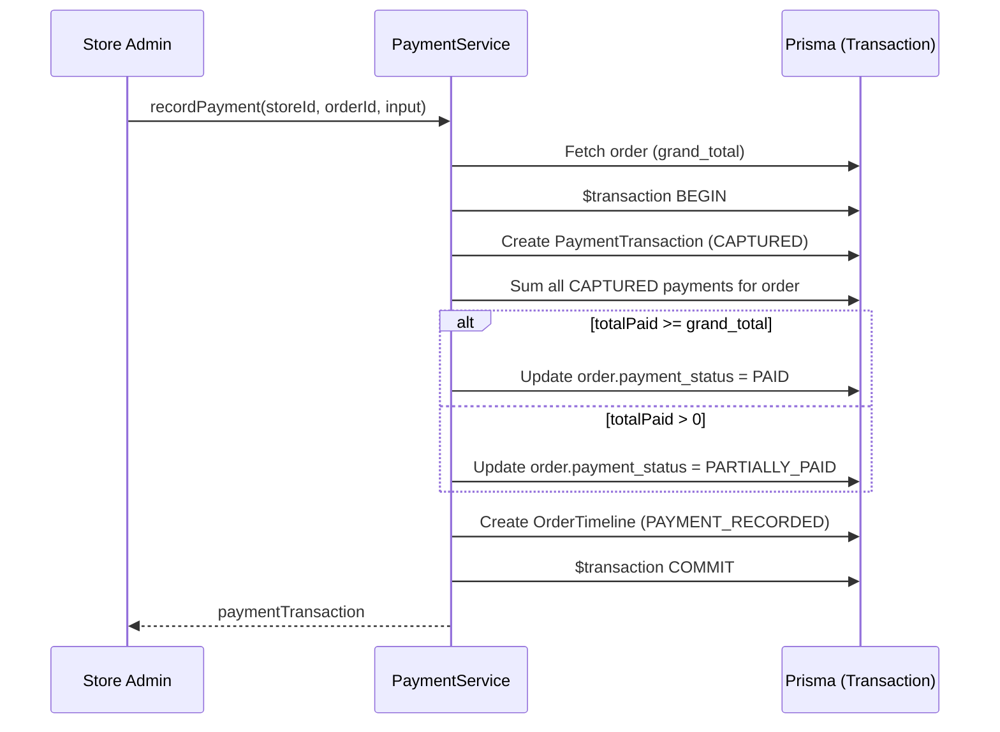

# Design Document: Phase 4 — Orders, Customers, Coupons, and Reports

## Overview

Phase 4 introduces the commercial core of Wasl SaaS: customer management, coupon/discount engine, order lifecycle management (including shipments, payments, and timeline tracking), and a store-level dashboard for analytics. These modules are tightly coupled — orders reference customers and coupons, payments and shipments belong to orders, and the dashboard aggregates data across all of them.

The design follows the established layered monolith pattern with class-based services exported as singletons, Zod validation at the middleware layer, and strict multi-tenant isolation via `store_id` scoping. A key architectural addition is the **Order State Machine** that enforces valid status transitions and triggers side effects (inventory rollback on cancel, timeline entries on transitions, payment status recalculation).

All endpoints are store-admin scoped, protected by `resolveStoreContext` + `requirePermission` middlewares, and follow the existing CRUD patterns established in Phases 1-3.

## Architecture

```mermaid
graph TD
    Client[Store Admin Client]

    subgraph "Middleware Pipeline"
        StoreCtx[resolveStoreContext]
        Auth[requirePermission]
        Validate[validateBody / validateQuery / validateParams]
    end

    subgraph "Route Layer"
        CustomerRoutes[/customers/*]
        CouponRoutes[/coupons/*]
        OrderRoutes[/orders/*]
        ShipmentRoutes[/orders/:orderId/shipments/*]
        PaymentRoutes[/orders/:orderId/payments/*]
        DashboardRoutes[/dashboard/*]
    end

    subgraph "Controller Layer"
        CustomerCtrl[CustomerController]
        CouponCtrl[CouponController]
        OrderCtrl[OrderController]
        ShipmentCtrl[ShipmentController]
        PaymentCtrl[PaymentController]
        DashboardCtrl[DashboardController]
    end

    subgraph "Service Layer"
        CustomerSvc[CustomerService]
        CouponSvc[CouponService]
        OrderSvc[OrderService]
        ShipmentSvc[ShipmentService]
        PaymentSvc[PaymentService]
        DashboardSvc[DashboardService]
        OrderStateMachine[OrderStateMachine]
        OrderNumberGen[OrderNumberGenerator]
    end

    subgraph "Data Layer"
        Prisma[Prisma Client]
        PG[(PostgreSQL)]
    end

    Client --> StoreCtx --> Auth --> Validate
    Validate --> CustomerRoutes --> CustomerCtrl --> CustomerSvc
    Validate --> CouponRoutes --> CouponCtrl --> CouponSvc
    Validate --> OrderRoutes --> OrderCtrl --> OrderSvc
    Validate --> ShipmentRoutes --> ShipmentCtrl --> ShipmentSvc
    Validate --> PaymentRoutes --> PaymentCtrl --> PaymentSvc
    Validate --> DashboardRoutes --> DashboardCtrl --> DashboardSvc

    OrderSvc --> OrderStateMachine
    OrderSvc --> OrderNumberGen
    OrderSvc --> CouponSvc
    OrderSvc --> PaymentSvc
    OrderSvc --> ShipmentSvc

    CustomerSvc --> Prisma
    CouponSvc --> Prisma
    OrderSvc --> Prisma
    ShipmentSvc --> Prisma
    PaymentSvc --> Prisma
    DashboardSvc --> Prisma
    Prisma --> PG
```


## Sequence Diagrams

### Order Creation Flow



### Order Cancellation Flow (with Inventory Rollback)



### Coupon Validation Flow



### Payment Recording & Status Recalculation



## Components and Interfaces

### Component 1: CustomerService

**Purpose**: Manages customer CRUD, address book, and order history retrieval.

```typescript
interface CustomerListParams {
  page?: number;
  limit?: number;
  search?: string;           // searches first_name, last_name, email, phone
  status?: CustomerStatus;
  accepts_marketing?: boolean;
  sort_by?: 'created_at' | 'first_name' | 'last_name';
  sort_order?: 'asc' | 'desc';
}

interface CreateCustomerInput {
  first_name?: string;
  last_name?: string;
  email?: string;
  phone?: string;
  gender?: string;
  birth_date?: Date;
  notes?: string;
  status?: CustomerStatus;
  accepts_marketing?: boolean;
}

interface UpdateCustomerInput extends Partial<CreateCustomerInput> {}

interface CreateAddressInput {
  type?: AddressType;
  full_name: string;
  phone?: string;
  city: string;
  region?: string;
  street_line_1: string;
  street_line_2?: string;
  postal_code?: string;
  google_maps_url?: string;
  is_default?: boolean;
}

class CustomerService {
  list(storeId: number, params: CustomerListParams): Promise<PaginatedResult<Customer>>;
  getById(storeId: number, customerId: number): Promise<Customer>;
  create(storeId: number, data: CreateCustomerInput): Promise<Customer>;
  update(storeId: number, customerId: number, data: UpdateCustomerInput): Promise<Customer>;
  delete(storeId: number, customerId: number): Promise<void>;
  getOrderHistory(storeId: number, customerId: number, params: PaginationParams): Promise<PaginatedResult<Order>>;

  // Address management
  listAddresses(storeId: number, customerId: number): Promise<CustomerAddress[]>;
  createAddress(storeId: number, customerId: number, data: CreateAddressInput): Promise<CustomerAddress>;
  updateAddress(storeId: number, customerId: number, addressId: number, data: Partial<CreateAddressInput>): Promise<CustomerAddress>;
  deleteAddress(storeId: number, customerId: number, addressId: number): Promise<void>;
  setDefaultAddress(storeId: number, customerId: number, addressId: number): Promise<CustomerAddress>;
}
```

**Responsibilities**:
- Enforce unique email/phone per store (both optional, but unique when provided)
- Cascade address default: when setting a new default, unset previous default for same customer
- Soft-archive on delete (set status = ARCHIVED) rather than hard delete

### Component 2: CouponService

**Purpose**: Manages coupon CRUD, validation logic, and usage tracking.

```typescript
interface CouponListParams {
  page?: number;
  limit?: number;
  search?: string;           // searches code, description
  is_active?: boolean;
  type?: DiscountType;
  sort_by?: 'created_at' | 'code' | 'starts_at' | 'ends_at';
  sort_order?: 'asc' | 'desc';
}

interface CreateCouponInput {
  code: string;
  description?: string;
  type: DiscountType;
  value: number;
  minimum_order_amount?: number;
  maximum_discount_amount?: number;
  usage_limit?: number;
  usage_limit_per_customer?: number;
  starts_at?: Date;
  ends_at?: Date;
  is_active?: boolean;
}

interface UpdateCouponInput extends Partial<CreateCouponInput> {}

interface CouponValidationResult {
  valid: boolean;
  discount_amount: number;
  coupon: Coupon;
  reason?: string;
}

class CouponService {
  list(storeId: number, params: CouponListParams): Promise<PaginatedResult<Coupon>>;
  getById(storeId: number, couponId: number): Promise<Coupon>;
  create(storeId: number, data: CreateCouponInput): Promise<Coupon>;
  update(storeId: number, couponId: number, data: UpdateCouponInput): Promise<Coupon>;
  delete(storeId: number, couponId: number): Promise<void>;
  getUsageHistory(storeId: number, couponId: number, params: PaginationParams): Promise<PaginatedResult<CouponUsage>>;
  validateCoupon(storeId: number, code: string, customerId: number | null, orderSubtotal: number): Promise<CouponValidationResult>;
}
```

**Responsibilities**:
- Coupon code uniqueness per store (case-insensitive comparison)
- Validation checks: active status, date range, usage limits, minimum order amount
- Discount calculation: PERCENTAGE applies `value%` of subtotal, FIXED subtracts `value` directly
- Cap discount at `maximum_discount_amount` when set
- Cannot delete a coupon that has usages (throw conflict)

### Component 3: OrderService

**Purpose**: Core order lifecycle management — creation, status transitions, cancellation, notes.

```typescript
interface OrderListParams {
  page?: number;
  limit?: number;
  search?: string;           // searches order_number, customer_name, customer_phone
  status?: ShipmentStatus;
  payment_status?: PaymentStatus;
  source?: OrderSource;
  customer_id?: number;
  date_from?: Date;
  date_to?: Date;
  amount_min?: number;
  amount_max?: number;
  sort_by?: 'placed_at' | 'grand_total' | 'order_number';
  sort_order?: 'asc' | 'desc';
}

interface CreateOrderItemInput {
  product_id: number;
  variant_id: number;
  quantity: number;
}

interface CreateOrderInput {
  customer_id?: number;
  source?: OrderSource;
  items: CreateOrderItemInput[];
  shipping_address: CreateAddressInput;
  billing_address?: CreateAddressInput;
  coupon_code?: string;
  shipping_total?: number;
  notes_from_customer?: string;
  notes_internal?: string;
}

interface UpdateOrderStatusInput {
  status: ShipmentStatus;
  note?: string;
}

interface UpdatePaymentStatusInput {
  payment_status: PaymentStatus;
  note?: string;
}

class OrderService {
  list(storeId: number, params: OrderListParams): Promise<PaginatedResult<Order>>;
  getById(storeId: number, orderId: number): Promise<OrderWithRelations>;
  create(storeId: number, data: CreateOrderInput, actorUserId: number): Promise<Order>;
  updateStatus(storeId: number, orderId: number, data: UpdateOrderStatusInput, actorUserId: number): Promise<Order>;
  updatePaymentStatus(storeId: number, orderId: number, data: UpdatePaymentStatusInput, actorUserId: number): Promise<Order>;
  cancel(storeId: number, orderId: number, actorUserId: number, reason?: string): Promise<Order>;
  addNote(storeId: number, orderId: number, note: string, actorUserId: number): Promise<OrderTimeline>;
  getTimeline(storeId: number, orderId: number, params: PaginationParams): Promise<PaginatedResult<OrderTimeline>>;
}
```

**Responsibilities**:
- Auto-generate sequential order numbers (format: `ORD-{storeId}-{sequential}`)
- Validate status transitions via OrderStateMachine
- Reserve inventory on creation, release on cancellation
- Create timeline entries automatically on status/payment changes
- Calculate totals: subtotal (sum of line_totals), apply discount, add shipping

### Component 4: OrderStateMachine

**Purpose**: Enforces valid order status transitions.

```typescript
class OrderStateMachine {
  canTransition(from: ShipmentStatus, to: ShipmentStatus): boolean;
  getValidTransitions(from: ShipmentStatus): ShipmentStatus[];
  assertTransition(from: ShipmentStatus, to: ShipmentStatus): void; // throws AppError.badRequest
}
```

**Valid Transitions**:
```
DRAFT       → PENDING, CANCELED
PENDING     → CONFIRMED, CANCELED
CONFIRMED   → PROCESSING, CANCELED
PROCESSING  → PREPARING, CANCELED
PREPARING   → SHIPPED, CANCELED
SHIPPED     → IN_TRANSIT, RETURNED
IN_TRANSIT  → OUT_FOR_DELIVERY, RETURNED
OUT_FOR_DELIVERY → DELIVERED, RETURNED
DELIVERED   → RETURNED
CANCELED    → (terminal state, no transitions)
RETURNED    → (terminal state, no transitions)
```

### Component 5: ShipmentService

**Purpose**: Manages shipments within an order.

```typescript
interface CreateShipmentInput {
  provider: string;
  service_name?: string;
  tracking_number?: string;
  shipping_cost?: number;
  expected_delivery_at?: Date;
}

interface UpdateShipmentInput extends Partial<CreateShipmentInput> {}

interface UpdateShipmentStatusInput {
  status: ShipmentStatus;
}

class ShipmentService {
  listByOrder(storeId: number, orderId: number): Promise<Shipment[]>;
  getById(storeId: number, shipmentId: number): Promise<Shipment>;
  create(storeId: number, orderId: number, data: CreateShipmentInput): Promise<Shipment>;
  update(storeId: number, shipmentId: number, data: UpdateShipmentInput): Promise<Shipment>;
  updateStatus(storeId: number, shipmentId: number, data: UpdateShipmentStatusInput): Promise<Shipment>;
}
```

**Responsibilities**:
- Auto-set `shipped_at` when status transitions to SHIPPED
- Auto-set `delivered_at` when status transitions to DELIVERED
- Validate shipment status transitions (same state machine as orders)

### Component 6: PaymentService

**Purpose**: Records payments, processes refunds, recalculates order payment status.

```typescript
interface RecordPaymentInput {
  method: PaymentMethod;
  amount: number;
  currency_code?: string;
  provider?: string;
  transaction_reference?: string;
  payment_link?: string;
  paid_at?: Date;
}

interface ProcessRefundInput {
  amount: number;
  reason?: string;
}

class PaymentService {
  listByOrder(storeId: number, orderId: number): Promise<PaymentTransaction[]>;
  recordPayment(storeId: number, orderId: number, data: RecordPaymentInput, actorUserId: number): Promise<PaymentTransaction>;
  processRefund(storeId: number, orderId: number, data: ProcessRefundInput, actorUserId: number): Promise<PaymentTransaction>;
  recalculatePaymentStatus(storeId: number, orderId: number, tx?: PrismaTransaction): Promise<PaymentStatus>;
}
```

**Responsibilities**:
- Payment amount cannot exceed remaining unpaid amount
- Refund amount cannot exceed total paid amount
- Auto-recalculate `order.payment_status` after each payment/refund
- Create timeline entries for payment events

### Component 7: DashboardService

**Purpose**: Aggregates store-level analytics.

```typescript
interface DashboardOverview {
  total_orders: number;
  total_revenue: number;
  total_customers: number;
  orders_today: number;
  revenue_today: number;
  pending_orders: number;
  average_order_value: number;
}

interface SalesStatParams {
  period: 'day' | 'week' | 'month';
  from_date?: Date;
  to_date?: Date;
}

interface SalesDataPoint {
  date: string;
  orders_count: number;
  revenue: number;
}

interface InventoryAlert {
  variant_id: number;
  product_name: string;
  variant_title: string;
  sku: string;
  available_quantity: number;
  low_stock_threshold: number;
}

class DashboardService {
  getOverview(storeId: number): Promise<DashboardOverview>;
  getSalesStats(storeId: number, params: SalesStatParams): Promise<SalesDataPoint[]>;
  getInventoryAlerts(storeId: number, params: PaginationParams): Promise<PaginatedResult<InventoryAlert>>;
}
```

**Responsibilities**:
- Revenue calculations exclude CANCELED and RETURNED orders
- Sales stats group by day/week/month based on `placed_at`
- Inventory alerts reuse the low-stock logic from Phase 3


## Data Models

All models already exist in the Prisma schema. Below documents validation rules and business constraints.

### Customer

```typescript
// Zod schema for creation
const createCustomerSchema = z.object({
  first_name: z.string().min(1).max(100).optional(),
  last_name: z.string().min(1).max(100).optional(),
  email: z.string().email().max(255).optional(),
  phone: z.string().min(8).max(20).optional(),
  gender: z.enum(['male', 'female', 'other']).optional(),
  birth_date: z.coerce.date().optional(),
  notes: z.string().max(1000).optional(),
  status: z.nativeEnum(CustomerStatus).optional(),
  accepts_marketing: z.boolean().optional(),
});
```

**Validation Rules**:
- At least one of `email` or `phone` must be provided on creation
- `email` unique per store (when provided)
- `phone` unique per store (when provided)
- `birth_date` must be in the past

### CustomerAddress

```typescript
const createAddressSchema = z.object({
  type: z.nativeEnum(AddressType).default('OTHER'),
  full_name: z.string().min(1).max(200),
  phone: z.string().min(8).max(20).optional(),
  city: z.string().min(1).max(100),
  region: z.string().max(100).optional(),
  street_line_1: z.string().min(1).max(300),
  street_line_2: z.string().max(300).optional(),
  postal_code: z.string().max(20).optional(),
  google_maps_url: z.string().url().optional(),
  is_default: z.boolean().default(false),
});
```

**Validation Rules**:
- Only one default address per customer (auto-unset previous on new default)
- `google_maps_url` must be a valid URL when provided

### Coupon

```typescript
const createCouponSchema = z.object({
  code: z.string().min(2).max(50).transform(v => v.toUpperCase()),
  description: z.string().max(500).optional(),
  type: z.nativeEnum(DiscountType),
  value: z.number().positive(),
  minimum_order_amount: z.number().nonnegative().optional(),
  maximum_discount_amount: z.number().positive().optional(),
  usage_limit: z.number().int().positive().optional(),
  usage_limit_per_customer: z.number().int().positive().optional(),
  starts_at: z.coerce.date().optional(),
  ends_at: z.coerce.date().optional(),
  is_active: z.boolean().default(true),
}).refine(
  data => data.type !== 'PERCENTAGE' || (data.value > 0 && data.value <= 100),
  { message: 'Percentage value must be between 1 and 100' }
).refine(
  data => !data.starts_at || !data.ends_at || data.starts_at < data.ends_at,
  { message: 'starts_at must be before ends_at' }
);
```

**Validation Rules**:
- `code` auto-uppercased, unique per store
- PERCENTAGE type: value must be 1-100
- FIXED type: value must be positive
- `starts_at` must be before `ends_at` when both provided
- `maximum_discount_amount` only meaningful for PERCENTAGE type

### Order

```typescript
const createOrderSchema = z.object({
  customer_id: z.number().int().positive().optional(),
  source: z.nativeEnum(OrderSource).default('ADMIN'),
  items: z.array(z.object({
    product_id: z.number().int().positive(),
    variant_id: z.number().int().positive(),
    quantity: z.number().int().positive().max(9999),
  })).min(1),
  shipping_address: createAddressSchema,
  billing_address: createAddressSchema.optional(),
  coupon_code: z.string().optional(),
  shipping_total: z.number().nonnegative().default(0),
  notes_from_customer: z.string().max(1000).optional(),
  notes_internal: z.string().max(1000).optional(),
});
```

**Validation Rules**:
- At least one item required
- Each item quantity must be positive and <= 9999
- `customer_id` must exist in the same store when provided
- All `variant_id` values must exist, be active, and belong to the referenced `product_id`
- Sufficient available inventory for each item

### PaymentTransaction

```typescript
const recordPaymentSchema = z.object({
  method: z.nativeEnum(PaymentMethod),
  amount: z.number().positive(),
  currency_code: z.string().length(3).default('LYD'),
  provider: z.string().max(100).optional(),
  transaction_reference: z.string().max(255).optional(),
  payment_link: z.string().url().optional(),
  paid_at: z.coerce.date().optional(),
});
```

**Validation Rules**:
- `amount` cannot exceed order's remaining unpaid balance
- `currency_code` defaults to store's currency

### Shipment

```typescript
const createShipmentSchema = z.object({
  provider: z.string().min(1).max(100),
  service_name: z.string().max(100).optional(),
  tracking_number: z.string().max(100).optional(),
  shipping_cost: z.number().nonnegative().default(0),
  expected_delivery_at: z.coerce.date().optional(),
});
```

**Validation Rules**:
- `expected_delivery_at` must be in the future when provided
- Order must not be in CANCELED or RETURNED status to create shipment

## Algorithmic Pseudocode

### Order Number Generation

```typescript
/**
 * Generates a sequential order number unique per store.
 * Format: ORD-{storeId padded to 4 digits}-{sequential padded to 6 digits}
 * Example: ORD-0001-000042
 */
async function generateOrderNumber(storeId: number, tx: PrismaTransaction): Promise<string> {
  // Get the latest order number for this store
  const lastOrder = await tx.order.findFirst({
    where: { store_id: storeId },
    orderBy: { id: 'desc' },
    select: { order_number: true },
  });

  let nextSequence = 1;
  if (lastOrder) {
    const parts = lastOrder.order_number.split('-');
    nextSequence = parseInt(parts[2], 10) + 1;
  }

  const storePrefix = String(storeId).padStart(4, '0');
  const sequenceStr = String(nextSequence).padStart(6, '0');
  return `ORD-${storePrefix}-${sequenceStr}`;
}
```

**Preconditions:**
- `storeId` is a valid positive integer
- Called within a transaction to prevent race conditions

**Postconditions:**
- Returns a string matching pattern `ORD-XXXX-XXXXXX`
- The number is unique within the store (enforced by DB unique constraint)
- Sequential ordering is maintained

### Order Creation Algorithm

```typescript
async function createOrder(
  storeId: number,
  input: CreateOrderInput,
  actorUserId: number
): Promise<Order> {
  return await prisma.$transaction(async (tx) => {
    // Step 1: Resolve customer info
    let customerName: string;
    let customerEmail: string | undefined;
    let customerPhone: string;

    if (input.customer_id) {
      const customer = await tx.customer.findFirst({
        where: { id: input.customer_id, store_id: storeId, status: 'ACTIVE' },
      });
      if (!customer) throw AppError.notFound('Customer not found');
      customerName = [customer.first_name, customer.last_name].filter(Boolean).join(' ');
      customerEmail = customer.email ?? undefined;
      customerPhone = customer.phone ?? input.shipping_address.phone ?? '';
    } else {
      customerName = input.shipping_address.full_name;
      customerPhone = input.shipping_address.phone ?? '';
    }

    // Step 2: Validate and resolve items (fetch variant prices, check inventory)
    let subtotal = 0;
    const resolvedItems: ResolvedOrderItem[] = [];

    for (const item of input.items) {
      const variant = await tx.productVariant.findFirst({
        where: { id: item.variant_id, store_id: storeId, product_id: item.product_id, is_active: true },
        include: { product: { select: { name: true, status: true } }, inventory: true },
      });

      if (!variant) throw AppError.notFound(`Variant ${item.variant_id} not found or inactive`);
      if (variant.product.status !== 'ACTIVE') throw AppError.badRequest(`Product "${variant.product.name}" is not active`);

      // Check inventory
      if (variant.inventory && variant.inventory.available_quantity < item.quantity) {
        throw AppError.badRequest(
          `Insufficient stock for "${variant.title}". Available: ${variant.inventory.available_quantity}`
        );
      }

      const unitPrice = Number(variant.price ?? variant.product?.base_price ?? 0);
      const lineTotal = unitPrice * item.quantity;
      subtotal += lineTotal;

      resolvedItems.push({
        product_id: item.product_id,
        variant_id: item.variant_id,
        product_name: variant.product.name,
        variant_title: variant.title,
        sku: variant.sku,
        quantity: item.quantity,
        unit_price: unitPrice,
        discount_total: 0,
        line_total: lineTotal,
      });
    }

    // Step 3: Apply coupon if provided
    let discountTotal = 0;
    let couponId: number | undefined;

    if (input.coupon_code) {
      const validation = await couponService.validateCoupon(
        storeId, input.coupon_code, input.customer_id ?? null, subtotal
      );
      discountTotal = validation.discount_amount;
      couponId = validation.coupon.id;
    }

    // Step 4: Calculate totals
    const shippingTotal = input.shipping_total ?? 0;
    const grandTotal = subtotal - discountTotal + shippingTotal;

    // Step 5: Generate order number
    const orderNumber = await generateOrderNumber(storeId, tx);

    // Step 6: Create order
    const order = await tx.order.create({
      data: {
        store_id: storeId,
        customer_id: input.customer_id ?? null,
        order_number: orderNumber,
        source: input.source ?? 'ADMIN',
        status: 'PENDING',
        payment_status: 'UNPAID',
        currency_code: 'LYD',
        customer_name: customerName,
        customer_email: customerEmail,
        customer_phone: customerPhone,
        subtotal,
        discount_total: discountTotal,
        shipping_total: shippingTotal,
        grand_total: grandTotal,
        notes_from_customer: input.notes_from_customer,
        notes_internal: input.notes_internal,
      },
    });

    // Step 7: Create order items
    await tx.orderItem.createMany({
      data: resolvedItems.map(item => ({
        store_id: storeId,
        order_id: order.id,
        ...item,
      })),
    });

    // Step 8: Create order addresses
    await tx.orderAddress.create({
      data: { store_id: storeId, order_id: order.id, type: 'SHIPPING', ...input.shipping_address },
    });
    if (input.billing_address) {
      await tx.orderAddress.create({
        data: { store_id: storeId, order_id: order.id, type: 'BILLING', ...input.billing_address },
      });
    }

    // Step 9: Reserve inventory
    for (const item of resolvedItems) {
      await tx.inventory.update({
        where: { variant_id_store_id: { variant_id: item.variant_id, store_id: storeId } },
        data: {
          available_quantity: { decrement: item.quantity },
          reserved_quantity: { increment: item.quantity },
        },
      });
      await tx.inventoryMovement.create({
        data: {
          store_id: storeId,
          variant_id: item.variant_id,
          order_id: order.id,
          actor_user_id: actorUserId,
          type: 'RESERVED',
          quantity_change: -item.quantity,
          reason: `Reserved for order ${orderNumber}`,
        },
      });
    }

    // Step 10: Record coupon usage
    if (couponId) {
      await tx.couponUsage.create({
        data: {
          store_id: storeId,
          coupon_id: couponId,
          customer_id: input.customer_id ?? null,
          order_id: order.id,
          discount_amount: discountTotal,
        },
      });
    }

    // Step 11: Create timeline entry
    await tx.orderTimeline.create({
      data: {
        store_id: storeId,
        order_id: order.id,
        actor_user_id: actorUserId,
        event: 'ORDER_CREATED',
        to_status: 'PENDING',
        note: `Order created by admin`,
      },
    });

    return order;
  });
}
```

**Preconditions:**
- `storeId` is valid and the store exists
- `actorUserId` is a valid store member with `order:create` permission
- `input.items` has at least one item
- All referenced products/variants exist in the same store

**Postconditions:**
- Order is created with status PENDING and payment_status UNPAID
- All order items are created with correct pricing
- Inventory is reserved (available decremented, reserved incremented)
- Timeline entry records the creation event
- If coupon applied: CouponUsage record created, discount reflected in totals
- `grand_total = subtotal - discount_total + shipping_total`

**Loop Invariants:**
- For item resolution loop: `subtotal` equals sum of all previously resolved items' `line_total`
- For inventory reservation loop: each variant's `available_quantity + reserved_quantity` remains constant (conservation)

### Coupon Validation Algorithm

```typescript
async function validateCoupon(
  storeId: number,
  code: string,
  customerId: number | null,
  orderSubtotal: number
): Promise<CouponValidationResult> {
  // Step 1: Find coupon
  const coupon = await prisma.coupon.findFirst({
    where: { store_id: storeId, code: code.toUpperCase() },
  });
  if (!coupon) throw AppError.notFound('Coupon not found');

  // Step 2: Check active status
  if (!coupon.is_active) {
    throw AppError.badRequest('Coupon is not active');
  }

  // Step 3: Check date range
  const now = new Date();
  if (coupon.starts_at && now < coupon.starts_at) {
    throw AppError.badRequest('Coupon is not yet valid');
  }
  if (coupon.ends_at && now > coupon.ends_at) {
    throw AppError.badRequest('Coupon has expired');
  }

  // Step 4: Check minimum order amount
  if (coupon.minimum_order_amount && orderSubtotal < Number(coupon.minimum_order_amount)) {
    throw AppError.badRequest(
      `Minimum order amount is ${coupon.minimum_order_amount}`
    );
  }

  // Step 5: Check global usage limit
  if (coupon.usage_limit) {
    const totalUsages = await prisma.couponUsage.count({
      where: { store_id: storeId, coupon_id: coupon.id },
    });
    if (totalUsages >= coupon.usage_limit) {
      throw AppError.badRequest('Coupon usage limit reached');
    }
  }

  // Step 6: Check per-customer usage limit
  if (coupon.usage_limit_per_customer && customerId) {
    const customerUsages = await prisma.couponUsage.count({
      where: { store_id: storeId, coupon_id: coupon.id, customer_id: customerId },
    });
    if (customerUsages >= coupon.usage_limit_per_customer) {
      throw AppError.badRequest('You have reached the usage limit for this coupon');
    }
  }

  // Step 7: Calculate discount
  let discountAmount: number;
  if (coupon.type === 'PERCENTAGE') {
    discountAmount = orderSubtotal * (Number(coupon.value) / 100);
  } else {
    // FIXED
    discountAmount = Math.min(Number(coupon.value), orderSubtotal);
  }

  // Step 8: Apply maximum discount cap
  if (coupon.maximum_discount_amount) {
    discountAmount = Math.min(discountAmount, Number(coupon.maximum_discount_amount));
  }

  // Ensure discount doesn't exceed subtotal
  discountAmount = Math.min(discountAmount, orderSubtotal);

  return { valid: true, discount_amount: discountAmount, coupon };
}
```

**Preconditions:**
- `storeId` is valid
- `code` is a non-empty string
- `orderSubtotal` >= 0

**Postconditions:**
- If returns successfully: `0 < discount_amount <= orderSubtotal`
- If any validation fails: throws AppError with descriptive message
- Coupon record is NOT modified (read-only validation)

### Order Cancellation with Inventory Rollback

```typescript
async function cancelOrder(
  storeId: number,
  orderId: number,
  actorUserId: number,
  reason?: string
): Promise<Order> {
  return await prisma.$transaction(async (tx) => {
    // Step 1: Fetch order with items
    const order = await tx.order.findFirst({
      where: { id: orderId, store_id: storeId },
      include: { items: true },
    });
    if (!order) throw AppError.notFound('Order not found');

    // Step 2: Validate transition
    orderStateMachine.assertTransition(order.status, 'CANCELED');

    // Step 3: Update order status
    const previousStatus = order.status;
    await tx.order.update({
      where: { id_store_id: { id: orderId, store_id: storeId } },
      data: { status: 'CANCELED' },
    });

    // Step 4: Release reserved inventory for each item
    for (const item of order.items) {
      const inventory = await tx.inventory.findFirst({
        where: { variant_id: item.variant_id, store_id: storeId },
      });

      if (inventory) {
        await tx.inventory.update({
          where: { variant_id_store_id: { variant_id: item.variant_id, store_id: storeId } },
          data: {
            available_quantity: { increment: item.quantity },
            reserved_quantity: { decrement: item.quantity },
          },
        });

        await tx.inventoryMovement.create({
          data: {
            store_id: storeId,
            variant_id: item.variant_id,
            order_id: orderId,
            actor_user_id: actorUserId,
            type: 'RELEASED',
            quantity_change: item.quantity,
            reason: reason ?? `Order ${order.order_number} canceled`,
          },
        });
      }
    }

    // Step 5: Create timeline entry
    await tx.orderTimeline.create({
      data: {
        store_id: storeId,
        order_id: orderId,
        actor_user_id: actorUserId,
        event: 'STATUS_CHANGED',
        from_status: previousStatus,
        to_status: 'CANCELED',
        note: reason ?? 'Order canceled by admin',
      },
    });

    return await tx.order.findFirst({
      where: { id: orderId, store_id: storeId },
      include: { items: true, addresses: true, timeline: { orderBy: { created_at: 'desc' }, take: 1 } },
    }) as Order;
  });
}
```

**Preconditions:**
- Order exists in the store
- Current status allows transition to CANCELED (not already CANCELED, DELIVERED, or RETURNED)

**Postconditions:**
- Order status is CANCELED
- For each order item: `available_quantity` is incremented and `reserved_quantity` is decremented by item quantity
- InventoryMovement records created with type RELEASED
- Timeline entry records the cancellation with from/to status and reason

**Loop Invariants:**
- For each processed item: `available_quantity + reserved_quantity` remains constant (inventory conservation)
- All previously processed items have their inventory released

### Payment Status Recalculation

```typescript
async function recalculatePaymentStatus(
  storeId: number,
  orderId: number,
  tx: PrismaTransaction
): Promise<PaymentStatus> {
  const order = await tx.order.findFirst({
    where: { id: orderId, store_id: storeId },
    select: { grand_total: true },
  });
  if (!order) throw AppError.notFound('Order not found');

  // Sum all captured payments
  const result = await tx.paymentTransaction.aggregate({
    where: { store_id: storeId, order_id: orderId, status: 'CAPTURED' },
    _sum: { amount: true },
  });
  const totalPaid = Number(result._sum.amount ?? 0);

  // Sum all refunds
  const refundResult = await tx.paymentTransaction.aggregate({
    where: { store_id: storeId, order_id: orderId, status: { in: ['REFUNDED', 'PARTIALLY_REFUNDED'] } },
    _sum: { amount: true },
  });
  const totalRefunded = Number(refundResult._sum.amount ?? 0);

  const grandTotal = Number(order.grand_total);
  const netPaid = totalPaid - totalRefunded;

  let newStatus: PaymentStatus;
  if (totalRefunded > 0 && netPaid <= 0) {
    newStatus = 'REFUNDED';
  } else if (totalRefunded > 0 && netPaid < grandTotal) {
    newStatus = 'PARTIALLY_REFUNDED';
  } else if (netPaid >= grandTotal) {
    newStatus = 'PAID';
  } else if (netPaid > 0) {
    newStatus = 'PARTIALLY_PAID';
  } else {
    newStatus = 'UNPAID';
  }

  await tx.order.update({
    where: { id_store_id: { id: orderId, store_id: storeId } },
    data: { payment_status: newStatus },
  });

  return newStatus;
}
```

**Preconditions:**
- Order exists in the store
- Called within a transaction after payment/refund creation

**Postconditions:**
- `order.payment_status` accurately reflects the sum of all captured payments minus refunds relative to `grand_total`
- Status transitions: UNPAID → PARTIALLY_PAID → PAID → PARTIALLY_REFUNDED → REFUNDED


## Key Functions with Formal Specifications

### OrderStateMachine.assertTransition()

```typescript
function assertTransition(from: ShipmentStatus, to: ShipmentStatus): void
```

**Preconditions:**
- `from` is a valid ShipmentStatus enum value
- `to` is a valid ShipmentStatus enum value

**Postconditions:**
- If transition is valid: returns void (no-op)
- If transition is invalid: throws `AppError.badRequest` with message describing the invalid transition
- The function is pure — no side effects, no state mutation

### CustomerService.setDefaultAddress()

```typescript
function setDefaultAddress(storeId: number, customerId: number, addressId: number): Promise<CustomerAddress>
```

**Preconditions:**
- Customer exists in the store with status != ARCHIVED
- Address exists and belongs to the customer in the same store

**Postconditions:**
- The specified address has `is_default = true`
- All other addresses for the same customer have `is_default = false`
- Exactly one address per customer has `is_default = true` after operation

### CouponService.create()

```typescript
function create(storeId: number, data: CreateCouponInput): Promise<Coupon>
```

**Preconditions:**
- `data.code` is non-empty after uppercase transformation
- If `data.type === 'PERCENTAGE'`: `0 < data.value <= 100`
- If `data.starts_at` and `data.ends_at` both provided: `starts_at < ends_at`

**Postconditions:**
- Coupon created with `code` stored in uppercase
- Code is unique within the store (throws conflict if duplicate)
- All optional fields default to null/undefined when not provided

### OrderService.updateStatus()

```typescript
function updateStatus(storeId: number, orderId: number, data: UpdateOrderStatusInput, actorUserId: number): Promise<Order>
```

**Preconditions:**
- Order exists in the store
- `data.status` is a valid target from the current order status (per state machine)
- Actor has `order:update` permission

**Postconditions:**
- Order status updated to `data.status`
- OrderTimeline entry created with event='STATUS_CHANGED', from_status, to_status, and optional note
- If transitioning to CANCELED: inventory rollback is triggered (delegated to `cancel()`)

### PaymentService.processRefund()

```typescript
function processRefund(storeId: number, orderId: number, data: ProcessRefundInput, actorUserId: number): Promise<PaymentTransaction>
```

**Preconditions:**
- Order exists in the store
- `data.amount > 0`
- `data.amount <= totalPaid - totalRefunded` (cannot refund more than net paid)
- Order payment_status is PAID or PARTIALLY_PAID

**Postconditions:**
- PaymentTransaction created with status REFUNDED and negative-sense amount
- Order payment_status recalculated (may become PARTIALLY_REFUNDED or REFUNDED)
- Timeline entry created with event='REFUND_PROCESSED'

## Example Usage

### Creating a Customer with Address

```typescript
// POST /api/stores/1/customers
const customer = await customerService.create(1, {
  first_name: 'Ahmed',
  last_name: 'Ali',
  email: 'ahmed@example.com',
  phone: '+218912345678',
  accepts_marketing: true,
});

// POST /api/stores/1/customers/5/addresses
const address = await customerService.createAddress(1, customer.id, {
  type: 'SHIPPING',
  full_name: 'Ahmed Ali',
  phone: '+218912345678',
  city: 'Tripoli',
  region: 'Tripoli',
  street_line_1: 'Al-Rashid Street, Building 42',
  is_default: true,
});
```

### Creating an Order with Coupon

```typescript
// POST /api/stores/1/orders
const order = await orderService.create(1, {
  customer_id: 5,
  source: 'ADMIN',
  items: [
    { product_id: 10, variant_id: 22, quantity: 2 },
    { product_id: 15, variant_id: 31, quantity: 1 },
  ],
  shipping_address: {
    full_name: 'Ahmed Ali',
    phone: '+218912345678',
    city: 'Tripoli',
    street_line_1: 'Al-Rashid Street, Building 42',
  },
  coupon_code: 'SUMMER20',
  shipping_total: 15.00,
}, actorUserId);

// Result: order with status=PENDING, payment_status=UNPAID
// Inventory reserved, coupon usage recorded, timeline entry created
```

### Order Status Transition

```typescript
// PATCH /api/stores/1/orders/100/status
const updated = await orderService.updateStatus(1, 100, {
  status: 'CONFIRMED',
  note: 'Payment verified via bank transfer',
}, actorUserId);

// Timeline entry auto-created: PENDING → CONFIRMED
```

### Recording Payment and Auto-Status Update

```typescript
// POST /api/stores/1/orders/100/payments
const payment = await paymentService.recordPayment(1, 100, {
  method: 'BANK_TRANSFER',
  amount: 250.00,
  transaction_reference: 'TXN-2024-001',
  paid_at: new Date(),
}, actorUserId);

// If grand_total is 250.00 → payment_status auto-updates to PAID
// If grand_total is 500.00 → payment_status auto-updates to PARTIALLY_PAID
```

### Dashboard Overview

```typescript
// GET /api/stores/1/dashboard/overview
const overview = await dashboardService.getOverview(1);
// {
//   total_orders: 156,
//   total_revenue: 45230.50,
//   total_customers: 89,
//   orders_today: 5,
//   revenue_today: 1250.00,
//   pending_orders: 12,
//   average_order_value: 290.00,
// }
```

## Correctness Properties

*A property is a characteristic or behavior that should hold true across all valid executions of a system — essentially, a formal statement about what the system should do. Properties serve as the bridge between human-readable specifications and machine-verifiable correctness guarantees.*

### Property 1: Order state machine transition validity

*For any* order with status S and any target status T, `assertTransition(S, T)` SHALL either succeed silently (when T is in the valid transitions set for S) or throw an AppError (when T is not valid). The valid transitions set is deterministic and immutable — it never changes at runtime.

**Validates: Requirements 22.3, 26.1, 26.2, 26.3, 26.4, 26.5**

### Property 2: Inventory conservation on order lifecycle

*For any* order creation followed by cancellation, the net change to each variant's `available_quantity` and `reserved_quantity` SHALL be zero. Specifically: creation decrements available and increments reserved by quantity Q; cancellation increments available and decrements reserved by the same Q.

**Validates: Requirements 20.11, 23.2, 23.3**

### Property 3: Coupon discount bounds

*For any* valid coupon application with subtotal S, the resulting `discount_amount` SHALL satisfy: `0 < discount_amount <= S` AND (if `maximum_discount_amount` M is set) `discount_amount <= M` AND (if type is PERCENTAGE with value V) `discount_amount <= S * V / 100`.

**Validates: Requirements 18.9, 18.10, 18.11, 18.12**

### Property 4: Payment status consistency

*For any* order with grand_total G, after recalculating payment status: if sum of captured payments minus refunds >= G then status is PAID; if > 0 but < G then PARTIALLY_PAID; if refunds > 0 and net <= 0 then REFUNDED; if 0 then UNPAID. The status always accurately reflects the financial state.

**Validates: Requirements 32.4, 32.5, 32.6, 33.4, 33.5, 33.6, 34.1, 34.2, 34.3, 34.4, 34.5, 34.6**

### Property 5: Order total calculation integrity

*For any* order, `grand_total = subtotal - discount_total + shipping_total` where `subtotal = SUM(unit_price * quantity)` for all items. This invariant holds at creation time and is never violated by subsequent operations.

**Validates: Requirements 20.8, 20.10, 39.1, 39.2, 39.3**

### Property 6: Customer uniqueness constraints

*For any* store, there SHALL never exist two active customers with the same non-null email, and never two active customers with the same non-null phone. The service layer enforces this before Prisma's unique constraint fires.

**Validates: Requirements 2.4, 2.5, 4.3, 4.4**

### Property 7: Coupon usage limit enforcement

*For any* coupon with `usage_limit = N`, the total count of CouponUsage records for that coupon SHALL never exceed N. Similarly, for `usage_limit_per_customer = M`, no single customer SHALL have more than M usages of that coupon.

**Validates: Requirements 18.7, 18.8**

### Property 8: Timeline completeness

*For any* order status change (including creation and cancellation), exactly one OrderTimeline entry SHALL be created with the correct `from_status`, `to_status`, `event`, and `actor_user_id`. No status change occurs without a corresponding timeline record.

**Validates: Requirements 20.13, 22.4, 23.4, 32.7, 33.7**

### Property 9: Multi-tenant isolation

*For any* service method call with `storeId = X`, all database queries SHALL include `store_id = X` in their where clause. No query shall return or modify data belonging to a different store.

**Validates: Requirements 38.1, 38.2, 38.3, 38.4, 38.5, 38.6, 38.7**

### Property 10: Default address uniqueness

*For any* customer, at most one address SHALL have `is_default = true` at any point in time. Setting a new default atomically unsets the previous default.

**Validates: Requirements 8.3, 9.2, 11.1, 11.2**

## Error Handling

### Error Scenarios by Domain

#### Customer Errors

| Scenario | Error Type | Message |
|----------|-----------|---------|
| Customer not found | `AppError.notFound` | "Customer not found" |
| Duplicate email in store | `AppError.conflict` | "A customer with this email already exists" |
| Duplicate phone in store | `AppError.conflict` | "A customer with this phone already exists" |
| Neither email nor phone provided | `AppError.badRequest` | "At least one of email or phone is required" |
| Address not found | `AppError.notFound` | "Address not found" |

#### Coupon Errors

| Scenario | Error Type | Message |
|----------|-----------|---------|
| Coupon not found | `AppError.notFound` | "Coupon not found" |
| Coupon inactive | `AppError.badRequest` | "Coupon is not active" |
| Coupon expired | `AppError.badRequest` | "Coupon has expired" |
| Coupon not yet valid | `AppError.badRequest` | "Coupon is not yet valid" |
| Below minimum order | `AppError.badRequest` | "Minimum order amount is {amount}" |
| Usage limit reached | `AppError.badRequest` | "Coupon usage limit reached" |
| Per-customer limit reached | `AppError.badRequest` | "You have reached the usage limit for this coupon" |
| Delete with usages | `AppError.conflict` | "Cannot delete coupon with existing usages" |
| Duplicate code | `AppError.conflict` | "A coupon with this code already exists" |

#### Order Errors

| Scenario | Error Type | Message |
|----------|-----------|---------|
| Order not found | `AppError.notFound` | "Order not found" |
| Invalid status transition | `AppError.badRequest` | "Cannot transition from {from} to {to}" |
| Variant not found/inactive | `AppError.notFound` | "Variant {id} not found or inactive" |
| Product not active | `AppError.badRequest` | "Product \"{name}\" is not active" |
| Insufficient stock | `AppError.badRequest` | "Insufficient stock for \"{title}\". Available: {qty}" |
| No items provided | `AppError.badRequest` | "At least one item is required" |

#### Payment Errors

| Scenario | Error Type | Message |
|----------|-----------|---------|
| Amount exceeds balance | `AppError.badRequest` | "Payment amount exceeds remaining balance" |
| Refund exceeds paid | `AppError.badRequest` | "Refund amount exceeds total paid amount" |
| Order already fully paid | `AppError.badRequest` | "Order is already fully paid" |

#### Shipment Errors

| Scenario | Error Type | Message |
|----------|-----------|---------|
| Shipment not found | `AppError.notFound` | "Shipment not found" |
| Order canceled/returned | `AppError.badRequest` | "Cannot create shipment for canceled/returned order" |
| Invalid shipment status | `AppError.badRequest` | "Invalid shipment status transition" |

### Error Recovery Strategy

- **Transaction rollback**: All multi-step operations use `prisma.$transaction`. If any step fails, the entire operation rolls back.
- **Inventory consistency**: If order creation fails mid-way, no inventory is reserved (transaction ensures atomicity).
- **Idempotency**: Order number generation within transaction prevents duplicates even under concurrent requests.

## Testing Strategy

### Unit Testing Approach

| Component | Key Test Cases |
|-----------|---------------|
| OrderStateMachine | All valid transitions succeed, all invalid transitions throw, terminal states have no transitions |
| Coupon validation | Each validation rule independently (active, dates, limits, amounts) |
| Order number generation | Sequential numbering, format correctness, store isolation |
| Payment status recalculation | All status combinations (unpaid, partial, paid, refunded) |
| Discount calculation | PERCENTAGE vs FIXED, cap application, edge cases (0 subtotal) |

### Property-Based Testing Approach

**Property Test Library**: [fast-check](https://github.com/dubzzz/fast-check)

| Property | Generator Strategy |
|----------|-------------------|
| State machine validity | Arbitrary ShipmentStatus pairs, verify deterministic result |
| Inventory conservation | Arbitrary quantities, create then cancel, verify net zero |
| Discount bounds | Arbitrary subtotals (0-999999), arbitrary coupon configs, verify bounds |
| Payment status consistency | Arbitrary payment sequences, verify status matches financial state |
| Order total integrity | Arbitrary item lists with prices/quantities, verify sum formula |

### Integration Testing Approach

| Flow | What's Tested |
|------|---------------|
| Full order lifecycle | Create → Confirm → Process → Ship → Deliver (happy path) |
| Order with coupon | Coupon validation + discount application + usage recording |
| Cancellation rollback | Create order → Cancel → Verify inventory restored |
| Payment flow | Record partial → Record remaining → Verify PAID status |
| Refund flow | Full payment → Partial refund → Verify PARTIALLY_REFUNDED |
| Dashboard accuracy | Create orders → Verify aggregation numbers |
| Multi-tenant isolation | Create data in store A → Verify invisible from store B |

### Test File Structure

```
src/
├── __tests__/
│   ├── services/
│   │   ├── customer.Service.test.ts
│   │   ├── coupon.Service.test.ts
│   │   ├── order.Service.test.ts
│   │   ├── shipment.Service.test.ts
│   │   ├── payment.Service.test.ts
│   │   └── dashboard.Service.test.ts
│   ├── utils/
│   │   └── orderStateMachine.test.ts
│   └── integration/
│       ├── order-lifecycle.test.ts
│       ├── coupon-validation.test.ts
│       └── payment-flow.test.ts
```

## Performance Considerations

### Database Indexing

The Prisma schema already includes indexes for the most common query patterns:
- `Order`: `[store_id, status, placed_at]`, `[store_id, customer_id, status]`
- `OrderTimeline`: `[order_id, created_at]`
- `PaymentTransaction`: `[order_id]`, `[status, created_at]`
- `Shipment`: `[order_id]`
- `Customer`: `[store_id, status]`, `[store_id, created_at]`
- `CouponUsage`: `[store_id, created_at]`

### Dashboard Query Optimization

- Use `prisma.order.aggregate()` for revenue/count calculations instead of fetching all records
- Cache dashboard overview with short TTL (30s) for stores with high order volume (future optimization)
- Date-range queries on `placed_at` leverage the composite index

### Pagination

- All list endpoints default to `limit=20`, max `limit=100`
- Use cursor-based pagination for timeline (ordered by `created_at`) if performance degrades
- Order list with complex filters: ensure compound indexes cover the most common filter combinations

### Transaction Scope

- Keep transactions as short as possible — only wrap the critical section
- Order creation transaction includes inventory reservation to prevent overselling
- Dashboard queries are read-only, no transactions needed

## Security Considerations

### Multi-Tenant Isolation

- Every service method receives `storeId` as first parameter
- All Prisma queries include `store_id` in where clause
- Composite unique constraints (e.g., `[store_id, order_number]`) prevent cross-store collisions
- `resolveStoreContext` middleware extracts and validates store context before any controller runs

### Permission Enforcement

| Resource | View | Create | Update | Delete/Cancel |
|----------|------|--------|--------|---------------|
| Customer | `customer:view` | `customer:create` | `customer:update` | `customer:delete` |
| Coupon | `coupon:view` | `coupon:create` | `coupon:update` | `coupon:delete` |
| Order | `order:view` | `order:create` | `order:update` | `order:cancel` |
| Shipment | `shipment:view` | `shipment:create` | `shipment:update` | — |
| Payment | `payment:view` | `payment:create` | — | `payment:refund` |
| Dashboard | `dashboard:view` | — | — | — |

### Input Validation

- All inputs validated via Zod schemas before reaching service layer
- Numeric IDs coerced from string params (URL params are always strings)
- Coupon codes sanitized (uppercase, trimmed)
- Monetary amounts validated as positive numbers with reasonable bounds
- Date inputs coerced and validated (no future birth dates, no past expiry dates on creation)

### Financial Data Integrity

- All monetary calculations use Prisma's `Decimal` type (maps to PostgreSQL `NUMERIC`)
- Avoid floating-point arithmetic — use integer cents or Decimal operations
- Payment amounts validated against order balance to prevent overpayment
- Refund amounts validated against paid total to prevent over-refund

## Dependencies

### Existing (from Phases 0-3)

| Dependency | Purpose |
|-----------|---------|
| `express` | HTTP framework |
| `@prisma/client` | Database ORM |
| `zod` | Input validation |
| `jsonwebtoken` | Auth tokens |
| `express-rate-limit` | Rate limiting |

### New Dependencies Required

None. Phase 4 uses only existing dependencies. The order state machine, number generator, and all business logic are implemented as plain TypeScript — no additional libraries needed.

### Internal Dependencies (Phase 4 modules)

| Module | Depends On |
|--------|-----------|
| OrderService | CouponService (validation), InventoryService (reservation/release), OrderStateMachine |
| PaymentService | OrderService (fetch order totals) |
| ShipmentService | OrderStateMachine (status validation) |
| DashboardService | Order, Customer, Inventory models (read-only aggregation) |
| CouponService | Independent (no cross-service deps) |
| CustomerService | Independent (no cross-service deps) |