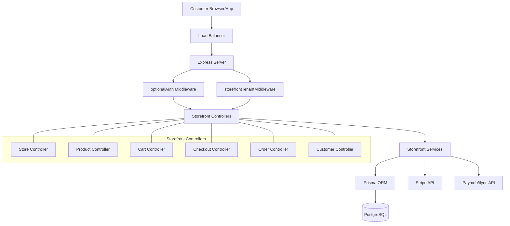
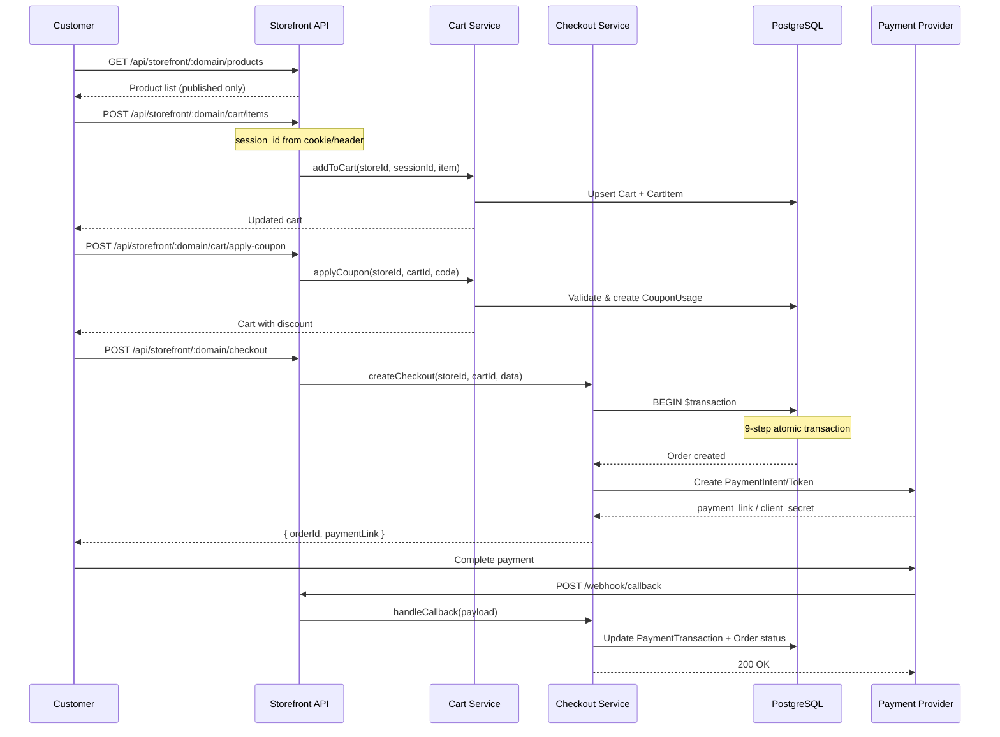
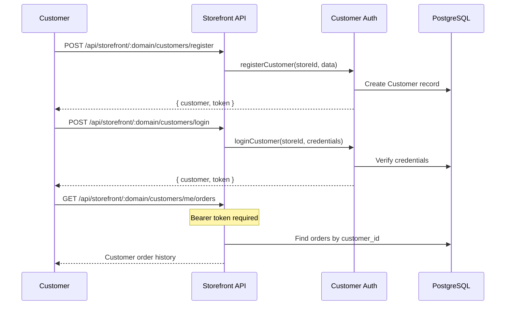

# Design Document: Phase 5 — Storefront (Customer-Facing) APIs

## Overview

Phase 5 implements the complete customer-facing storefront for the Wasl SaaS multi-tenant e-commerce platform. This layer exposes public and semi-authenticated APIs that allow end customers (both guests and registered) to browse stores, manage shopping carts, complete checkouts with payment integration, and manage their accounts.

The storefront is identified by store domain (subdomain or custom domain) rather than numeric store IDs used in admin APIs. It supports guest checkout via session-based carts, registered customer authentication via JWT, and integrates with Stripe and Paymob/tlync payment providers. The checkout process is implemented as an atomic 9-step Prisma transaction to ensure data consistency across order creation, inventory deduction, coupon application, and payment initiation.

Key architectural decisions include: `optionalAuth` middleware for mixed guest/authenticated access, `storefrontTenantMiddleware` for domain-based store resolution, session-based cart persistence for guests, and snapshot-based order items to preserve historical pricing data.

## Architecture



## Sequence Diagrams

### Guest Checkout Flow



### Registered Customer Flow



## Components and Interfaces

### Component 1: Storefront Tenant Middleware

**Purpose**: Resolves store context from domain parameter instead of numeric storeId. Validates store exists and is active.

```typescript
interface StorefrontRequest extends AppRequest {
  store?: {
    id: number;
    name: string;
    domain: string;
    currency_code: string;
    locale: string;
    status: StoreStatus;
  };
  customer?: {
    customerId: number;
    email: string;
  };
  sessionId?: string;
}
```

**Responsibilities**:
- Extract `:domain` from route params
- Query store by `domain` or `custom_domain`
- Reject if store status is not ACTIVE
- Attach `req.store` with store context
- Generate/read `sessionId` from cookie for guest carts

### Component 2: Optional Auth Middleware

**Purpose**: Attempts JWT verification but does not reject unauthenticated requests. Enables mixed guest/authenticated access.

```typescript
// Middleware signature
const optionalAuth: (req: StorefrontRequest, res: Response, next: NextFunction) => void;

// If token present and valid: req.customer = { customerId, email }
// If token absent or invalid: req.customer = undefined (guest)
```

**Responsibilities**:
- Check Authorization header for Bearer token
- If present, verify customer JWT and attach `req.customer`
- If absent or invalid, continue without error (guest mode)
- Never block request flow

### Component 3: Customer Auth Middleware

**Purpose**: Requires valid customer JWT. Used for protected customer endpoints (profile, orders, addresses).

```typescript
const requireCustomerAuth: (req: StorefrontRequest, res: Response, next: NextFunction) => void;
```

**Responsibilities**:
- Verify Bearer token is present
- Decode and validate customer JWT
- Attach `req.customer` with customer data
- Return 401 if token missing or invalid

### Component 4: Storefront Store Controller

**Purpose**: Provides public store information, categories, and navigation data.

```typescript
// GET /api/storefront/:domain
const getStoreByDomain: RequestHandler;

// GET /api/storefront/:domain/categories
const listCategories: RequestHandler;

// GET /api/storefront/:domain/categories/:slug
const getCategoryBySlug: RequestHandler;
```

**Responsibilities**:
- Return store public profile (name, logo, description, social links, SEO)
- List active categories with hierarchy (parent/children)
- Get category by slug with associated published products

### Component 5: Storefront Product Controller

**Purpose**: Product browsing, search, and detail views for published products only.

```typescript
// GET /api/storefront/:domain/products
const listProducts: RequestHandler;

// GET /api/storefront/:domain/products/:slug
const getProductBySlug: RequestHandler;

// GET /api/storefront/:domain/products/search
const searchProducts: RequestHandler;
```

**Responsibilities**:
- List published products with pagination, filtering (category, price range), sorting
- Get product detail with variants, options, media, inventory availability
- Full-text search on product name, description, SKU

### Component 6: Storefront Cart Controller

**Purpose**: Shopping cart management for both guests (session-based) and authenticated customers.

```typescript
// GET /api/storefront/:domain/cart
const getCart: RequestHandler;

// POST /api/storefront/:domain/cart/items
const addToCart: RequestHandler;

// PATCH /api/storefront/:domain/cart/items/:itemId
const updateCartItem: RequestHandler;

// DELETE /api/storefront/:domain/cart/items/:itemId
const removeCartItem: RequestHandler;

// POST /api/storefront/:domain/cart/apply-coupon
const applyCoupon: RequestHandler;

// DELETE /api/storefront/:domain/cart/coupon
const removeCoupon: RequestHandler;

// POST /api/storefront/:domain/cart/checkout
const initiateCheckout: RequestHandler;
```

**Responsibilities**:
- Identify cart by customer_id (authenticated) or session_id (guest)
- Validate product/variant availability and stock before adding
- Recalculate totals on every cart mutation
- Validate and apply coupon codes with all business rules
- Initiate checkout transition (validate cart is non-empty)

### Component 7: Storefront Checkout Controller

**Purpose**: Handles the complete checkout process including order creation and payment initiation.

```typescript
// POST /api/storefront/:domain/checkout
const createCheckout: RequestHandler;

// GET /api/storefront/:domain/checkout/:id
const getCheckoutStatus: RequestHandler;

// POST /api/storefront/:domain/checkout/:id/complete
const completeCheckout: RequestHandler;

// POST /api/storefront/:domain/checkout/callback
const paymentCallback: RequestHandler;
```

**Responsibilities**:
- Execute 9-step atomic checkout transaction
- Integrate with Stripe (PaymentIntent) and Paymob/tlync
- Handle payment webhooks/callbacks
- Return checkout status and payment links

### Component 8: Storefront Order Controller

**Purpose**: Order lookup for guests and order history for authenticated customers.

```typescript
// GET /api/storefront/:domain/orders/lookup
const lookupOrder: RequestHandler;

// GET /api/storefront/:domain/orders/:orderNumber
const getOrderByNumber: RequestHandler;
```

**Responsibilities**:
- Guest order lookup by order_number + phone/email verification
- Get order details with items, status, timeline, shipping info

### Component 9: Storefront Customer Controller

**Purpose**: Customer registration, authentication, profile management, and account features.

```typescript
// POST /api/storefront/:domain/customers/register
const registerCustomer: RequestHandler;

// POST /api/storefront/:domain/customers/login
const loginCustomer: RequestHandler;

// GET /api/storefront/:domain/customers/me
const getProfile: RequestHandler;

// PATCH /api/storefront/:domain/customers/me
const updateProfile: RequestHandler;

// GET /api/storefront/:domain/customers/me/orders
const getCustomerOrders: RequestHandler;

// POST /api/storefront/:domain/customers/me/addresses
const addAddress: RequestHandler;
```

**Responsibilities**:
- Customer registration with email/phone per store (scoped uniqueness)
- JWT-based customer authentication (separate from admin User auth)
- Profile CRUD operations
- Order history with pagination
- Address book management

## Data Models

### Storefront Cart Identification

```typescript
interface CartIdentifier {
  storeId: number;
  customerId?: number;   // For authenticated customers
  sessionId?: string;    // For guest users (UUID from cookie)
}
```

**Validation Rules**:
- Either `customerId` or `sessionId` must be present
- `sessionId` is a UUID v4 string
- One active (OPEN) cart per customer/session per store

### Checkout Input

```typescript
interface CreateCheckoutInput {
  // Customer info (required for guests, optional for authenticated)
  customer_name: string;
  customer_email?: string;
  customer_phone: string;
  
  // Shipping address
  shipping_address: {
    full_name: string;
    phone?: string;
    city: string;
    region?: string;
    street_line_1: string;
    street_line_2?: string;
    postal_code?: string;
    google_maps_url?: string;
  };
  
  // Payment
  payment_method: PaymentMethod;
  
  // Optional
  notes_from_customer?: string;
  coupon_code?: string;
}
```

**Validation Rules**:
- `customer_name` is required, min 2 chars
- `customer_phone` is required, valid Libyan phone format
- `customer_email` is optional but must be valid email if provided
- `shipping_address.city` and `shipping_address.street_line_1` are required
- `payment_method` must be one of: CASH_ON_DELIVERY, CARD, BANK_TRANSFER, WALLET

### Customer Registration Input

```typescript
interface CustomerRegistrationInput {
  first_name: string;
  last_name?: string;
  email: string;
  phone: string;
  password: string;
}
```

**Validation Rules**:
- `first_name` required, min 2 chars
- `email` required, valid email, unique per store
- `phone` required, valid format, unique per store
- `password` required, min 8 chars

### Cart Item Input

```typescript
interface AddToCartInput {
  product_id: number;
  variant_id: number;
  quantity: number;
}
```

**Validation Rules**:
- `product_id` must reference a published product in the store
- `variant_id` must belong to the product and be active
- `quantity` must be positive integer, not exceed available stock


## Algorithmic Pseudocode

### Checkout Transaction Algorithm (9-Step Atomic)

```typescript
async function executeCheckout(
  storeId: number,
  cartId: number,
  input: CreateCheckoutInput,
  customerId?: number
): Promise<{ order: Order; paymentLink?: string }> {
  return prisma.$transaction(async (tx) => {
    // ─── Step 1: Validate Cart & Stock ───
    const cart = await tx.cart.findUnique({
      where: { id_store_id: { id: cartId, store_id: storeId } },
      include: { items: { include: { variant: { include: { inventory: true } }, product: true } } }
    });
    
    if (!cart || cart.status !== 'OPEN' || cart.items.length === 0) {
      throw AppError.badRequest('Cart is empty or invalid');
    }
    
    for (const item of cart.items) {
      if (!item.product.is_published || item.product.status !== 'ACTIVE') {
        throw AppError.badRequest(`Product "${item.product.name}" is no longer available`);
      }
      if (item.variant.inventory && item.variant.inventory.available_quantity < item.quantity) {
        throw AppError.badRequest(`Insufficient stock for "${item.product.name}"`);
      }
    }

    // ─── Step 2: Create Order + OrderItems (snapshot data) ───
    const orderNumber = generateOrderNumber(storeId);
    const order = await tx.order.create({
      data: {
        store_id: storeId,
        customer_id: customerId ?? null,
        cart_id: cartId,
        order_number: orderNumber,
        source: 'STOREFRONT',
        status: 'PENDING',
        payment_status: input.payment_method === 'CASH_ON_DELIVERY' ? 'UNPAID' : 'PENDING',
        currency_code: cart.currency_code,
        customer_name: input.customer_name,
        customer_email: input.customer_email ?? null,
        customer_phone: input.customer_phone,
        subtotal: cart.subtotal,
        discount_total: cart.discount_total,
        shipping_total: cart.shipping_total,
        grand_total: cart.grand_total,
        notes_from_customer: input.notes_from_customer ?? null,
      }
    });

    // Create OrderItems with snapshot data
    await tx.orderItem.createMany({
      data: cart.items.map(item => ({
        store_id: storeId,
        order_id: order.id,
        product_id: item.product_id,
        variant_id: item.variant_id,
        product_name: item.product.name,
        variant_title: item.variant.title ?? null,
        sku: item.variant.sku,
        quantity: item.quantity,
        unit_price: item.unit_price,
        discount_total: 0,
        line_total: item.total_price,
      }))
    });

    // ─── Step 3: Deduct Inventory (create InventoryMovement) ───
    for (const item of cart.items) {
      if (item.product.track_inventory) {
        await tx.inventory.update({
          where: { variant_id_store_id: { variant_id: item.variant_id, store_id: storeId } },
          data: {
            available_quantity: { decrement: item.quantity },
            reserved_quantity: { increment: item.quantity },
          }
        });

        await tx.inventoryMovement.create({
          data: {
            store_id: storeId,
            variant_id: item.variant_id,
            order_id: order.id,
            type: 'RESERVED',
            quantity_change: -item.quantity,
            reason: `Order ${orderNumber} placed`,
            reference_type: 'ORDER',
            reference_id: order.id,
          }
        });
      }
    }

    // ─── Step 4: Create OrderAddress ───
    await tx.orderAddress.create({
      data: {
        store_id: storeId,
        order_id: order.id,
        type: 'SHIPPING',
        full_name: input.shipping_address.full_name,
        phone: input.shipping_address.phone ?? null,
        city: input.shipping_address.city,
        region: input.shipping_address.region ?? null,
        street_line_1: input.shipping_address.street_line_1,
        street_line_2: input.shipping_address.street_line_2 ?? null,
        postal_code: input.shipping_address.postal_code ?? null,
        google_maps_url: input.shipping_address.google_maps_url ?? null,
      }
    });

    // ─── Step 5: Apply Coupon (create CouponUsage) ───
    if (cart.discount_total > 0) {
      const couponUsage = await tx.couponUsage.findFirst({
        where: { store_id: storeId, cart_id: cartId }
      });
      if (couponUsage) {
        await tx.couponUsage.update({
          where: { id: couponUsage.id },
          data: { order_id: order.id }
        });
      }
    }

    // ─── Step 6: Create OrderTimeline ───
    await tx.orderTimeline.create({
      data: {
        store_id: storeId,
        order_id: order.id,
        event: 'ORDER_PLACED',
        to_status: 'PENDING',
        note: 'Order placed via storefront',
      }
    });

    // ─── Step 7: Clear Cart ───
    await tx.cart.update({
      where: { id_store_id: { id: cartId, store_id: storeId } },
      data: { status: 'CONVERTED' }
    });

    // ─── Step 8: Create PaymentTransaction ───
    const paymentTx = await tx.paymentTransaction.create({
      data: {
        store_id: storeId,
        order_id: order.id,
        method: input.payment_method,
        status: input.payment_method === 'CASH_ON_DELIVERY' ? 'PENDING' : 'PENDING',
        amount: order.grand_total,
        currency_code: order.currency_code,
        provider: resolvePaymentProvider(input.payment_method),
      }
    });

    // ─── Step 9: Update Order Totals (final recalculation) ───
    const finalOrder = await tx.order.update({
      where: { id_store_id: { id: order.id, store_id: storeId } },
      data: {
        subtotal: cart.subtotal,
        discount_total: cart.discount_total,
        shipping_total: cart.shipping_total,
        grand_total: cart.grand_total,
      },
      include: { items: true, addresses: true, payments: true }
    });

    return { order: finalOrder, paymentTxId: paymentTx.id };
  });
}
```

### Cart Total Recalculation Algorithm

```typescript
async function recalculateCartTotals(
  tx: PrismaTransactionClient,
  storeId: number,
  cartId: number
): Promise<Cart> {
  const items = await tx.cartItem.findMany({
    where: { store_id: storeId, cart_id: cartId }
  });

  const subtotal = items.reduce(
    (sum, item) => sum + Number(item.unit_price) * item.quantity, 0
  );

  // Check for active coupon on cart
  const couponUsage = await tx.couponUsage.findFirst({
    where: { store_id: storeId, cart_id: cartId, order_id: null },
    include: { coupon: true }
  });

  let discountTotal = 0;
  if (couponUsage) {
    const coupon = couponUsage.coupon;
    if (coupon.type === 'PERCENTAGE') {
      discountTotal = subtotal * (Number(coupon.value) / 100);
      if (coupon.maximum_discount_amount) {
        discountTotal = Math.min(discountTotal, Number(coupon.maximum_discount_amount));
      }
    } else {
      discountTotal = Math.min(Number(coupon.value), subtotal);
    }
  }

  // Shipping calculation (zone-based, simplified)
  const shippingTotal = 0; // Calculated at checkout based on address

  const grandTotal = subtotal - discountTotal + shippingTotal;

  return tx.cart.update({
    where: { id_store_id: { id: cartId, store_id: storeId } },
    data: {
      subtotal,
      discount_total: discountTotal,
      shipping_total: shippingTotal,
      grand_total: Math.max(grandTotal, 0),
    },
    include: { items: true }
  });
}
```

### Coupon Validation Algorithm

```typescript
async function validateCouponForCart(
  storeId: number,
  code: string,
  cartSubtotal: number,
  customerId?: number
): Promise<{ valid: boolean; coupon?: Coupon; discount: number; error?: string }> {
  const coupon = await prisma.coupon.findUnique({
    where: { store_id_code: { store_id: storeId, code: code.toUpperCase() } }
  });

  // Rule 1: Coupon exists
  if (!coupon) return { valid: false, discount: 0, error: 'Coupon not found' };

  // Rule 2: Coupon is active
  if (!coupon.is_active) return { valid: false, discount: 0, error: 'Coupon is inactive' };

  // Rule 3: Date validity
  const now = new Date();
  if (coupon.starts_at && now < coupon.starts_at) {
    return { valid: false, discount: 0, error: 'Coupon not yet active' };
  }
  if (coupon.ends_at && now > coupon.ends_at) {
    return { valid: false, discount: 0, error: 'Coupon has expired' };
  }

  // Rule 4: Global usage limit
  if (coupon.usage_limit) {
    const totalUsages = await prisma.couponUsage.count({
      where: { store_id: storeId, coupon_id: coupon.id }
    });
    if (totalUsages >= coupon.usage_limit) {
      return { valid: false, discount: 0, error: 'Coupon usage limit reached' };
    }
  }

  // Rule 5: Per-customer usage limit
  if (coupon.usage_limit_per_customer && customerId) {
    const customerUsages = await prisma.couponUsage.count({
      where: { store_id: storeId, coupon_id: coupon.id, customer_id: customerId }
    });
    if (customerUsages >= coupon.usage_limit_per_customer) {
      return { valid: false, discount: 0, error: 'You have already used this coupon' };
    }
  }

  // Rule 6: Minimum order amount
  if (coupon.minimum_order_amount && cartSubtotal < Number(coupon.minimum_order_amount)) {
    return { valid: false, discount: 0, error: `Minimum order amount is ${coupon.minimum_order_amount}` };
  }

  // Calculate discount
  let discount = 0;
  if (coupon.type === 'PERCENTAGE') {
    discount = cartSubtotal * (Number(coupon.value) / 100);
    if (coupon.maximum_discount_amount) {
      discount = Math.min(discount, Number(coupon.maximum_discount_amount));
    }
  } else {
    discount = Math.min(Number(coupon.value), cartSubtotal);
  }

  return { valid: true, coupon, discount };
}
```

### Payment Integration Algorithm

```typescript
async function initiatePayment(
  order: Order,
  paymentMethod: PaymentMethod,
  paymentTxId: number
): Promise<{ paymentLink?: string; clientSecret?: string }> {
  if (paymentMethod === 'CASH_ON_DELIVERY') {
    return {}; // No payment link needed
  }

  if (paymentMethod === 'CARD') {
    // Stripe PaymentIntent flow
    const paymentIntent = await stripe.paymentIntents.create({
      amount: Math.round(Number(order.grand_total) * 100), // cents
      currency: order.currency_code.toLowerCase(),
      metadata: {
        order_id: order.id.toString(),
        store_id: order.store_id.toString(),
        order_number: order.order_number,
      }
    });

    await prisma.paymentTransaction.update({
      where: { id: paymentTxId },
      data: {
        transaction_reference: paymentIntent.id,
        payment_link: paymentIntent.client_secret,
      }
    });

    return { clientSecret: paymentIntent.client_secret! };
  }

  if (paymentMethod === 'WALLET') {
    // Paymob/tlync flow for Libya
    const session = await paymob.createPaymentSession({
      amount: Number(order.grand_total),
      currency: order.currency_code,
      orderId: order.order_number,
      callbackUrl: `${config.baseUrl}/api/storefront/${order.store_id}/checkout/callback`,
    });

    await prisma.paymentTransaction.update({
      where: { id: paymentTxId },
      data: {
        transaction_reference: session.id,
        payment_link: session.payment_url,
        provider: 'paymob',
      }
    });

    return { paymentLink: session.payment_url };
  }

  return {};
}
```

## Key Functions with Formal Specifications

### Function 1: resolveStorefrontStore()

```typescript
async function resolveStorefrontStore(domain: string): Promise<Store>
```

**Preconditions:**
- `domain` is a non-empty string
- `domain` matches either `Store.domain` or `Store.custom_domain` in the database

**Postconditions:**
- Returns a Store object with status === 'ACTIVE'
- Throws AppError(404) if store not found
- Throws AppError(403) if store is SUSPENDED or ARCHIVED
- No side effects

### Function 2: getOrCreateCart()

```typescript
async function getOrCreateCart(
  storeId: number,
  customerId?: number,
  sessionId?: string
): Promise<Cart>
```

**Preconditions:**
- `storeId` is a valid store ID
- At least one of `customerId` or `sessionId` is provided
- If `customerId` provided, customer exists in the store

**Postconditions:**
- Returns an existing OPEN cart if one exists for the identifier
- Creates a new OPEN cart if none exists
- Cart is always scoped to `storeId`
- If customer logs in with existing session cart, merges session cart into customer cart

**Loop Invariants:** N/A

### Function 3: addToCart()

```typescript
async function addToCart(
  storeId: number,
  cartId: number,
  input: AddToCartInput
): Promise<Cart>
```

**Preconditions:**
- Cart exists with status OPEN in the given store
- `input.product_id` references a published, active product in the store
- `input.variant_id` belongs to the product and is active
- `input.quantity` > 0
- Available inventory >= requested quantity (if track_inventory is true)

**Postconditions:**
- If variant already in cart: quantity is updated (summed)
- If variant not in cart: new CartItem created
- Cart totals are recalculated
- `unit_price` is set from variant.price ?? product.base_price
- `total_price` = unit_price × quantity
- Returns updated cart with all items

**Loop Invariants:** N/A

### Function 4: executeCheckout()

```typescript
async function executeCheckout(
  storeId: number,
  cartId: number,
  input: CreateCheckoutInput,
  customerId?: number
): Promise<{ order: Order; paymentLink?: string }>
```

**Preconditions:**
- Cart exists, status is OPEN, has at least 1 item
- All cart items reference published, active products
- All cart items have sufficient available inventory
- If coupon applied, coupon is still valid at checkout time
- `input` passes Zod validation

**Postconditions:**
- Order created with status PENDING
- OrderItems created with snapshot data (product_name, sku, unit_price at time of order)
- Inventory decremented: available_quantity -= quantity, reserved_quantity += quantity
- InventoryMovement records created for each item
- OrderAddress created from shipping_address input
- CouponUsage linked to order (if coupon was applied)
- OrderTimeline entry created with event 'ORDER_PLACED'
- Cart status changed to CONVERTED
- PaymentTransaction created
- If payment_method requires online payment: payment link/secret returned
- All operations are atomic (all succeed or all rollback)

**Loop Invariants:**
- For inventory deduction loop: all previously processed items have their inventory correctly decremented

### Function 5: handlePaymentCallback()

```typescript
async function handlePaymentCallback(
  storeId: number,
  payload: PaymentWebhookPayload
): Promise<void>
```

**Preconditions:**
- `payload` contains valid provider signature (verified)
- `payload.transaction_reference` matches an existing PaymentTransaction

**Postconditions:**
- PaymentTransaction status updated (CAPTURED or FAILED)
- If CAPTURED: Order.payment_status = PAID, PaymentTransaction.paid_at = now
- If FAILED: Order.payment_status = FAILED
- OrderTimeline entry created for payment event
- If CAPTURED and COD: inventory moves from RESERVED to OUT
- Idempotent: duplicate callbacks produce same result

### Function 6: lookupOrder()

```typescript
async function lookupOrder(
  storeId: number,
  orderNumber: string,
  verificationValue: string
): Promise<Order>
```

**Preconditions:**
- `storeId` is valid
- `orderNumber` is non-empty
- `verificationValue` is either a valid email or phone number

**Postconditions:**
- Returns order if order_number matches AND (customer_email OR customer_phone) matches verificationValue
- Throws AppError(404) if no match found
- Includes order items, addresses, timeline, payment status
- No mutation of any data

## Example Usage

```typescript
// ─── Example 1: Guest browsing and adding to cart ───
// GET /api/storefront/my-store.wasl.ly/products?category=electronics&page=1&limit=12
const products = await storefrontProductService.listProducts(storeId, {
  category_slug: 'electronics',
  page: 1,
  limit: 12,
  sort_by: 'created_at',
  sort_order: 'desc',
});

// POST /api/storefront/my-store.wasl.ly/cart/items
// Cookie: session_id=uuid-v4-value
const cart = await storefrontCartService.addToCart(storeId, cartId, {
  product_id: 42,
  variant_id: 101,
  quantity: 2,
});

// ─── Example 2: Apply coupon ───
// POST /api/storefront/my-store.wasl.ly/cart/apply-coupon
const cartWithDiscount = await storefrontCartService.applyCoupon(
  storeId, cartId, 'SUMMER20', customerId
);
// Returns: { ...cart, discount_total: 15.00, grand_total: 60.00 }

// ─── Example 3: Complete checkout as guest ───
// POST /api/storefront/my-store.wasl.ly/checkout
const { order, paymentLink } = await storefrontCheckoutService.createCheckout(
  storeId, cartId, {
    customer_name: 'أحمد محمد',
    customer_phone: '+218912345678',
    customer_email: 'ahmed@example.com',
    shipping_address: {
      full_name: 'أحمد محمد',
      city: 'طرابلس',
      street_line_1: 'شارع الجمهورية',
    },
    payment_method: 'CASH_ON_DELIVERY',
  }
);
// order.status = 'PENDING', order.payment_status = 'UNPAID'

// ─── Example 4: Customer registration and login ───
// POST /api/storefront/my-store.wasl.ly/customers/register
const { customer, token } = await storefrontCustomerService.register(storeId, {
  first_name: 'سارة',
  email: 'sara@example.com',
  phone: '+218923456789',
  password: 'SecurePass123',
});

// POST /api/storefront/my-store.wasl.ly/customers/login
const { customer: loggedIn, token: jwt } = await storefrontCustomerService.login(
  storeId, { email: 'sara@example.com', password: 'SecurePass123' }
);

// ─── Example 5: Order lookup by guest ───
// GET /api/storefront/my-store.wasl.ly/orders/lookup?order_number=ORD-001234&phone=+218912345678
const order = await storefrontOrderService.lookupOrder(
  storeId, 'ORD-001234', '+218912345678'
);
```

## Correctness Properties

*A property is a characteristic or behavior that should hold true across all valid executions of a system — essentially, a formal statement about what the system should do. Properties serve as the bridge between human-readable specifications and machine-verifiable correctness guarantees.*

### Property 1: Tenant Data Isolation

*For any* request to `/api/storefront/:domain/*`, all data returned (products, categories, carts, orders, customers) SHALL belong exclusively to the store matching that domain, and any customer JWT with a store_id that does not match the resolved store SHALL be rejected.

**Validates: Requirements 13.1, 13.2, 13.3, 13.4, 13.5**

### Property 2: Published Products Only

*For any* product listing or category product listing on the storefront, all returned products SHALL have `is_published = true` and `status = ACTIVE` — no draft, archived, or unpublished products are ever visible to customers.

**Validates: Requirements 5.1, 4.3**

### Property 3: Cart Total Invariant

*For any* cart after any mutation (add, update, remove item), the cart subtotal SHALL equal the sum of (item.unit_price × item.quantity) for all items, and each item's total_price SHALL equal its unit_price multiplied by its quantity.

**Validates: Requirements 6.7, 6.8**

### Property 4: Checkout Atomicity

*For any* checkout attempt, either all 9 steps complete successfully (Order, OrderItems, Inventory deductions, OrderAddress, CouponUsage linkage, OrderTimeline, Cart status update, PaymentTransaction, and final totals) or none of them persist — no partial order state exists in the database.

**Validates: Requirements 8.3, 8.4**

### Property 5: Price Snapshot Integrity

*For any* OrderItem created during checkout, the product_name, variant_title, sku, and unit_price SHALL reflect the values at the time of order placement and SHALL NOT be affected by subsequent changes to the product or variant.

**Validates: Requirement 8.6**

### Property 6: Inventory Balance After Checkout

*For any* variant with `track_inventory = true`, after a successful checkout the variant's `available_quantity` SHALL decrease by the ordered quantity and `reserved_quantity` SHALL increase by the same amount, and the invariant `total_quantity = available_quantity + reserved_quantity` SHALL hold.

**Validates: Requirements 8.7, 6.6**

### Property 7: Coupon Discount Calculation

*For any* PERCENTAGE coupon applied to a cart, the discount SHALL equal `subtotal × (value / 100)` capped at `maximum_discount_amount` (if set). *For any* FIXED coupon, the discount SHALL equal `min(coupon.value, cart.subtotal)`. The discount SHALL never exceed the cart subtotal.

**Validates: Requirements 7.7, 7.8**

### Property 8: Coupon Validation Rules

*For any* coupon application attempt, the coupon SHALL be rejected if: it is inactive, the current date is outside the starts_at/ends_at range, total usages have reached usage_limit, the customer has reached usage_limit_per_customer, or the cart subtotal is below minimum_order_amount.

**Validates: Requirements 7.2, 7.3, 7.4, 7.5, 7.6**

### Property 9: Order Lookup Security

*For any* guest order lookup request, the system SHALL return order data only when BOTH the order_number matches AND the verification value matches either customer_email or customer_phone on the order — mismatched or partial matches SHALL return 404.

**Validates: Requirement 10.1**

### Property 10: Payment Webhook Idempotency

*For any* payment webhook received for a PaymentTransaction that already has status CAPTURED, the system SHALL return 200 OK without modifying any data — repeated callbacks produce identical state.

**Validates: Requirement 9.7**

### Property 11: Store-Scoped Customer Uniqueness

*For any* customer registration, email and phone uniqueness SHALL be enforced within the store scope — the same email or phone MAY exist in different stores but SHALL NOT be duplicated within the same store.

**Validates: Requirements 11.2, 11.3**

### Property 12: Cart Merge Correctness

*For any* customer login where both a session-based cart and a customer cart exist, the merge SHALL combine all items from both carts, and for any variant present in both carts, the resulting quantity SHALL be the maximum of the two quantities.

**Validates: Requirements 16.1, 16.2**

### Property 13: One Open Cart Per Identifier

*For any* customer_id or session_id within a store, at most one cart with status OPEN SHALL exist at any time.

**Validates: Requirement 6.10**

### Property 14: Optional Auth Never Blocks

*For any* request to an optionalAuth-protected endpoint, regardless of whether the Authorization header is absent, contains an invalid token, or contains an expired token, the request SHALL proceed without returning an authentication error.

**Validates: Requirements 2.2, 2.3, 2.4**

## Error Handling

### Error Scenario 1: Insufficient Stock at Checkout

**Condition**: Customer attempts checkout but another customer purchased the last item between cart-add and checkout.
**Response**: Return 409 Conflict with specific item(s) that are out of stock.
**Recovery**: Client removes/updates affected items and retries checkout.

### Error Scenario 2: Expired Coupon at Checkout

**Condition**: Coupon was valid when applied to cart but expired before checkout.
**Response**: Return 400 Bad Request indicating coupon is no longer valid.
**Recovery**: Remove coupon from cart, recalculate totals, allow checkout without discount.

### Error Scenario 3: Store Suspended During Session

**Condition**: Store admin suspends store while customer has active cart/checkout.
**Response**: storefrontTenantMiddleware returns 403 with message "Store is currently unavailable".
**Recovery**: No recovery — customer must wait for store reactivation.

### Error Scenario 4: Payment Provider Timeout

**Condition**: Stripe/Paymob API call times out during checkout.
**Response**: Transaction rolls back, return 502 Bad Gateway.
**Recovery**: Client retries checkout. Idempotency key prevents duplicate orders.

### Error Scenario 5: Duplicate Payment Callback

**Condition**: Payment provider sends webhook multiple times for same transaction.
**Response**: Check if PaymentTransaction already has status CAPTURED; if so, return 200 OK without changes.
**Recovery**: Idempotent handling — no duplicate processing.

### Error Scenario 6: Invalid Session/Cart Mismatch

**Condition**: Guest provides session_id that doesn't match any cart, or cart belongs to different store.
**Response**: Return empty cart (create new one) rather than error.
**Recovery**: Transparent — customer sees empty cart and can add items.

## Testing Strategy

### Unit Testing Approach

- Test coupon validation logic with all edge cases (expired, usage limit, minimum amount)
- Test cart total recalculation with various item combinations
- Test order number generation uniqueness
- Test payment provider resolution logic
- Test shipping cost calculation

### Property-Based Testing Approach

**Property Test Library**: fast-check

Key properties to test:
- Cart total always equals sum of (item.unit_price × item.quantity) minus discount
- Checkout transaction either fully succeeds or fully rolls back (no partial state)
- Coupon discount never exceeds cart subtotal
- Inventory available_quantity never goes negative after checkout

### Integration Testing Approach

- Full checkout flow: add items → apply coupon → checkout → verify order + inventory
- Guest vs authenticated cart behavior
- Payment webhook handling with mock providers
- Concurrent checkout race condition testing
- Store domain resolution with subdomain and custom domain

## Performance Considerations

- **Product Listing**: Index on `(store_id, status, is_published)` already exists. Add Redis caching for published product lists with 5-minute TTL.
- **Cart Operations**: Cart lookups by `(store_id, session_id)` and `(store_id, customer_id)` are indexed via unique constraints.
- **Checkout Transaction**: The 9-step transaction holds a DB connection for its duration. Keep transaction scope minimal. Consider connection pool size (min 10 connections).
- **Search**: Use PostgreSQL full-text search with `tsvector` on product name + description. Add GIN index for performance.
- **Rate Limiting**: Apply stricter rate limits on checkout (5 req/min) and customer registration (3 req/min) to prevent abuse.
- **Session Cleanup**: Cron job to expire abandoned carts (status OPEN, updated_at > 7 days ago).

## Security Considerations

- **Customer JWT**: Separate signing key from admin User JWT. Include `store_id` in token payload to prevent cross-store access.
- **Session ID**: Use cryptographically random UUID v4. Set as HttpOnly, Secure, SameSite=Strict cookie.
- **Payment Webhooks**: Verify Stripe signature (`stripe-signature` header) and Paymob HMAC before processing.
- **Order Lookup**: Require both order_number + phone/email to prevent order enumeration.
- **Input Sanitization**: All user inputs validated via Zod schemas. SQL injection prevented by Prisma parameterized queries.
- **Rate Limiting**: Aggressive rate limiting on auth endpoints (login: 5/min, register: 3/min) and checkout (5/min).
- **CORS**: Storefront APIs should allow the specific storefront domain origins only.
- **Phone Validation**: Validate Libyan phone format (+218XXXXXXXXX) to prevent abuse.

## Dependencies

| Dependency | Purpose | Version |
|-----------|---------|---------|
| express | HTTP framework | ^5.2.1 (existing) |
| prisma | ORM / Database | ^7.6.0 (existing) |
| zod | Input validation | ^4.3.6 (existing) |
| jsonwebtoken | Customer JWT | ^9.0.3 (existing) |
| bcryptjs | Password hashing | ^3.0.3 (existing) |
| stripe | Payment integration | ^14.x (new) |
| uuid | Session ID generation | ^9.x (new) |
| cookie-parser | Session cookie handling | ^1.4.7 (existing) |

**External Services**:
- Stripe API (card payments)
- Paymob/tlync API (Libyan wallet payments)
- PostgreSQL (existing database)
