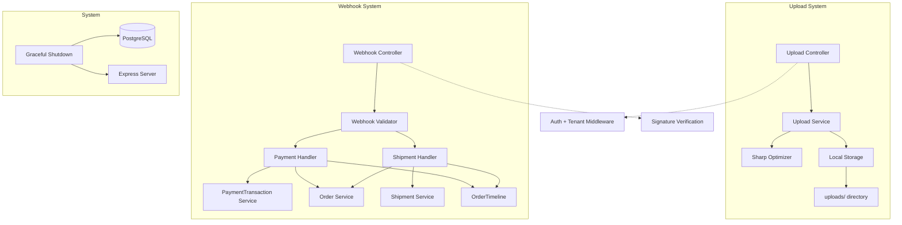
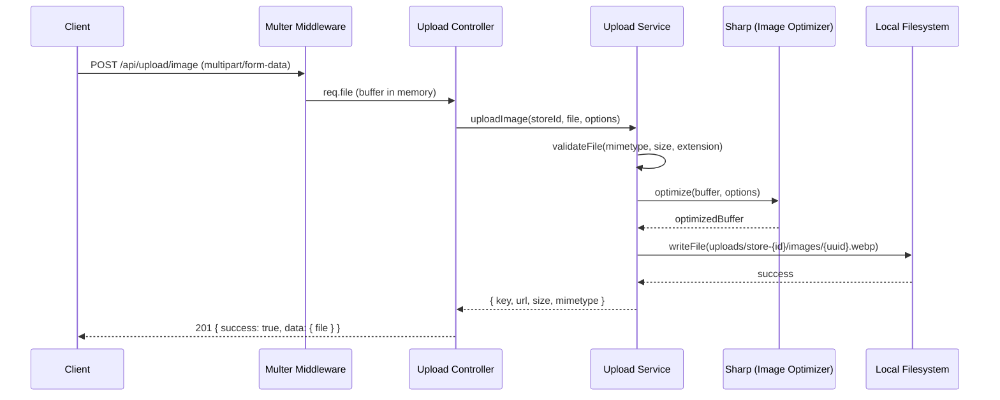
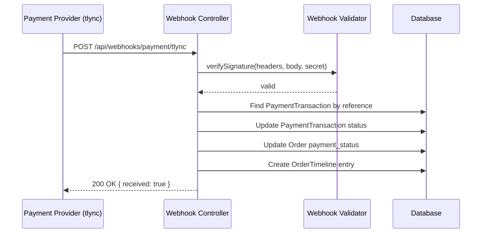
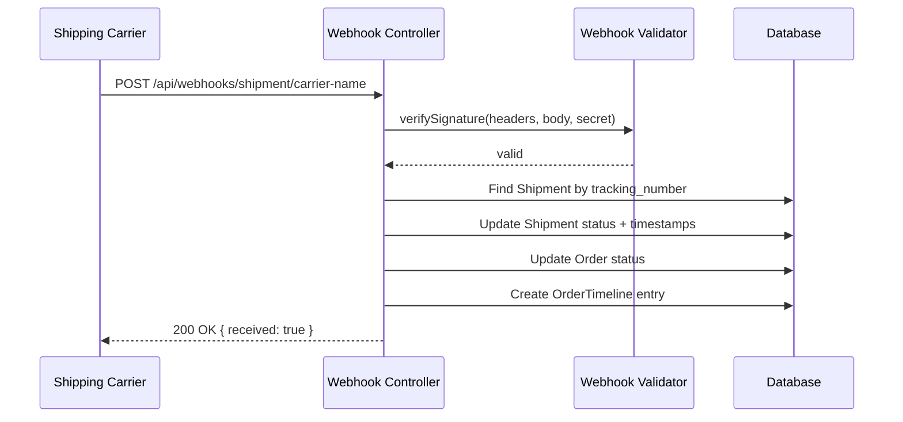

# Design Document: Phase 6 — Upload System + Webhooks

## Overview

Phase 6 adds two core subsystems to the Wasl_SaaS platform: a general-purpose **Upload System** for image/file management with optimization via `sharp`, and a **Webhook System** for receiving payment and shipment status updates from external providers (e.g., tlync for Libya). Both systems are designed for local development and testing — files are stored on the local filesystem in an `uploads/` directory, and webhooks are tested via manual HTTP calls (Postman/curl).

The Upload System extends the existing `productMedia.Service.ts` pattern into a standalone, reusable service that any part of the application can use (store logos, category images, general files). The Webhook System provides secure endpoints that validate incoming payloads, update order/payment/shipment state, and log events to the `OrderTimeline`.

Additionally, this phase adds graceful shutdown handling (SIGTERM/SIGINT) to ensure clean process termination during development.

## Architecture



## Sequence Diagrams

### Upload Image Flow



### Payment Webhook Flow



### Shipment Webhook Flow



## Components and Interfaces

### Component 1: Upload Service

**Purpose**: Handles file validation, image optimization via sharp, local storage, and file deletion. Provides a reusable interface for any part of the app that needs file uploads.

**Interface**:
```typescript
interface UploadResult {
  key: string;          // Unique file key (e.g., "store-1/images/uuid.webp")
  url: string;          // Relative URL path (e.g., "/uploads/store-1/images/uuid.webp")
  originalName: string; // Original filename from client
  mimetype: string;     // Final mimetype after optimization
  size: number;         // Final file size in bytes
}

interface ImageUploadOptions {
  maxWidth?: number;    // Max width for resize (default: 1920)
  maxHeight?: number;   // Max height for resize (default: 1920)
  quality?: number;     // Compression quality 1-100 (default: 80)
  format?: "webp" | "jpeg" | "png"; // Output format (default: "webp")
}

interface UploadServiceInterface {
  uploadImage(storeId: number, file: UploadedFile, options?: ImageUploadOptions): Promise<UploadResult>;
  uploadFile(storeId: number, file: UploadedFile): Promise<UploadResult>;
  deleteFile(key: string): Promise<void>;
}
```

**Responsibilities**:
- Validate file type (mimetype + extension) and size
- Optimize images using sharp (resize, compress, convert to webp)
- Store files in `uploads/store-{storeId}/{type}/{uuid}.{ext}`
- Delete files from local storage
- Serve as a single point of change when migrating to S3 later

### Component 2: Webhook Controller

**Purpose**: Receives incoming webhook payloads from payment providers and shipping carriers, validates signatures, and delegates processing to appropriate handlers.

**Interface**:
```typescript
interface WebhookPayload {
  provider: string;
  event: string;
  data: Record<string, unknown>;
  timestamp: string;
}

interface PaymentWebhookData {
  transaction_reference: string;
  status: "authorized" | "captured" | "failed" | "refunded";
  amount: number;
  currency: string;
  paid_at?: string;
  metadata?: Record<string, unknown>;
}

interface ShipmentWebhookData {
  tracking_number: string;
  status: string;
  provider: string;
  shipped_at?: string;
  delivered_at?: string;
  expected_delivery_at?: string;
  metadata?: Record<string, unknown>;
}

interface WebhookControllerInterface {
  handlePaymentWebhook(provider: string, payload: WebhookPayload): Promise<void>;
  handleShipmentWebhook(provider: string, payload: WebhookPayload): Promise<void>;
}
```

**Responsibilities**:
- Parse raw body for signature verification
- Validate webhook signatures (HMAC-based)
- Map provider-specific status values to internal enums
- Update PaymentTransaction, Shipment, and Order records
- Log events to OrderTimeline
- Return 200 quickly to avoid provider retries

### Component 3: Upload Controller

**Purpose**: Express route handlers for upload endpoints. Handles multer integration and delegates to Upload Service.

**Interface**:
```typescript
// POST /api/upload/image
// POST /api/upload/file
// DELETE /api/upload/:key
```

**Responsibilities**:
- Configure multer for memory storage
- Validate authenticated user has upload permissions
- Parse upload options from request body/query
- Delegate to Upload Service
- Return standardized API responses

### Component 4: Graceful Shutdown Handler

**Purpose**: Ensures clean process termination by closing database connections and stopping the HTTP server.

**Interface**:
```typescript
interface GracefulShutdownInterface {
  register(server: import("http").Server): void;
}
```

**Responsibilities**:
- Listen for SIGTERM and SIGINT signals
- Stop accepting new connections
- Close existing connections gracefully
- Disconnect Prisma client
- Exit process with code 0

## Data Models

### Upload Configuration (App Config Extension)

```typescript
// Added to AppConfig interface
interface UploadConfig {
  maxImageSize: number;       // bytes (default: 5MB)
  maxFileSize: number;        // bytes (default: 10MB)
  allowedImageTypes: string[];
  allowedFileTypes: string[];
  imageQuality: number;       // 1-100 (default: 80)
  imageMaxWidth: number;      // pixels (default: 1920)
  imageMaxHeight: number;     // pixels (default: 1920)
  uploadsDir: string;         // absolute path to uploads directory
}
```

**Validation Rules**:
- `maxImageSize` must be positive, max 10MB
- `maxFileSize` must be positive, max 50MB
- `imageQuality` must be between 1 and 100
- `imageMaxWidth` and `imageMaxHeight` must be positive integers

### Webhook Secret Configuration

```typescript
// Added to AppConfig interface
interface WebhookConfig {
  paymentProviders: Record<string, {
    secret: string;
    signatureHeader: string;
  }>;
  shipmentProviders: Record<string, {
    secret: string;
    signatureHeader: string;
  }>;
}
```

**Validation Rules**:
- Each provider must have a non-empty secret
- Signature header name must be a valid HTTP header name

## Algorithmic Pseudocode

### Image Upload Algorithm

```typescript
async function uploadImage(storeId: number, file: UploadedFile, options?: ImageUploadOptions): Promise<UploadResult> {
  // PRECONDITIONS:
  // - storeId is a valid positive integer
  // - file.buffer is non-empty
  // - file.mimetype is a valid MIME type string

  // Step 1: Validate file
  const ext = path.extname(file.originalname).toLowerCase();
  if (!ALLOWED_IMAGE_MIMES.includes(file.mimetype) && !ALLOWED_IMAGE_EXTS.includes(ext)) {
    throw AppError.badRequest("Only image files are allowed (jpg, png, webp, gif)");
  }
  if (file.size > MAX_IMAGE_SIZE) {
    throw AppError.badRequest(`Image size exceeds ${MAX_IMAGE_SIZE / 1024 / 1024}MB limit`);
  }

  // Step 2: Optimize image with sharp
  const optimized = await sharp(file.buffer)
    .resize({
      width: options?.maxWidth ?? 1920,
      height: options?.maxHeight ?? 1920,
      fit: "inside",
      withoutEnlargement: true,
    })
    .toFormat(options?.format ?? "webp", {
      quality: options?.quality ?? 80,
    })
    .toBuffer();

  // Step 3: Generate unique key and write to disk
  const outputExt = `.${options?.format ?? "webp"}`;
  const uniqueName = `${randomUUID()}${outputExt}`;
  const key = `store-${storeId}/images/${uniqueName}`;
  const fullPath = path.join(UPLOADS_DIR, key);

  await fs.mkdir(path.dirname(fullPath), { recursive: true });
  await fs.writeFile(fullPath, optimized);

  // POSTCONDITIONS:
  // - File exists at fullPath
  // - Returned UploadResult.key uniquely identifies the file
  // - Returned UploadResult.size reflects the optimized size
  return {
    key,
    url: `/uploads/${key}`,
    originalName: file.originalname,
    mimetype: `image/${options?.format ?? "webp"}`,
    size: optimized.length,
  };
}
```

### Payment Webhook Processing Algorithm

```typescript
async function handlePaymentWebhook(
  provider: string,
  headers: Record<string, string>,
  rawBody: Buffer,
  parsedBody: PaymentWebhookData
): Promise<void> {
  // PRECONDITIONS:
  // - provider is a registered payment provider key
  // - rawBody is the unmodified request body
  // - parsedBody has been validated against Zod schema

  // Step 1: Verify webhook signature
  const providerConfig = config.webhooks.paymentProviders[provider];
  if (!providerConfig) {
    throw AppError.notFound(`Unknown payment provider: ${provider}`);
  }

  const signature = headers[providerConfig.signatureHeader];
  const expectedSignature = createHmac("sha256", providerConfig.secret)
    .update(rawBody)
    .digest("hex");

  if (!timingSafeEqual(Buffer.from(signature ?? ""), Buffer.from(expectedSignature))) {
    throw AppError.unauthorized("Invalid webhook signature");
  }

  // Step 2: Find the payment transaction
  const transaction = await prisma.paymentTransaction.findFirst({
    where: { transaction_reference: parsedBody.transaction_reference },
    include: { order: true },
  });

  if (!transaction) {
    throw AppError.notFound("Payment transaction not found");
  }

  // Step 3: Map provider status to internal status
  const statusMap: Record<string, PaymentTransactionStatus> = {
    authorized: "AUTHORIZED",
    captured: "CAPTURED",
    failed: "FAILED",
    refunded: "REFUNDED",
  };
  const newStatus = statusMap[parsedBody.status];
  if (!newStatus) {
    throw AppError.badRequest(`Unknown payment status: ${parsedBody.status}`);
  }

  // Step 4: Update transaction and order in a transaction
  await prisma.$transaction(async (tx) => {
    // Update PaymentTransaction
    await tx.paymentTransaction.update({
      where: { id: transaction.id },
      data: {
        status: newStatus,
        paid_at: parsedBody.paid_at ? new Date(parsedBody.paid_at) : undefined,
        raw_payload: parsedBody as any,
      },
    });

    // Update Order payment_status
    const orderPaymentStatus = mapToOrderPaymentStatus(newStatus);
    await tx.order.update({
      where: { id_store_id: { id: transaction.order_id, store_id: transaction.store_id } },
      data: { payment_status: orderPaymentStatus },
    });

    // Log to OrderTimeline
    await tx.orderTimeline.create({
      data: {
        store_id: transaction.store_id,
        order_id: transaction.order_id,
        event: `payment.${parsedBody.status}`,
        note: `Payment ${parsedBody.status} via ${provider}`,
        payload: parsedBody as any,
      },
    });
  });

  // POSTCONDITIONS:
  // - PaymentTransaction.status is updated
  // - Order.payment_status reflects the new payment state
  // - OrderTimeline has a new entry for this event
}
```

### Shipment Webhook Processing Algorithm

```typescript
async function handleShipmentWebhook(
  provider: string,
  headers: Record<string, string>,
  rawBody: Buffer,
  parsedBody: ShipmentWebhookData
): Promise<void> {
  // PRECONDITIONS:
  // - provider is a registered shipment provider key
  // - rawBody is the unmodified request body
  // - parsedBody has been validated against Zod schema

  // Step 1: Verify webhook signature
  const providerConfig = config.webhooks.shipmentProviders[provider];
  if (!providerConfig) {
    throw AppError.notFound(`Unknown shipment provider: ${provider}`);
  }

  const signature = headers[providerConfig.signatureHeader];
  const expectedSignature = createHmac("sha256", providerConfig.secret)
    .update(rawBody)
    .digest("hex");

  if (!timingSafeEqual(Buffer.from(signature ?? ""), Buffer.from(expectedSignature))) {
    throw AppError.unauthorized("Invalid webhook signature");
  }

  // Step 2: Find the shipment by tracking number
  const shipment = await prisma.shipment.findFirst({
    where: {
      tracking_number: parsedBody.tracking_number,
      provider: provider,
    },
    include: { order: true },
  });

  if (!shipment) {
    throw AppError.notFound("Shipment not found");
  }

  // Step 3: Map provider status to internal ShipmentStatus
  const newStatus = mapProviderShipmentStatus(provider, parsedBody.status);

  // Step 4: Update shipment and order in a transaction
  await prisma.$transaction(async (tx) => {
    // Update Shipment
    await tx.shipment.update({
      where: { id_store_id: { id: shipment.id, store_id: shipment.store_id } },
      data: {
        status: newStatus,
        shipped_at: parsedBody.shipped_at ? new Date(parsedBody.shipped_at) : undefined,
        delivered_at: parsedBody.delivered_at ? new Date(parsedBody.delivered_at) : undefined,
        expected_delivery_at: parsedBody.expected_delivery_at
          ? new Date(parsedBody.expected_delivery_at)
          : undefined,
      },
    });

    // Update Order status to match shipment
    await tx.order.update({
      where: { id_store_id: { id: shipment.order_id, store_id: shipment.store_id } },
      data: { status: newStatus },
    });

    // Log to OrderTimeline
    await tx.orderTimeline.create({
      data: {
        store_id: shipment.store_id,
        order_id: shipment.order_id,
        event: `shipment.${parsedBody.status}`,
        from_status: shipment.status,
        to_status: newStatus,
        note: `Shipment status updated to ${newStatus} via ${provider}`,
        payload: parsedBody as any,
      },
    });
  });

  // POSTCONDITIONS:
  // - Shipment.status is updated to newStatus
  // - Order.status reflects the shipment state
  // - OrderTimeline has a new entry with from_status and to_status
}
```

### File Deletion Algorithm

```typescript
async function deleteFile(key: string): Promise<void> {
  // PRECONDITIONS:
  // - key is a non-empty string representing a relative path within uploads/

  const fullPath = path.join(UPLOADS_DIR, key);

  // Security: Ensure the resolved path is within UPLOADS_DIR (prevent path traversal)
  const resolvedPath = path.resolve(fullPath);
  if (!resolvedPath.startsWith(path.resolve(UPLOADS_DIR))) {
    throw AppError.forbidden("Invalid file path");
  }

  // Attempt deletion
  try {
    await fs.unlink(resolvedPath);
  } catch (err: any) {
    if (err.code === "ENOENT") {
      throw AppError.notFound("File not found");
    }
    throw AppError.internal(`Failed to delete file: ${err.message}`);
  }

  // POSTCONDITIONS:
  // - File no longer exists at resolvedPath
  // - If file was already missing, AppError.notFound is thrown
}
```

## Key Functions with Formal Specifications

### Function: optimizeImage()

```typescript
async function optimizeImage(
  buffer: Buffer,
  options: ImageUploadOptions
): Promise<Buffer>
```

**Preconditions:**
- `buffer` is a non-empty Buffer containing valid image data
- `options.quality` is between 1 and 100 (if provided)
- `options.maxWidth` and `options.maxHeight` are positive integers (if provided)

**Postconditions:**
- Returns a Buffer containing the optimized image
- Output dimensions ≤ maxWidth × maxHeight
- Output format matches `options.format` (default: webp)
- Output size ≤ input size (in most cases; sharp may produce larger output for very small images)

**Loop Invariants:** N/A (single-pass pipeline)

### Function: verifyWebhookSignature()

```typescript
function verifyWebhookSignature(
  rawBody: Buffer,
  signature: string,
  secret: string
): boolean
```

**Preconditions:**
- `rawBody` is the exact bytes received from the provider (not parsed/modified)
- `signature` is a hex-encoded HMAC-SHA256 string
- `secret` is the shared secret for this provider

**Postconditions:**
- Returns `true` if and only if HMAC-SHA256(secret, rawBody) === signature
- Uses timing-safe comparison to prevent timing attacks
- No side effects

**Loop Invariants:** N/A

### Function: mapToOrderPaymentStatus()

```typescript
function mapToOrderPaymentStatus(
  transactionStatus: PaymentTransactionStatus
): PaymentStatus
```

**Preconditions:**
- `transactionStatus` is a valid `PaymentTransactionStatus` enum value

**Postconditions:**
- Returns a valid `PaymentStatus` enum value
- Mapping: AUTHORIZED → PENDING, CAPTURED → PAID, FAILED → FAILED, REFUNDED → REFUNDED
- Pure function with no side effects

**Loop Invariants:** N/A

### Function: mapProviderShipmentStatus()

```typescript
function mapProviderShipmentStatus(
  provider: string,
  providerStatus: string
): ShipmentStatus
```

**Preconditions:**
- `provider` is a known provider key
- `providerStatus` is a non-empty string from the provider's webhook payload

**Postconditions:**
- Returns a valid `ShipmentStatus` enum value
- If provider status cannot be mapped, throws `AppError.badRequest`
- Each provider has its own status mapping table

**Loop Invariants:** N/A

## Example Usage

```typescript
// Example 1: Upload an image via the API
// POST /api/upload/image
// Headers: Authorization: Bearer <token>, Content-Type: multipart/form-data
// Body: file (image), maxWidth=800, quality=75

const formData = new FormData();
formData.append("file", imageBlob, "product-photo.jpg");
formData.append("maxWidth", "800");
formData.append("quality", "75");

const response = await fetch("/api/upload/image", {
  method: "POST",
  headers: { Authorization: `Bearer ${token}` },
  body: formData,
});
// Response: { success: true, data: { file: { key, url, originalName, mimetype, size } } }

// Example 2: Delete a file
// DELETE /api/upload/store-1/images/abc123.webp
const deleteResponse = await fetch("/api/upload/store-1/images/abc123.webp", {
  method: "DELETE",
  headers: { Authorization: `Bearer ${token}` },
});
// Response: { success: true, data: null, message: "File deleted" }

// Example 3: Simulate a payment webhook (Postman/curl)
// POST /api/webhooks/payment/tlync
// Headers: x-tlync-signature: <hmac-sha256-hex>
// Body:
// {
//   "event": "payment.captured",
//   "data": {
//     "transaction_reference": "TXN-12345",
//     "status": "captured",
//     "amount": 150.00,
//     "currency": "LYD",
//     "paid_at": "2024-01-15T10:30:00Z"
//   }
// }

// Example 4: Simulate a shipment webhook
// POST /api/webhooks/shipment/local-carrier
// Headers: x-carrier-signature: <hmac-sha256-hex>
// Body:
// {
//   "event": "shipment.delivered",
//   "data": {
//     "tracking_number": "TRACK-67890",
//     "status": "delivered",
//     "delivered_at": "2024-01-16T14:00:00Z"
//   }
// }
```

## Correctness Properties

*A property is a characteristic or behavior that should hold true across all valid executions of a system — essentially, a formal statement about what the system should do. Properties serve as the bridge between human-readable specifications and machine-verifiable correctness guarantees.*

### Property 1: Path Traversal Safety

*For any* string key provided to the deleteFile function, the resolved path either starts with the resolved UPLOADS_DIR (and deletion proceeds), or the function rejects with a 403 Forbidden error — no file outside the uploads directory can ever be accessed or deleted.

**Validates: Requirements 3.2, 3.3**

### Property 2: Image Optimization Guarantee

*For any* valid image buffer and any maxWidth/maxHeight configuration, the optimized output dimensions shall never exceed maxWidth × maxHeight, and the output format shall match the configured format (default webp).

**Validates: Requirements 1.2, 1.3**

### Property 3: Webhook Signature Verification Round-Trip

*For any* (rawBody, secret) pair, computing HMAC-SHA256(secret, rawBody) and then verifying that signature against the same rawBody and secret shall always return true. Conversely, verifying against a different body or different secret shall always return false.

**Validates: Requirements 6.1, 7.1, 8.1, 8.2**

### Property 4: Invalid Signature Causes No State Mutation

*For any* webhook request with an invalid or missing signature, the system shall return 401 Unauthorized and the database state (PaymentTransaction, Shipment, Order, OrderTimeline) shall remain unchanged.

**Validates: Requirements 6.9, 7.9**

### Property 5: Webhook Processing Atomicity

*For any* webhook processing operation, either ALL database updates (transaction/shipment status + order status + timeline entry) succeed together, or NONE of them persist — partial updates are impossible.

**Validates: Requirements 6.7, 7.7**

### Property 6: Status Mapping Completeness

*For any* provider status string, the mapping function either returns exactly one valid internal enum value (PaymentTransactionStatus or ShipmentStatus), or throws a 400 Bad Request error. No provider status maps to multiple internal values, and no valid provider status is left unmapped.

**Validates: Requirements 6.4, 6.5, 6.12, 7.5, 7.12**

### Property 7: Upload Key Uniqueness

*For any* sequence of file uploads (regardless of identical content, filename, or storeId), every generated file key shall be unique — no two uploads produce the same key.

**Validates: Requirements 5.1, 5.2**

### Property 8: File Type Validation Correctness

*For any* file mimetype and extension pair, the validation function accepts the upload if and only if both the mimetype AND extension are in the configured allowed list. All other combinations are rejected with a 400 error.

**Validates: Requirements 1.1, 1.6, 2.1, 2.4**

## Error Handling

### Error Scenario 1: Invalid File Type

**Condition**: Client uploads a file with unsupported mimetype or extension
**Response**: 400 Bad Request with message specifying allowed types
**Recovery**: Client retries with a valid file format

### Error Scenario 2: File Size Exceeded

**Condition**: Uploaded file exceeds configured maximum size
**Response**: 400 Bad Request with message specifying the limit
**Recovery**: Client compresses or resizes the file before retrying

### Error Scenario 3: Invalid Webhook Signature

**Condition**: Webhook request has missing or invalid HMAC signature
**Response**: 401 Unauthorized — no database mutations occur
**Recovery**: Provider retries (most providers have retry logic). For local testing, regenerate the signature.

### Error Scenario 4: Webhook References Unknown Transaction/Shipment

**Condition**: `transaction_reference` or `tracking_number` not found in database
**Response**: 404 Not Found — logged for debugging
**Recovery**: Ensure the transaction/shipment exists before triggering the webhook in testing

### Error Scenario 5: File Deletion — File Not Found

**Condition**: DELETE request for a key that doesn't exist on disk
**Response**: 404 Not Found
**Recovery**: Client acknowledges the file is already gone

### Error Scenario 6: Sharp Processing Failure

**Condition**: Image buffer is corrupted or in an unsupported format that sharp cannot process
**Response**: 422 Unprocessable Entity with descriptive message
**Recovery**: Client uploads a valid image file

### Error Scenario 7: Disk Write Failure

**Condition**: Filesystem is full or permissions prevent writing
**Response**: 500 Internal Server Error
**Recovery**: Developer frees disk space or fixes permissions

## Testing Strategy

### Unit Testing Approach

- **Upload Service**: Test file validation (type, size), path generation (UUID uniqueness), path traversal prevention
- **Webhook Validator**: Test HMAC signature generation and verification with known inputs
- **Status Mappers**: Test all provider status → internal enum mappings
- **Graceful Shutdown**: Test signal handler registration and cleanup sequence

### Property-Based Testing Approach

**Property Test Library**: fast-check (TypeScript)

- **Path Traversal Property**: For any generated string key, `deleteFile` either succeeds (path within uploads/) or throws Forbidden (path escapes uploads/)
- **Image Dimensions Property**: For any valid image buffer and maxWidth/maxHeight constraints, output dimensions never exceed the constraints
- **Signature Verification Property**: For any (body, secret) pair, `verify(body, sign(body, secret), secret) === true`

### Integration Testing Approach

- **Upload Flow**: POST image → verify file exists on disk → DELETE → verify file removed
- **Webhook Flow**: Create order + payment transaction → POST webhook → verify transaction status updated + timeline entry created
- **Multer Integration**: Test file size limits enforced by multer before reaching service layer

## Performance Considerations

- **Sharp Streaming**: For large images, sharp processes in a streaming pipeline — memory usage stays bounded regardless of input size
- **Multer Memory Storage**: Files are buffered in memory (suitable for local testing with ≤10MB files). For production, switch to disk storage or streaming to S3.
- **Webhook Response Time**: Webhooks return 200 immediately after validation. Heavy processing (if any) should be deferred — for local testing, synchronous processing is acceptable.
- **Static File Serving**: The `uploads/` directory is served via `express.static()` for local development. In production, use a CDN or reverse proxy.

## Security Considerations

- **Path Traversal Prevention**: All file keys are validated to resolve within the `uploads/` directory. `../` sequences are blocked.
- **File Type Validation**: Double validation — both mimetype header and file extension must match allowed lists.
- **Webhook Signature Verification**: HMAC-SHA256 with timing-safe comparison prevents both forgery and timing attacks.
- **Raw Body Preservation**: Webhook routes use `express.raw()` middleware to preserve the exact bytes for signature verification (JSON parsing happens after verification).
- **Upload Authentication**: All upload endpoints require valid JWT authentication and store membership.
- **Webhook Secrets**: Provider secrets are stored in environment variables, never in code or database.
- **File Size Limits**: Enforced at both multer level (reject early) and service level (defense in depth).

## Dependencies

| Package | Version | Purpose |
|---------|---------|---------|
| `sharp` | latest | Image optimization (resize, compress, format conversion) |
| `multer` | 2.1.1 | Already installed — multipart/form-data parsing |
| `crypto` | built-in | HMAC-SHA256 for webhook signature verification |
| `fs/promises` | built-in | Local file system operations |
| `path` | built-in | Path manipulation and security checks |

**New dependency to install**: `sharp` (and `@types/sharp` as devDependency)

## File Structure (New Files)

```
src/
├── configs/
│   └── upload.config.ts          # Upload + webhook configuration
├── controllers/
│   └── shared/
│       ├── upload.Controller.ts   # Upload endpoints
│       └── webhook.Controller.ts  # Webhook endpoints
├── services/
│   ├── upload.Service.ts          # Upload + optimization logic
│   └── webhook.Service.ts         # Webhook processing logic
├── middlewares/
│   └── rawBody.Middleware.ts      # Preserves raw body for webhooks
├── routes/
│   ├── upload.routes.ts           # /api/upload/*
│   └── webhook.routes.ts          # /api/webhooks/*
├── validators/
│   ├── upload.validators.ts       # Zod schemas for upload params
│   └── webhook.validators.ts      # Zod schemas for webhook payloads
├── utils/
│   └── gracefulShutdown.ts        # SIGTERM/SIGINT handler
└── types/
    └── upload.types.ts            # Upload + webhook type definitions
```
