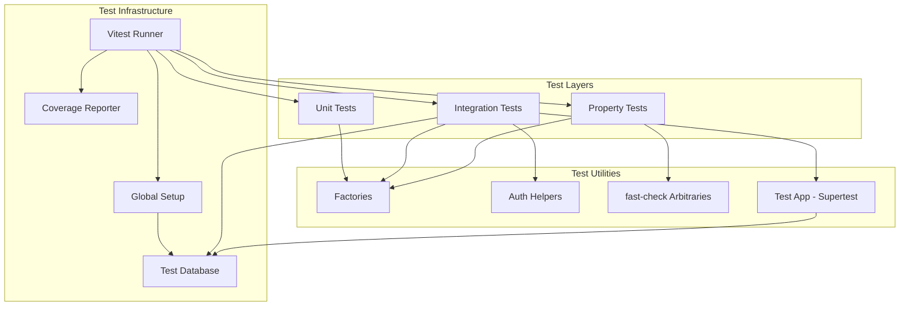
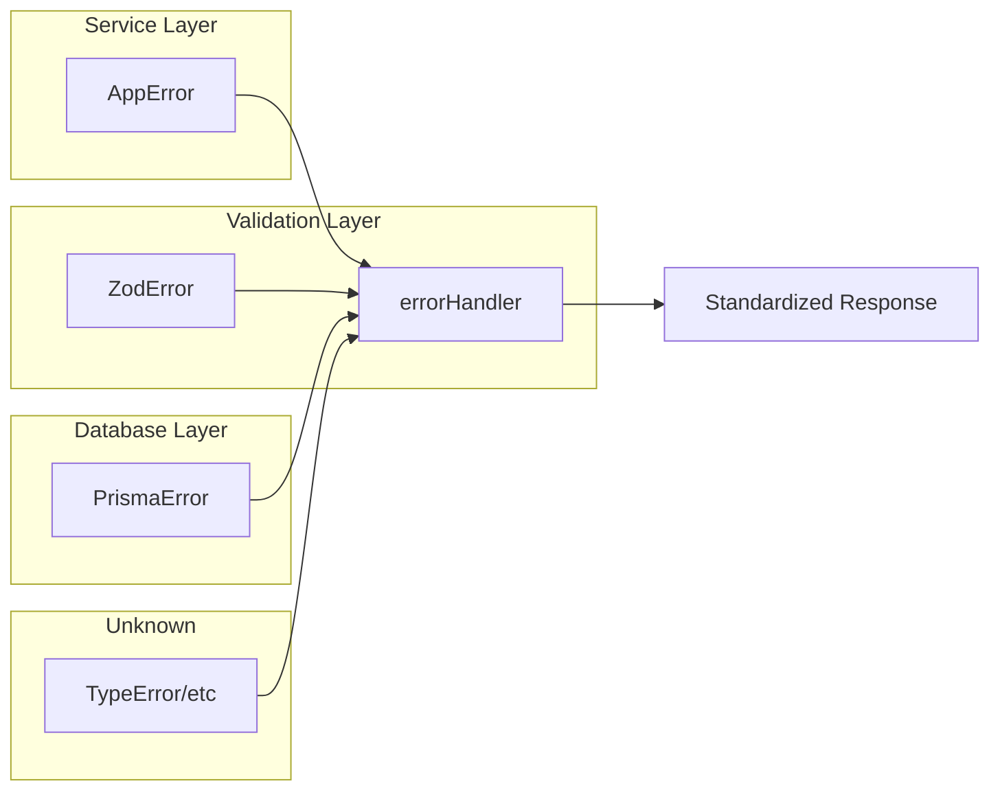

# مستند التصميم — Testing & QA

## Overview

يُحدد هذا المستند التصميم التقني لبنية الاختبارات في مشروع Wasl SaaS Server. يشمل التصميم إعداد Vitest كإطار اختبار، تكوين قاعدة بيانات اختبار معزولة، وتنظيم الاختبارات في طبقات: وحدة (unit)، تكامل (integration)، وخصائص (property-based).

### أهداف التصميم

- **السرعة**: اختبارات الوحدة تعمل بدون I/O خارجي، اختبارات التكامل تستخدم قاعدة بيانات حقيقية
- **العزل**: كل ملف اختبار مستقل، لا يعتمد على ترتيب التنفيذ
- **الشمولية**: تغطية المنطق التجاري الحرج بخصائص رياضية قابلة للتحقق
- **البساطة**: هيكل واضح يسهل إضافة اختبارات جديدة

## Architecture

### هيكل الملفات

```
src/
├── __tests__/
│   ├── setup/
│   │   ├── globalSetup.ts          # Prisma migrate + seed before all
│   │   ├── testDatabase.ts         # Database cleanup utilities
│   │   └── testApp.ts              # Express app instance for Supertest
│   ├── helpers/
│   │   ├── factories.ts            # Test data factories
│   │   ├── auth.helpers.ts         # Token generation helpers
│   │   └── arbitrary.ts            # fast-check arbitraries
│   ├── unit/
│   │   ├── utils/
│   │   │   ├── slugify.test.ts
│   │   │   ├── orderStateMachine.test.ts
│   │   │   ├── orderNumberGenerator.test.ts
│   │   │   ├── AppError.test.ts
│   │   │   ├── asyncHandler.test.ts
│   │   │   └── apiResponse.test.ts
│   │   ├── validators/
│   │   │   ├── auth.validators.test.ts
│   │   │   └── store.validators.test.ts
│   │   ├── middlewares/
│   │   │   ├── validate.test.ts
│   │   │   └── error.test.ts
│   │   └── services/
│   │       ├── auth.Service.test.ts
│   │       └── category.Service.test.ts
│   ├── integration/
│   │   ├── auth/
│   │   │   ├── register.test.ts
│   │   │   ├── login.test.ts
│   │   │   ├── refresh.test.ts
│   │   │   └── password.test.ts
│   │   ├── store-admin/
│   │   │   ├── category.test.ts
│   │   │   └── order.test.ts
│   │   ├── storefront/
│   │   │   └── tenant.test.ts
│   │   └── middleware/
│   │       ├── auth.test.ts
│   │       └── storeContext.test.ts
│   └── property/
│       ├── slugify.property.test.ts
│       ├── orderStateMachine.property.test.ts
│       ├── validators.property.test.ts
│       ├── categoryTree.property.test.ts
│       └── orderNumber.property.test.ts
```

### مخطط المعمارية



## Components and Interfaces

### 1. Vitest Configuration (`vitest.config.ts`)

```typescript
import { defineConfig } from 'vitest/config';
import path from 'path';

export default defineConfig({
  test: {
    globals: true,
    root: './src',
    environment: 'node',
    include: ['**/*.test.ts'],
    exclude: ['**/node_modules/**'],
    coverage: {
      provider: 'v8',
      reporter: ['text', 'lcov'],
      include: ['src/**/*.ts'],
      exclude: ['src/__tests__/**', 'src/types/**'],
    },
    // Workspace-based separation
    projects: [
      {
        test: {
          name: 'unit',
          include: ['__tests__/unit/**/*.test.ts', '__tests__/property/**/*.test.ts'],
          environment: 'node',
          pool: 'threads',
        },
      },
      {
        test: {
          name: 'integration',
          include: ['__tests__/integration/**/*.test.ts'],
          environment: 'node',
          pool: 'forks',
          poolOptions: { forks: { singleFork: true } },
          globalSetup: ['__tests__/setup/globalSetup.ts'],
        },
      },
    ],
  },
  resolve: {
    alias: {
      '@': path.resolve(__dirname, './src'),
    },
  },
});
```

### 2. Global Setup (`globalSetup.ts`)

```typescript
interface GlobalSetupContext {
  databaseUrl: string;
  cleanup: () => Promise<void>;
}

// Responsibilities:
// - Set DATABASE_URL to test database
// - Run prisma migrate deploy
// - Export teardown function to drop test schema
```

### 3. Test Database Utilities (`testDatabase.ts`)

```typescript
interface TestDatabaseUtils {
  /** Reset all tables (truncate with cascade) */
  resetDatabase(): Promise<void>;
  
  /** Reset specific tables */
  resetTables(tables: string[]): Promise<void>;
  
  /** Disconnect Prisma client */
  disconnect(): Promise<void>;
}
```

### 4. Test App (`testApp.ts`)

```typescript
// Creates an Express app instance identical to production
// but without calling app.listen()
// Used with Supertest for integration tests

interface TestAppExports {
  app: Express.Application;
  prisma: PrismaClient;
}
```

### 5. Test Data Factories (`factories.ts`)

```typescript
interface UserFactory {
  build(overrides?: Partial<UserInput>): UserInput;
  create(overrides?: Partial<UserInput>): Promise<User>;
}

interface StoreFactory {
  build(overrides?: Partial<StoreInput>): StoreInput;
  create(ownerId: number, overrides?: Partial<StoreInput>): Promise<Store>;
}

interface CategoryFactory {
  build(storeId: number, overrides?: Partial<CategoryInput>): CategoryInput;
  create(storeId: number, overrides?: Partial<CategoryInput>): Promise<Category>;
  createTree(storeId: number, depth: number): Promise<Category[]>;
}
```

### 6. Auth Helpers (`auth.helpers.ts`)

```typescript
interface AuthHelpers {
  /** Create a user and return valid access token */
  createAuthenticatedUser(overrides?: Partial<UserInput>): Promise<{
    user: User;
    accessToken: string;
    refreshToken: string;
  }>;
  
  /** Create a user with store membership */
  createStoreAdmin(storeId: number): Promise<{
    user: User;
    accessToken: string;
    storeId: number;
  }>;
  
  /** Generate a valid JWT for testing */
  generateTestToken(payload: { userId: number; systemRole: string }): string;
}
```

### 7. fast-check Arbitraries (`arbitrary.ts`)

```typescript
import * as fc from 'fast-check';
import { ShipmentStatus } from '../../generated/prisma';

// Arbitrary for any string (slug input testing)
const arbSlugInput: fc.Arbitrary<string> = fc.string();

// Arbitrary for valid ShipmentStatus
const arbShipmentStatus: fc.Arbitrary<ShipmentStatus> = 
  fc.constantFrom(...Object.values(ShipmentStatus));

// Arbitrary for valid registration data
const arbRegistrationData: fc.Arbitrary<RegisterInput> = fc.record({
  name: fc.string({ minLength: 2, maxLength: 100 }),
  email: fc.emailAddress(),
  phone: fc.stringMatching(/^\+?\d{7,15}$/),
  password: fc.string({ minLength: 8, maxLength: 128 }),
});

// Arbitrary for flat category list with valid parent references
const arbCategoryList: fc.Arbitrary<CategoryNode[]> = /* ... */;

// Arbitrary for valid store ID
const arbStoreId: fc.Arbitrary<number> = fc.integer({ min: 1, max: 9999 });

// Arbitrary for whitespace-only strings
const arbWhitespace: fc.Arbitrary<string> = 
  fc.stringOf(fc.constantFrom(' ', '\t', '\n', '\r'));
```

## Data Models

### Test Configuration Model

```typescript
interface TestConfig {
  database: {
    url: string;           // postgresql://...test_db
    schema: string;        // "test" schema name
    resetStrategy: 'truncate' | 'drop-recreate';
  };
  coverage: {
    threshold: {
      lines: number;       // minimum 70%
      branches: number;    // minimum 60%
      functions: number;   // minimum 70%
    };
  };
  property: {
    numRuns: number;       // minimum 100
    seed?: number;         // reproducible failures
  };
}
```

### Test Factory Data Models

```typescript
interface UserInput {
  name: string;
  email: string;
  phone: string;
  password: string;
}

interface StoreInput {
  name: string;
  domain: string;
  status?: StoreStatus;
}

interface CategoryInput {
  name: string;
  parent_id?: number | null;
  image_url?: string | null;
  is_active?: boolean;
}

interface CategoryNode {
  id: number;
  store_id: number;
  name: string;
  slug: string;
  parent_id: number | null;
  sort_order: number;
  is_active: boolean;
  children: CategoryNode[];
}
```

### Mocking Strategy

| Component | Mock Strategy |
|-----------|--------------|
| Prisma Client | `vitest-mock-extended` for unit tests, real DB for integration |
| bcrypt | Real implementation (fast enough for tests) |
| jsonwebtoken | Real implementation with test secrets |
| Express req/res | `node-mocks-http` for middleware unit tests |
| crypto | Real implementation |

## Correctness Properties

*A property is a characteristic or behavior that should hold true across all valid executions of a system — essentially, a formal statement about what the system should do. Properties serve as the bridge between human-readable specifications and machine-verifiable correctness guarantees.*

### Property 1: Slugify Idempotence

*For any* arbitrary string `x`, applying slugify twice produces the same result as applying it once: `slugify(slugify(x)) === slugify(x)`.

**Validates: Requirements 9.1**

### Property 2: Slugify Output Character Set

*For any* arbitrary string `x`, the output of `slugify(x)` contains only lowercase alphanumeric characters and hyphens, matching the regex `^[a-z0-9-]*$`.

**Validates: Requirements 2.1, 9.2**

### Property 3: Slugify Whitespace Produces Empty

*For any* string composed entirely of whitespace characters (spaces, tabs, newlines), `slugify(x)` returns an empty string `""`.

**Validates: Requirements 2.3, 9.6**

### Property 4: Order State Machine Transition Correctness

*For any* pair of ShipmentStatus values `(from, to)`, `canTransition(from, to)` returns `true` if and only if `to` is in the defined allowed transitions list for `from`.

**Validates: Requirements 7.1, 7.2, 7.5, 7.6, 2.4**

### Property 5: Order State Machine Assert Consistency

*For any* pair of ShipmentStatus values `(from, to)`, `assertTransition(from, to)` throws an AppError if and only if `canTransition(from, to)` returns `false`. When it throws, the error message contains both the source and target status names.

**Validates: Requirements 7.4, 9.3, 9.4, 2.6**

### Property 6: Order Number Format Validity

*For any* valid store ID (1–9999), the generated order number matches the regex `^ORD-\d{4}-\d{6}$`, where the first 4 digits represent the zero-padded store ID.

**Validates: Requirements 2.7, 9.7**

### Property 7: Zod Schema Round-Trip

*For any* valid registration data object (name 2–100 chars, valid email, phone matching `^\+?\d{7,15}$`, password 8–128 chars), parsing with `registerSchema` succeeds and the output contains all input fields with identical values.

**Validates: Requirements 3.1, 3.7, 9.5**

### Property 8: Category Tree Node Count Invariant

*For any* flat list of categories with valid parent references (parent_id either null or referencing another category in the list), `buildCategoryTree` produces a tree where the total count of all nodes (recursively) equals the input list length.

**Validates: Requirements 6.1, 9.8**

### Property 9: Category Tree Sort Order Invariant

*For any* flat list of categories with sort_order values, `buildCategoryTree` produces a tree where at every level, the children array is sorted by sort_order in non-decreasing order.

**Validates: Requirements 6.2, 9.9**

## Error Handling

### Error Classification Strategy

The test suite validates the centralized error handler's classification logic:

| Error Type | Expected Status | Expected Response |
|-----------|----------------|-------------------|
| `AppError` | `err.statusCode` | `{ success: false, error: message, message: message }` |
| Prisma P2002 | 409 | `{ success: false, error: "Unique constraint violation", message: "..." }` |
| Prisma P2025 | 404 | `{ success: false, error: "Not found", message: "..." }` |
| `ZodError` | 422 | `{ success: false, error: issues[], message: "Validation failed" }` |
| Unknown | 500 | `{ success: false, error: "Internal server error", message: "..." }` |

### Test Error Isolation

- Unit tests use mocked dependencies — errors are thrown directly
- Integration tests trigger errors through HTTP requests — validates full middleware chain
- Property tests focus on pure functions — errors are caught and verified in assertions

### Error Scenarios per Layer



## Testing Strategy

### Framework & Libraries

| Library | Purpose | Version |
|---------|---------|---------|
| `vitest` | Test runner + assertions | ^3.x |
| `@vitest/coverage-v8` | Code coverage | ^3.x |
| `supertest` | HTTP integration testing | ^7.x |
| `fast-check` | Property-based testing | ^4.x |
| `vitest-mock-extended` | Prisma mocking | ^2.x |
| `node-mocks-http` | Express req/res mocking | ^1.x |

### Test Execution Strategy

```
npm test              → runs all tests (unit + property + integration)
npm run test:unit     → unit + property tests only (fast, no DB)
npm run test:int      → integration tests only (requires test DB)
npm run test:coverage → all tests with coverage report
```

### Dual Testing Approach

- **Unit tests**: Verify specific examples, edge cases, and error conditions for services, utilities, and middlewares
- **Property tests**: Verify universal properties across all inputs using fast-check for slugify, order state machine, validators, and category tree builder
- Both are complementary: unit tests catch concrete bugs, property tests verify general correctness

### Property-Based Testing Configuration

- Library: **fast-check** v4.x
- Minimum iterations: **100** per property test
- Each property test references its design document property
- Tag format: `Feature: testing-qa, Property {number}: {property_text}`
- Property tests run alongside unit tests (no DB required — pure functions only)

### Test Priority Order

1. **P0 (Critical)**: Auth flows, multi-tenant isolation, order state machine
2. **P1 (High)**: Category tree operations, error handling, Zod validators
3. **P2 (Medium)**: API integration tests, utility functions
4. **P3 (Low)**: Upload, webhooks, rate limiting

### Coverage Targets

| Metric | Target |
|--------|--------|
| Lines | ≥ 70% |
| Branches | ≥ 60% |
| Functions | ≥ 70% |
| Critical paths (auth, orders) | ≥ 90% |

